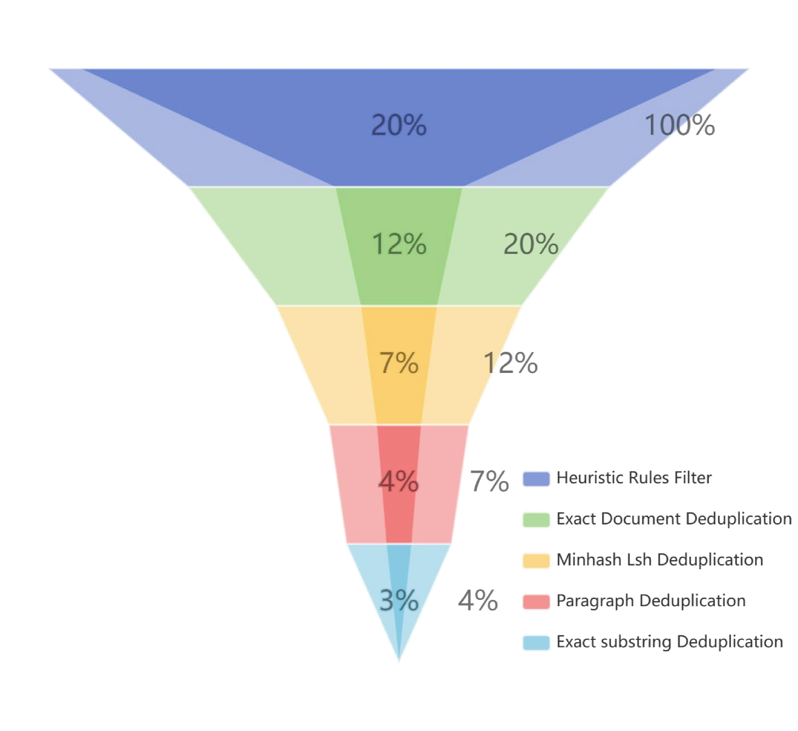

# MAP-Neo系列：高效透明的双语大型语言模型

发布时间：2024年05月29日

`LLM应用

这篇论文介绍了MAP-Neo，一个完全开源的双语大型语言模型，它不仅提供了模型的权重，还包括了训练过程中的中间状态、预训练数据集、数据处理流程、模型检查点以及优化的训练与评估框架。这些详细的公开信息旨在提高LLMs的透明度，并促进科学研究。论文强调了MAP-Neo在性能上与当前最先进的LLMs相当，这表明了其在实际应用中的潜力。因此，这篇论文应归类为LLM应用，因为它主要关注于实际应用中的模型开发和透明度提升，而不是理论研究或Agent的设计。` `人工智能`

> MAP-Neo: Highly Capable and Transparent Bilingual Large Language Model Series

# 摘要

> 近年来，大型语言模型（LLMs）在各类任务中取得了突破性进展。然而，由于商业考量，顶尖模型如GPT、Gemini和Claude的训练细节并未公开，仅通过专有接口提供服务。近期，多家机构开源了性能强劲的LLMs，如LLaMA-3，与闭源模型不相上下。尽管如此，这些开源模型仅提供了权重，关键细节如训练过程中的中间状态、预训练数据集和代码等仍未公开。为了提升LLMs的透明度，研究界推出了真正开放的LLMs（例如Pythia、Amber、OLMo），公开了更多关键信息。这些模型的出现极大地促进了大型模型的科学研究，揭示了它们的优劣、偏见及潜在风险。尽管如此，现有真正开放的LLMs在推理、知识应用和编程任务上仍不及同规模的最先进闭源模型。为此，我们推出了MAP-Neo，一个拥有70亿参数、透明度高的双语语言模型，基于4.5万亿高质量令牌从头训练。MAP-Neo不仅是首个完全开源的双语LLM，其性能也与当前最先进的LLMs相当。我们不仅公开了MAP-Neo的所有细节，包括清理后的预训练数据集、数据处理流程、模型检查点，还有优化的训练与评估框架，以便复现。我们期望MAP-Neo能强化开放研究社区，激发更多创新，推动LLMs的持续进步。

> Large Language Models (LLMs) have made great strides in recent years to achieve unprecedented performance across different tasks. However, due to commercial interest, the most competitive models like GPT, Gemini, and Claude have been gated behind proprietary interfaces without disclosing the training details. Recently, many institutions have open-sourced several strong LLMs like LLaMA-3, comparable to existing closed-source LLMs. However, only the model's weights are provided with most details (e.g., intermediate checkpoints, pre-training corpus, and training code, etc.) being undisclosed. To improve the transparency of LLMs, the research community has formed to open-source truly open LLMs (e.g., Pythia, Amber, OLMo), where more details (e.g., pre-training corpus and training code) are being provided. These models have greatly advanced the scientific study of these large models including their strengths, weaknesses, biases and risks. However, we observe that the existing truly open LLMs on reasoning, knowledge, and coding tasks are still inferior to existing state-of-the-art LLMs with similar model sizes. To this end, we open-source MAP-Neo, a highly capable and transparent bilingual language model with 7B parameters trained from scratch on 4.5T high-quality tokens. Our MAP-Neo is the first fully open-sourced bilingual LLM with comparable performance compared to existing state-of-the-art LLMs. Moreover, we open-source all details to reproduce our MAP-Neo, where the cleaned pre-training corpus, data cleaning pipeline, checkpoints, and well-optimized training/evaluation framework are provided. Finally, we hope our MAP-Neo will enhance and strengthen the open research community and inspire more innovations and creativities to facilitate the further improvements of LLMs.

[Arxiv](https://arxiv.org/abs/2405.19327)