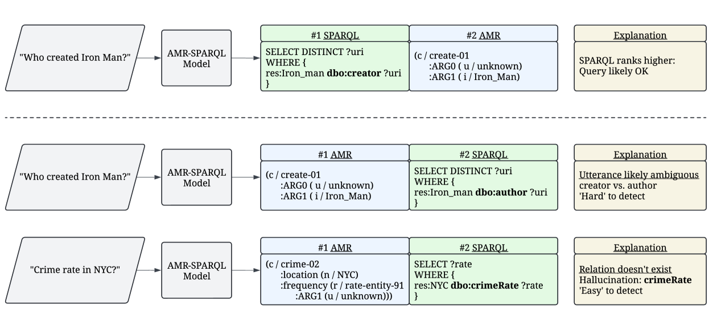

# 巨型多语种抽象意义表示：幻觉检测的数据集与基准

发布时间：2024年05月29日

`LLM应用

这篇论文摘要讨论了抽象意义表示（AMR）和MASSIVE-AMR数据集，这是一个大规模的多语言资源，用于文本至图表的标注。论文中提到了大型语言模型在多语言AMR和SPARQL解析中的应用，以及在知识库问答中利用AMR检测幻觉的成果。这些内容展示了LLMs在结构化解析中的应用，特别是在多语言环境下的应用，因此属于LLM应用分类。` `知识库问答`

> MASSIVE Multilingual Abstract Meaning Representation: A Dataset and Baselines for Hallucination Detection

# 摘要

> 抽象意义表示（AMR）捕捉话语精髓，而MASSIVE-AMR数据集则以其超过84,000个文本至图表的标注，成为当前最大且最多样的AMR资源，涵盖1,685个信息查询话语，跨越50余种语言类型。我们详述了这一资源的构建过程及其独到之处，并通过实验展示了大型语言模型在多语言AMR和SPARQL解析中的应用，以及在知识库问答中利用AMR检测幻觉的成果，这些研究为LLMs在结构化解析中的挑战提供了新的视角。

> Abstract Meaning Representation (AMR) is a semantic formalism that captures the core meaning of an utterance. There has been substantial work developing AMR corpora in English and more recently across languages, though the limited size of existing datasets and the cost of collecting more annotations are prohibitive. With both engineering and scientific questions in mind, we introduce MASSIVE-AMR, a dataset with more than 84,000 text-to-graph annotations, currently the largest and most diverse of its kind: AMR graphs for 1,685 information-seeking utterances mapped to 50+ typologically diverse languages. We describe how we built our resource and its unique features before reporting on experiments using large language models for multilingual AMR and SPARQL parsing as well as applying AMRs for hallucination detection in the context of knowledge base question answering, with results shedding light on persistent issues using LLMs for structured parsing.

[Arxiv](https://arxiv.org/abs/2405.19285)