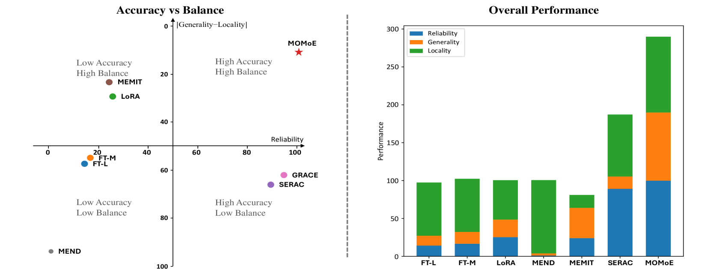

# MEMoE：利用专家混合适配器提升模型编辑能力

发布时间：2024年05月29日

`LLM应用

这篇论文介绍了一种新的模型编辑技术MOMoE，它结合了混合专家（MoE）架构和知识锚点路由策略，用于精准调整大型语言模型（LLMs）的行为。这种技术旨在提高模型编辑的效率和效果，同时保持模型的通用能力。由于该论文主要关注于LLM的具体应用技术，即模型编辑，因此它属于LLM应用分类。` `模型优化`

> MEMoE: Enhancing Model Editing with Mixture of Experts Adaptors

# 摘要

> 模型编辑旨在精准调整大型语言模型（LLMs）的行为，确保在特定范围内的高效改变，同时不影响其他输入。尽管已有多种编辑技术问世，但它们往往在整体性能或泛化与局部性的平衡上表现不佳。我们提出的MOMoE，一种结合混合专家（MoE）架构与知识锚点路由策略的编辑适配器，通过旁路MoE结构更新知识，保持LLMs的通用能力不变。知识锚点路由确保相似知识需求的输入由同一专家处理，增强了知识的泛化。实验证明，MOMoE在批量及顺序批量编辑任务中表现卓越，实现了泛化与局部性的完美平衡。相关代码即将公开。

> Model editing aims to efficiently alter the behavior of Large Language Models (LLMs) within a desired scope, while ensuring no adverse impact on other inputs. Recent years have witnessed various model editing methods been proposed. However, these methods either exhibit poor overall performance or struggle to strike a balance between generalization and locality. We propose MOMoE, a model editing adapter utilizing a Mixture of Experts (MoE) architecture with a knowledge anchor routing strategy. MOMoE updates knowledge using a bypass MoE structure, keeping the original parameters unchanged to preserve the general ability of LLMs. And, the knowledge anchor routing ensures that inputs requiring similar knowledge are routed to the same expert, thereby enhancing the generalization of the updated knowledge. Experimental results show the superiority of our approach over both batch editing and sequential batch editing tasks, exhibiting exceptional overall performance alongside outstanding balance between generalization and locality. Our code will be available.

[Arxiv](https://arxiv.org/abs/2405.19086)