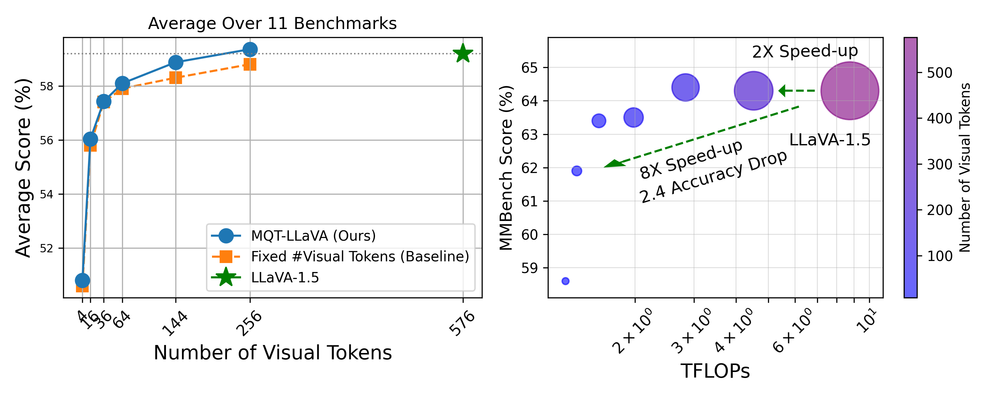
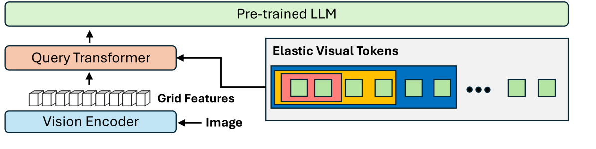
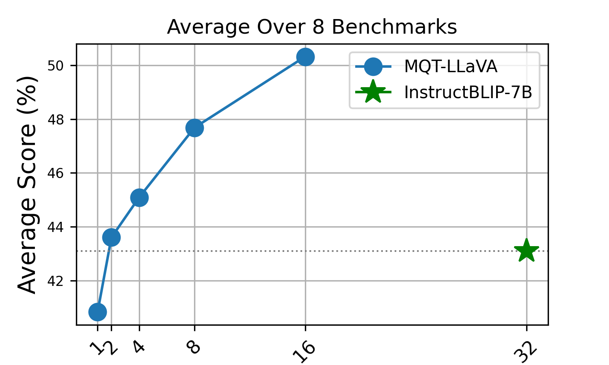
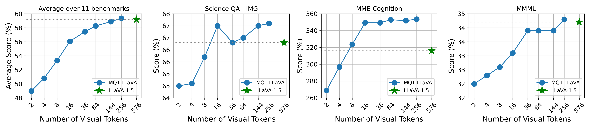
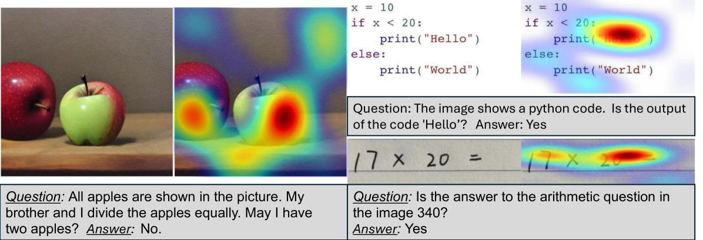
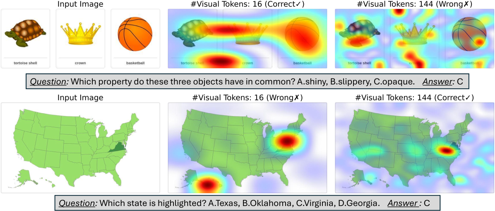
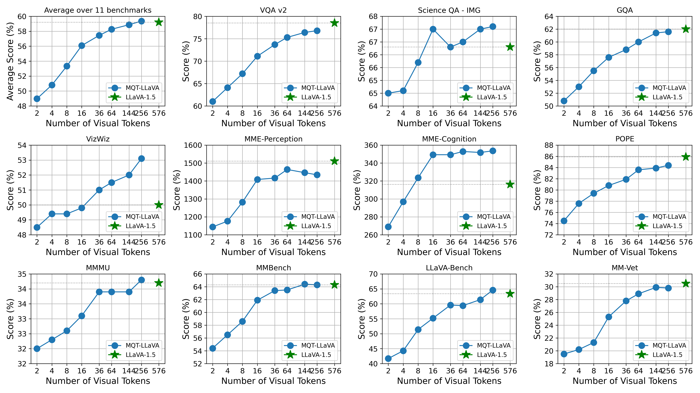
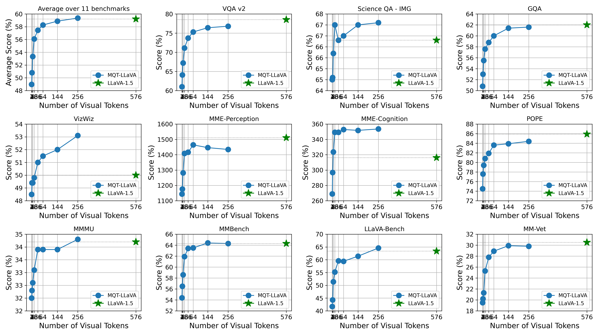

# 大型视觉-语言模型的嵌套查询转换器

发布时间：2024年05月29日

`LLM应用

这篇论文主要探讨了大型视觉-语言模型（LVLMs）在适应不同计算限制方面的挑战，并提出了一种新的方法——Matryoshka查询变换器（MQT），以灵活调整视觉令牌数量来适应多样化的任务和计算资源。这种方法通过在推理时动态调整视觉令牌的数量，实现了在保持或提升性能的同时减少计算量的目标。因此，这项工作属于大型语言模型（LLM）的应用范畴，具体是在优化和调整LLM以适应不同计算环境和任务需求方面的应用。` `计算机视觉` `人工智能`

> Matryoshka Query Transformer for Large Vision-Language Models

# 摘要

> 大型视觉-语言模型（LVLMs）通常将图像固定编码为576个视觉令牌，并由语言模型处理。尽管性能卓越，但LVLMs在适应不同计算限制方面存在挑战。我们提出一个关键问题：是否能灵活调整视觉令牌数量，以适应多样化的任务和计算资源？答案是肯定的。我们受Matryoshka表示学习的启发，开发了Matryoshka查询变换器（MQT），该变换器能在推理时将图像编码为任意数量（最多预设最大值）的视觉令牌。通过使用具有M个潜在查询令牌的查询变换器来压缩视觉嵌入，我们实现了这一目标。在训练过程中，我们随机选择m个令牌（m≤M）进行训练，其余丢弃。结合MQT与LLaVA，我们训练了一个模型，该模型能灵活减少推理时的视觉令牌数量，同时保持或提升性能。我们的模型MQT-LLAVA在11个基准测试中使用最多256个令牌，性能与LLaVA-1.5相当，而LLaVA固定使用576个令牌。将令牌数量减少至16个，计算量减少8倍，性能仅下降2.4个点。在特定任务如ScienceQA和MMMU上，我们甚至可以仅使用2个视觉令牌，性能下降仅为3%和6%。我们的研究揭示了视觉令牌数量与计算成本之间的权衡，为未来研究提供了实现最佳平衡的途径。

> Large Vision-Language Models (LVLMs) typically encode an image into a fixed number of visual tokens (e.g., 576) and process these tokens with a language model. Despite their strong performance, LVLMs face challenges in adapting to varying computational constraints. This raises the question: can we achieve flexibility in the number of visual tokens to suit different tasks and computational resources? We answer this with an emphatic yes. Inspired by Matryoshka Representation Learning, we introduce the Matryoshka Query Transformer (MQT), capable of encoding an image into m visual tokens during inference, where m can be any number up to a predefined maximum. This is achieved by employing a query transformer with M latent query tokens to compress the visual embeddings. During each training step, we randomly select m <= M latent query tokens and train the model using only these first m tokens, discarding the rest. Combining MQT with LLaVA, we train a single model once, and flexibly and drastically reduce the number of inference-time visual tokens while maintaining similar or better performance compared to training independent models for each number of tokens. Our model, MQT-LLAVA, matches LLaVA-1.5 performance across 11 benchmarks using a maximum of 256 tokens instead of LLaVA's fixed 576. Reducing to 16 tokens (8x less TFLOPs) only sacrifices the performance by 2.4 points on MMBench. On certain tasks such as ScienceQA and MMMU, we can even go down to only 2 visual tokens with performance drops of just 3% and 6% each. Our exploration of the trade-off between the accuracy and computational cost brought about by the number of visual tokens facilitates future research to achieve the best of both worlds.

[Arxiv](https://arxiv.org/abs/2405.19315)