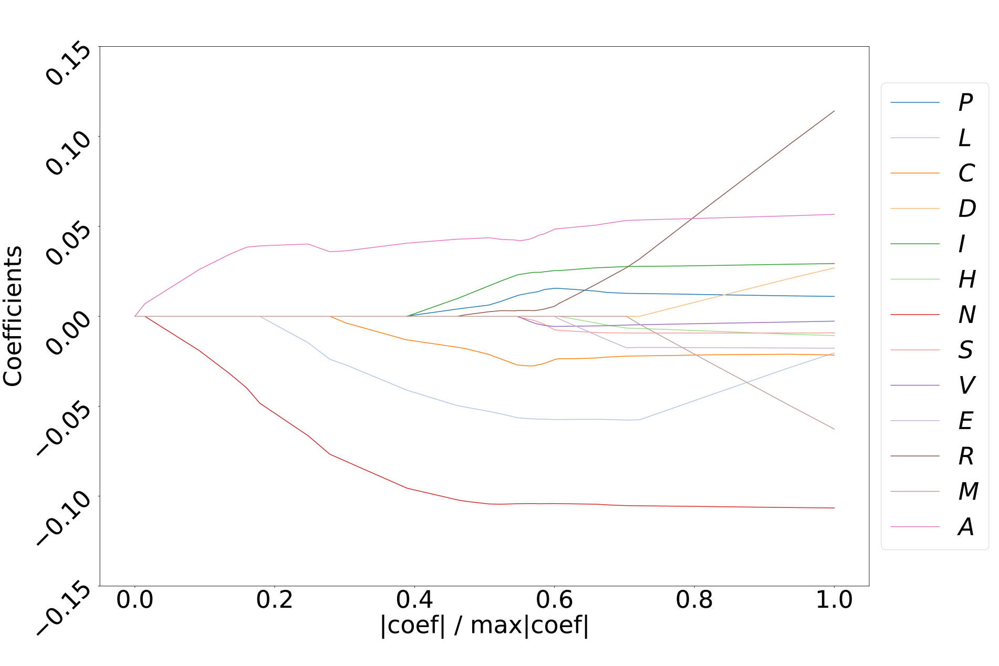
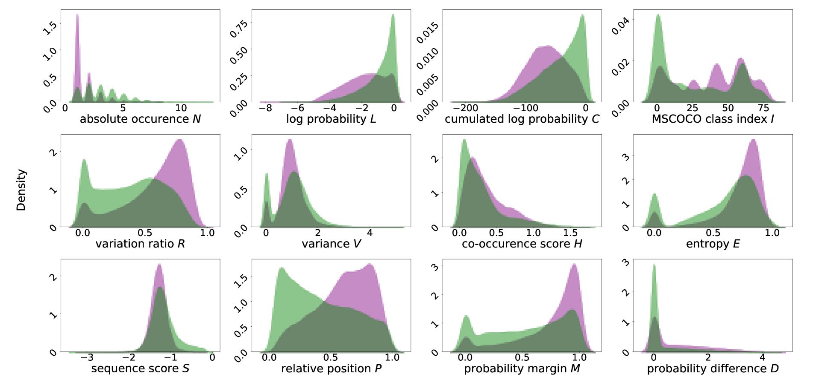

# MetaToken：利用元分类技术揭示图像描述中的幻觉现象

发布时间：2024年05月29日

`LLM应用

这篇论文介绍了一种名为MetaToken的二元分类器，用于检测大型视觉语言模型（LVLMs）中的幻觉现象。这种工具能够在词级别以低成本精准地检测幻觉，并且不需要真实数据支持，可以应用于各种开源的LVLM。论文通过在四个顶尖的LVLMs上验证其效能，展示了其在实际应用中的有效性。因此，这篇论文属于LLM应用分类，因为它关注的是如何应用技术来解决特定问题，即在多模态任务中检测和减少幻觉现象。` `视觉问答` `图像描述`

> MetaToken: Detecting Hallucination in Image Descriptions by Meta Classification

# 摘要

> 大型视觉语言模型（LVLMs）在处理视觉问答和图像描述等多模态任务时表现出色，但视觉信息与生成文本间的幻觉现象仍是一个棘手问题。为此，我们开发了MetaToken，一个轻巧的二元分类器，能在词级别以极低成本精准检测幻觉。通过深入分析，我们发现了先前研究中未曾注意到的幻觉关键因素。MetaToken无需真实数据支持，即可无缝应用于各类开源LVLM，确保幻觉检测的可靠性。我们在四个顶尖LVLMs上验证了其效能，结果令人信服。

> Large Vision Language Models (LVLMs) have shown remarkable capabilities in multimodal tasks like visual question answering or image captioning. However, inconsistencies between the visual information and the generated text, a phenomenon referred to as hallucinations, remain an unsolved problem with regard to the trustworthiness of LVLMs. To address this problem, recent works proposed to incorporate computationally costly Large (Vision) Language Models in order to detect hallucinations on a sentence- or subsentence-level. In this work, we introduce MetaToken, a lightweight binary classifier to detect hallucinations on the token-level at negligible cost. Based on a statistical analysis, we reveal key factors of hallucinations in LVLMs which have been overseen in previous works. MetaToken can be applied to any open-source LVLM without any knowledge about ground truth data providing a reliable detection of hallucinations. We evaluate our method on four state-of-the-art LVLMs demonstrating the effectiveness of our approach.

[Arxiv](https://arxiv.org/abs/2405.19186)