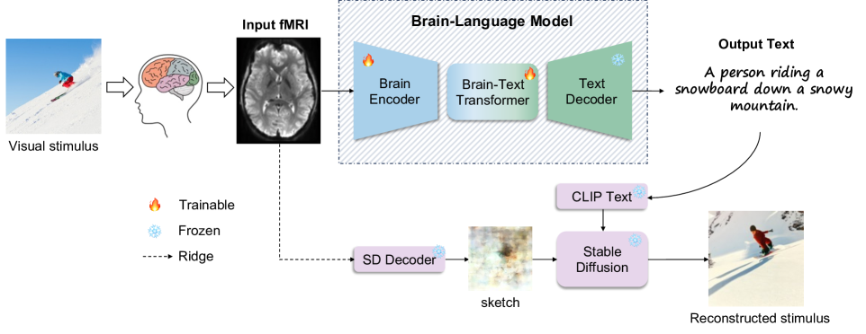
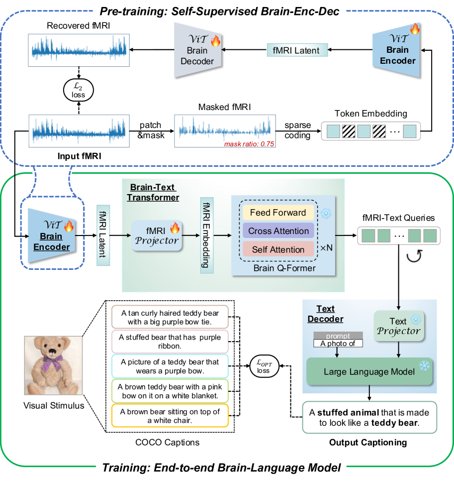
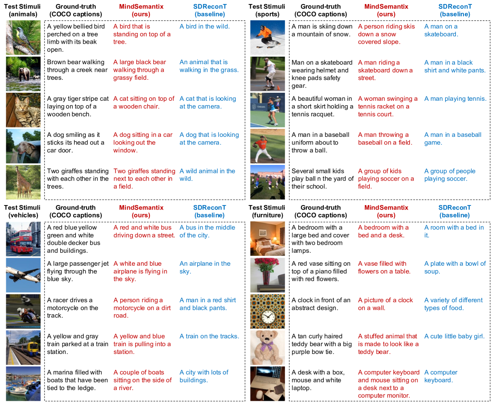
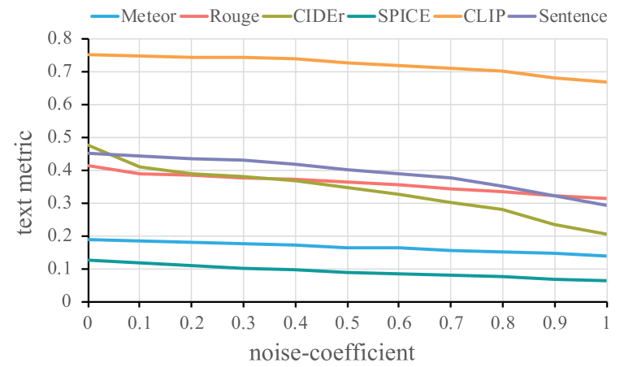
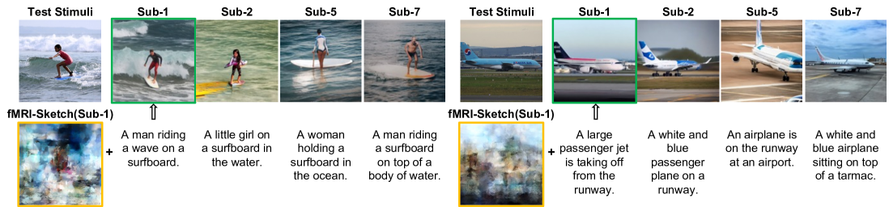
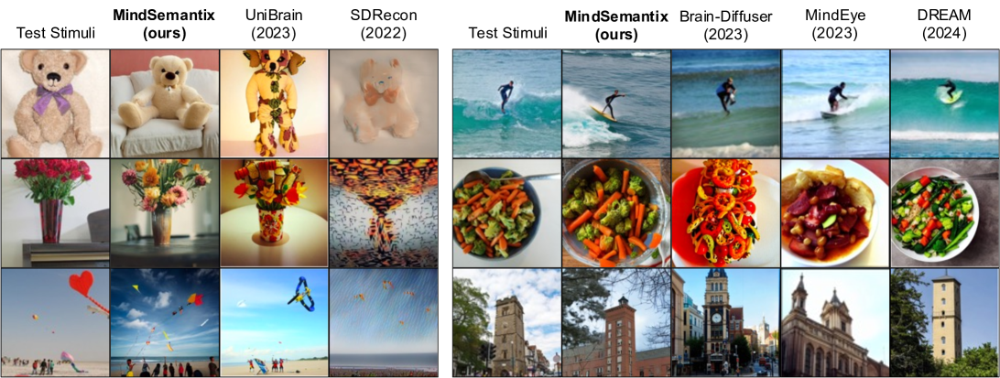

# MindSemantix：借助脑语言模型，解码大脑的视觉世界

发布时间：2024年05月29日

`LLM应用

这篇论文介绍了一种名为MindSemantix的多模态框架，它利用大型语言模型（LLMs）来解读通过fMRI捕捉的大脑活动中的视觉语义内容。该框架通过整合LLMs与大脑活动分析，创建了一个端到端的大脑-语言模型，实现了大脑与语言的无缝对接。这种应用展示了LLM在神经科学领域的实际应用，特别是在理解和解释大脑视觉体验方面的潜力。因此，这篇论文属于LLM应用分类。` `神经科学` `人工智能`

> MindSemantix: Deciphering Brain Visual Experiences with a Brain-Language Model

# 摘要

> 通过fMRI捕捉的大脑活动来解读人类的视觉体验，是神经科学研究中一项前沿且引人入胜的挑战。与单纯预测图像相比，将大脑活动转化为有意义的描述，为视觉信息提供了更深层次的解读，增强了现实应用的灵活性。本研究中，我们推出了MindSemantix，一种创新的多模态框架，它让大型语言模型（LLMs）能够理解大脑中的视觉语义内容。MindSemantix通过整合LLMs与大脑活动分析，打造了一个端到端的大脑-语言模型，实现了大脑与语言的无缝对接。我们提出的Brain-Text Transformer，以Brain Q-Former为核心，结合预训练的大脑编码器与冻结的LLM，实现了大脑、视觉与语言的多模态对齐。为了提升神经表示的泛化能力，我们利用自监督学习在大规模跨主题fMRI数据集上预训练了大脑编码器。MindSemantix不仅增强了大脑解码任务的可行性，如刺激重建，还通过与先进生成模型如稳定扩散的结合，提升了对大脑视觉感知的理解。它生成的描述深入反映了大脑活动中的视觉与语义信息，定量上显著超越了现有技术。我们将会公开相关代码。

> Deciphering the human visual experience through brain activities captured by fMRI represents a compelling and cutting-edge challenge in the field of neuroscience research. Compared to merely predicting the viewed image itself, decoding brain activity into meaningful captions provides a higher-level interpretation and summarization of visual information, which naturally enhances the application flexibility in real-world situations. In this work, we introduce MindSemantix, a novel multi-modal framework that enables LLMs to comprehend visually-evoked semantic content in brain activity. Our MindSemantix explores a more ideal brain captioning paradigm by weaving LLMs into brain activity analysis, crafting a seamless, end-to-end Brain-Language Model. To effectively capture semantic information from brain responses, we propose Brain-Text Transformer, utilizing a Brain Q-Former as its core architecture. It integrates a pre-trained brain encoder with a frozen LLM to achieve multi-modal alignment of brain-vision-language and establish a robust brain-language correspondence. To enhance the generalizability of neural representations, we pre-train our brain encoder on a large-scale, cross-subject fMRI dataset using self-supervised learning techniques. MindSemantix provides more feasibility to downstream brain decoding tasks such as stimulus reconstruction. Conditioned by MindSemantix captioning, our framework facilitates this process by integrating with advanced generative models like Stable Diffusion and excels in understanding brain visual perception. MindSemantix generates high-quality captions that are deeply rooted in the visual and semantic information derived from brain activity. This approach has demonstrated substantial quantitative improvements over prior art. Our code will be released.

[Arxiv](https://arxiv.org/abs/2405.18812)