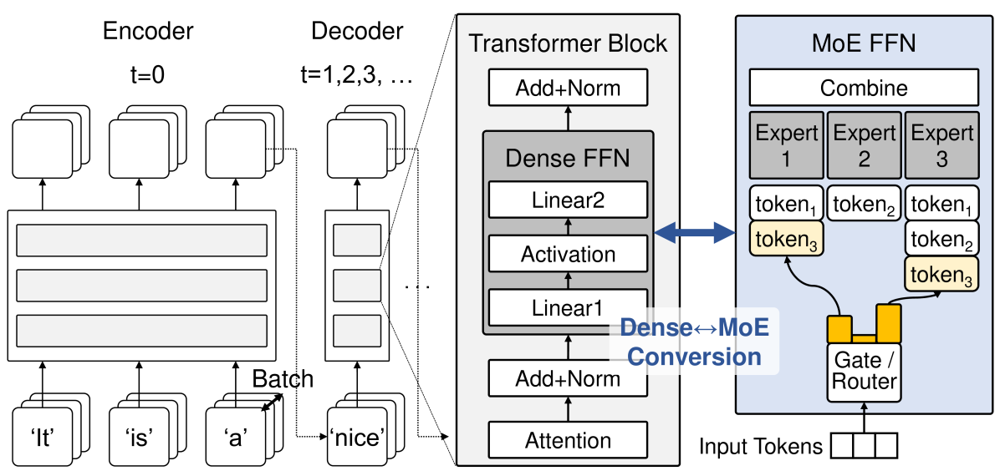
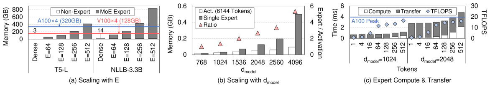
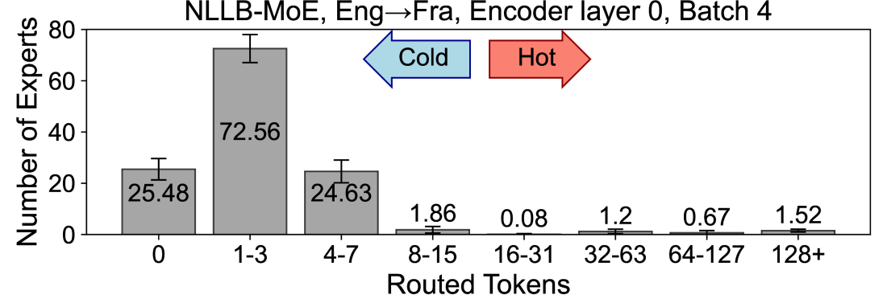
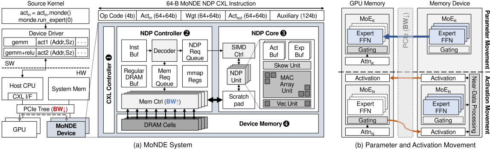
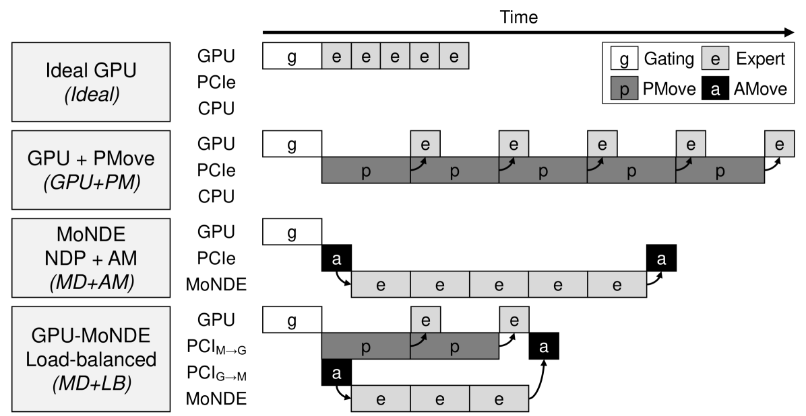
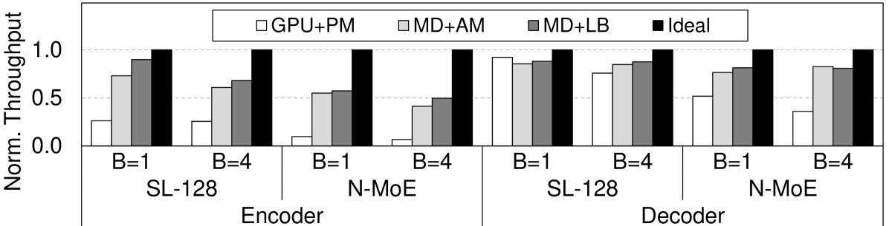
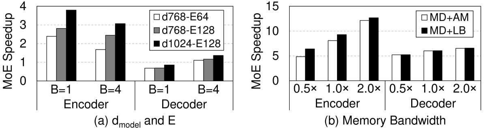
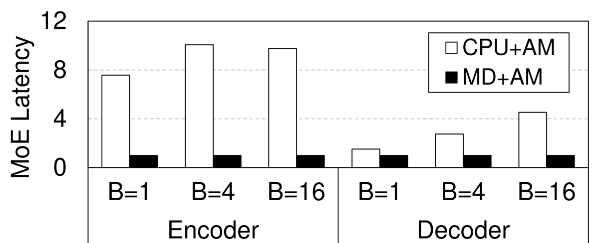
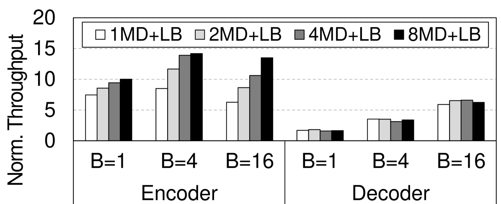
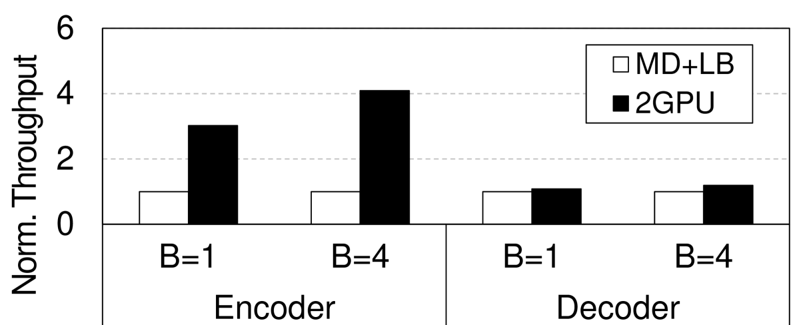

# MoNDE：融合近数据专家的大规模稀疏模型策略

发布时间：2024年05月29日

`LLM应用

理由：这篇论文主要关注的是大型语言模型（LLM）中的混合专家（MoE）模型的内存优化问题，并提出了一种名为混合近数据专家（MoNDE）的解决方案来优化推理过程。这种研究直接应用于LLM的实际操作中，特别是在处理内存需求和提高推理效率方面，因此属于LLM应用类别。它并不涉及Agent的行为或决策，也不是关于RAG（Retrieval-Augmented Generation）的研究，更不是关于LLM理论的基础研究。` `人工智能` `高性能计算`

> MoNDE: Mixture of Near-Data Experts for Large-Scale Sparse Models

# 摘要

> 混合专家（MoE）大型语言模型（LLM）的内存需求往往超出GPU的容量，导致需要昂贵的参数传输过程，从辅助内存到GPU以进行专家计算。本研究提出了一种名为混合近数据专家（MoNDE）的解决方案，它通过高效的近数据计算技术优化了MoE LLM的推理过程。MoNDE策略性地将活跃的“热”专家参数转移到GPU，而将不活跃的“冷”专家留在主机内存中处理，从而大幅减少了参数传输量。通过这种方式，MoNDE用较小的激活数据替换了大量参数的传输，显著提高了通信效率，使得MoE推理在编码器和解码器操作上都实现了显著的速度提升，超越了现有的参数卸载框架。

> Mixture-of-Experts (MoE) large language models (LLM) have memory requirements that often exceed the GPU memory capacity, requiring costly parameter movement from secondary memories to the GPU for expert computation. In this work, we present Mixture of Near-Data Experts (MoNDE), a near-data computing solution that efficiently enables MoE LLM inference. MoNDE reduces the volume of MoE parameter movement by transferring only the $\textit{hot}$ experts to the GPU, while computing the remaining $\textit{cold}$ experts inside the host memory device. By replacing the transfers of massive expert parameters with the ones of small activations, MoNDE enables far more communication-efficient MoE inference, thereby resulting in substantial speedups over the existing parameter offloading frameworks for both encoder and decoder operations.

[Arxiv](https://arxiv.org/abs/2405.18832)