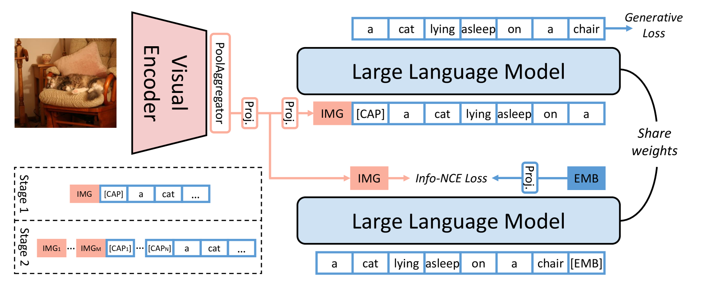
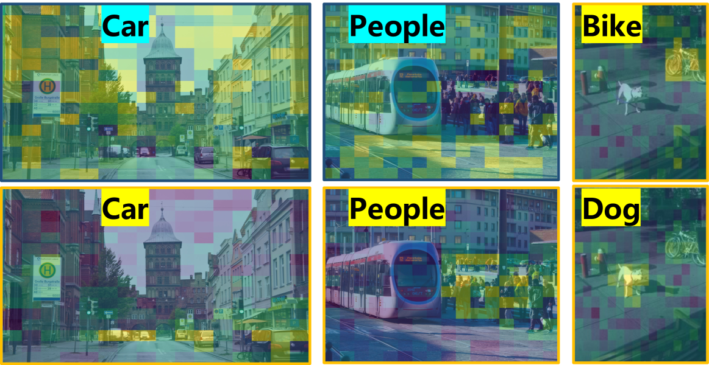

# 多模态生成式嵌入模型

发布时间：2024年05月29日

`多模态任务的处理通常涉及生成和嵌入两个方面，而这篇论文提出的多模态生成嵌入模型（MM-GEM）将这两个目标整合在一个大型语言模型中，并通过PoolAggregator提升效率。这种模型设计不仅适用于生成任务，也适用于嵌入任务，并且在跨模态检索和零样本分类等任务中表现出色。因此，这篇论文的研究内容更偏向于大型语言模型的应用，特别是在多模态任务中的应用。

LLM应用` `多模态学习` `图像处理`

> Multi-Modal Generative Embedding Model

# 摘要

> 多模态任务大多可归结为生成或嵌入问题，现有模型通常通过分离语言模块来应对这两种挑战。本研究追求多模态范式的极简主义，尝试为每种模态构建单一模型。我们提出的多模态生成嵌入模型（MM-GEM）将生成与嵌入目标整合于一个大型语言模型中，并引入PoolAggregator提升效率，实现精细的嵌入与生成。令人意外的是，这两个目标并不互相冲突。例如，基于ViT-Large和TinyLlama的MM-GEM在跨模态检索和零样本分类等基准测试中表现出色，同时擅长图像标注。它还能流畅地执行区域级图像标注和检索任务。此外，MM-GEM中的先进文本模型在长文本与图像检索的Recall@1上提升了超过5%。

> Most multi-modal tasks can be formulated into problems of either generation or embedding. Existing models usually tackle these two types of problems by decoupling language modules into a text decoder for generation, and a text encoder for embedding. To explore the minimalism of multi-modal paradigms, we attempt to achieve only one model per modality in this work. We propose a Multi-Modal Generative Embedding Model (MM-GEM), whereby the generative and embedding objectives are encapsulated in one Large Language Model. We also propose a PoolAggregator to boost efficiency and enable the ability of fine-grained embedding and generation. A surprising finding is that these two objectives do not significantly conflict with each other. For example, MM-GEM instantiated from ViT-Large and TinyLlama shows competitive performance on benchmarks for multimodal embedding models such as cross-modal retrieval and zero-shot classification, while has good ability of image captioning. Additionally, MM-GEM can seamlessly execute region-level image caption generation and retrieval tasks. Besides, the advanced text model in MM-GEM brings over 5% improvement in Recall@1 for long text and image retrieval.

[Arxiv](https://arxiv.org/abs/2405.19333)