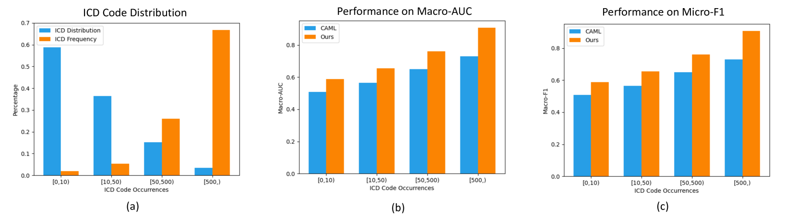

# 自动医疗编码推荐的多阶段检索与重排模型

发布时间：2024年05月29日

`RAG

该论文摘要描述了一种针对国际疾病分类（ICD）系统的索引优化方法，提出了一种多阶段的“检索与重排序”框架，结合了混合离散检索技术和对比学习。这种方法特别关注于优化ICD标签的选择和排序，以提高医疗记录的准确性和效率。由于该研究主要集中在通过检索和重排序技术来改进特定应用（即ICD索引），它更符合RAG分类，即检索增强生成（Retrieval-Augmented Generation），这是一种结合检索和生成技术来优化特定任务的方法。` `健康信息管理`

> Multi-stage Retrieve and Re-rank Model for Automatic Medical Coding Recommendation

# 摘要

> 国际疾病分类（ICD）系统详尽地记录了各类疾病与状况。ICD索引旨在为医疗记录指定一组ICD代码，以促进健康状况的标准化管理与记录。现有方法在处理庞大且分布不均的ICD标签集合时面临挑战。本文提出了一种新颖的多阶段“检索与重排序”框架，结合混合离散检索技术与对比学习，优化了ICD索引过程，使模型能从精简的标签空间中做出更精准的预测。该框架融合了电子健康记录的知识与BM25检索技术，高效筛选出优质候选标签。最后，通过标签共现引导的对比学习，我们进一步优化了候选标签的排序，确保临床笔记与正确的ICD代码紧密关联。实验证明，该方法在MIMIC-III数据集上取得了卓越的性能。

> The International Classification of Diseases (ICD) serves as a definitive medical classification system encompassing a wide range of diseases and conditions. The primary objective of ICD indexing is to allocate a subset of ICD codes to a medical record, which facilitates standardized documentation and management of various health conditions. Most existing approaches have suffered from selecting the proper label subsets from an extremely large ICD collection with a heavy long-tailed label distribution. In this paper, we leverage a multi-stage ``retrieve and re-rank'' framework as a novel solution to ICD indexing, via a hybrid discrete retrieval method, and re-rank retrieved candidates with contrastive learning that allows the model to make more accurate predictions from a simplified label space. The retrieval model is a hybrid of auxiliary knowledge of the electronic health records (EHR) and a discrete retrieval method (BM25), which efficiently collects high-quality candidates. In the last stage, we propose a label co-occurrence guided contrastive re-ranking model, which re-ranks the candidate labels by pulling together the clinical notes with positive ICD codes. Experimental results show the proposed method achieves state-of-the-art performance on a number of measures on the MIMIC-III benchmark.

[Arxiv](https://arxiv.org/abs/2405.19093)