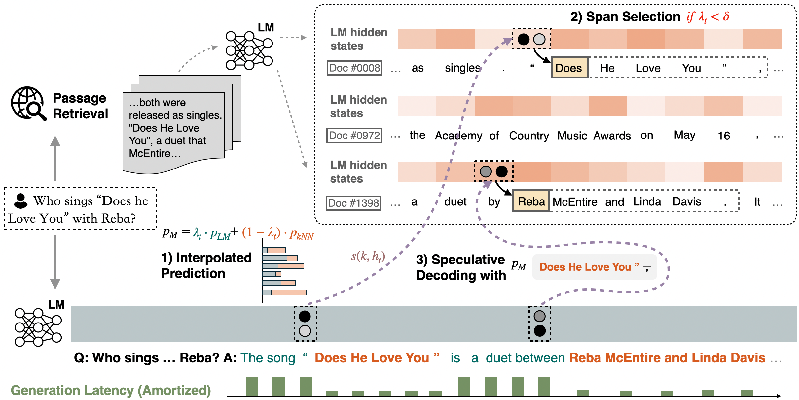
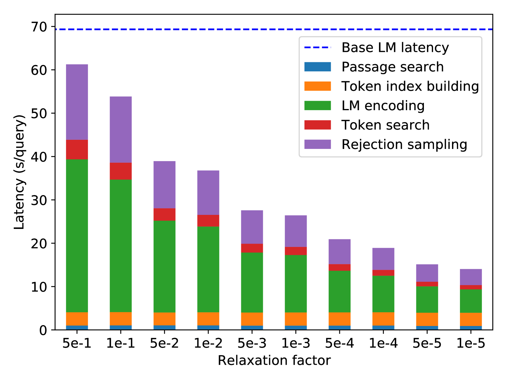
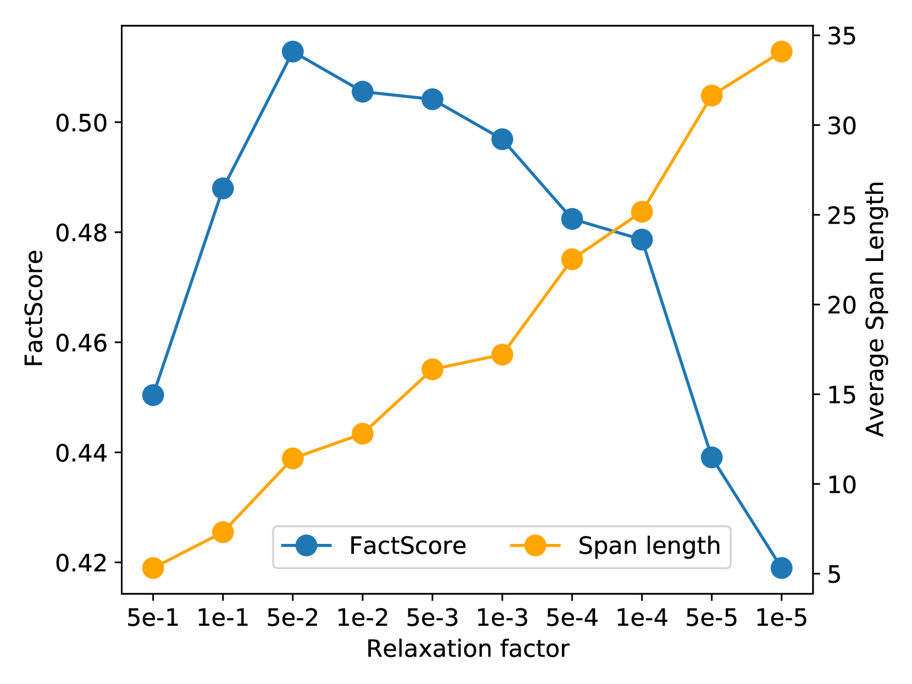
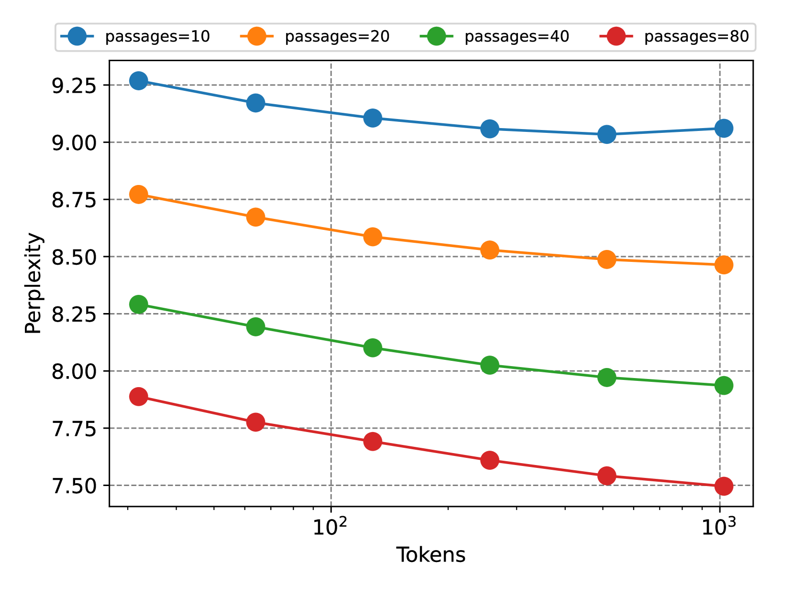
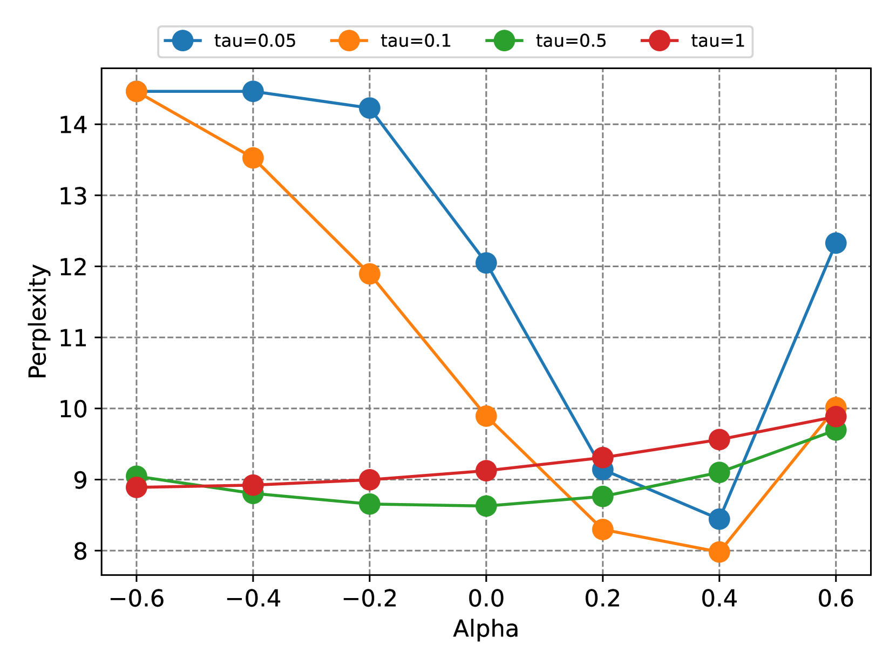
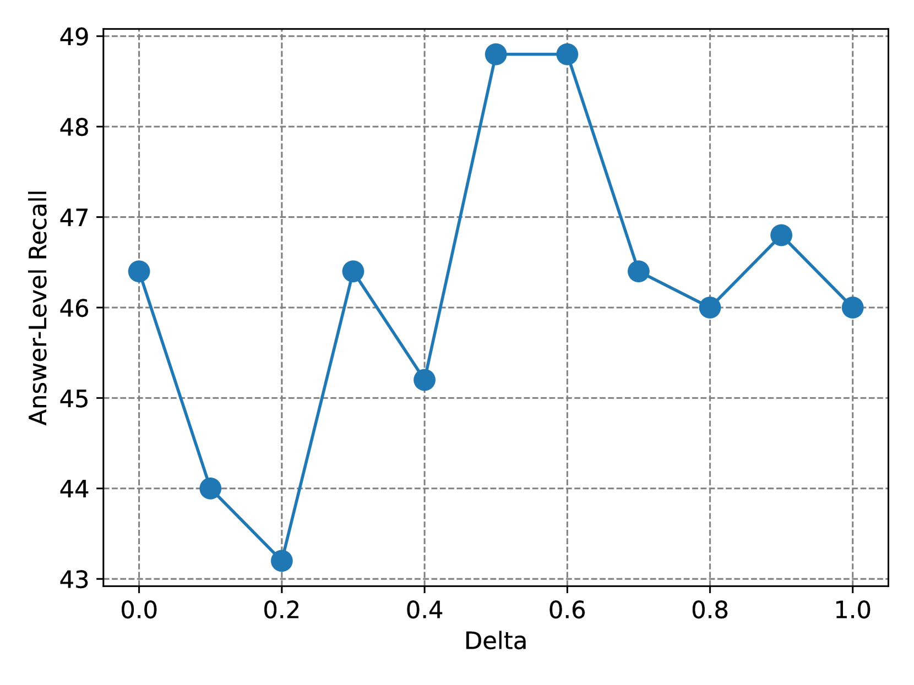

# 大型语言模型生成与归属的最近邻推测解码法

发布时间：2024年05月29日

`RAG

理由：这篇论文介绍了一种名为“最近邻推测解码（NEST）”的技术，该技术通过在推理过程中进行令牌级检索，将真实文本片段融入模型生成，并明确来源。这种方法特别强调了在生成过程中结合检索到的信息，以提高生成质量和归属准确性。这与RAG（Retrieval-Augmented Generation）模型的概念相符，即通过检索增强生成过程。此外，NEST技术还优化了生成速度，这与RAG模型旨在提高效率和效果的目标一致。因此，这篇论文最适合归类为RAG。` `知识检索`

> Nearest Neighbor Speculative Decoding for LLM Generation and Attribution

# 摘要

> 大型语言模型（LLMs）常出现幻觉且难以提供生成内容的来源。半参数模型如kNN-LM尝试通过在非参数数据存储中寻找最邻近匹配来优化输出，但往往导致推理缓慢且文本不流畅。本文提出的最近邻推测解码（NEST）技术，能将任意长度的真实文本片段融入模型生成，并明确来源。NEST在每一步推理中进行令牌级检索，计算混合分布并寻找语料库中的潜在延续。通过近似推测解码，NEST既可接受检索片段前缀，也可生成新令牌。这一技术显著提升了LLMs在多类知识任务中的生成质量与归属准确性，超越了传统kNN-LM，并在上下文检索增强方面表现出色。此外，NEST还大幅加快了生成速度，为Llama-2-Chat 70B带来了1.8倍的推理加速。

> Large language models (LLMs) often hallucinate and lack the ability to provide attribution for their generations. Semi-parametric LMs, such as kNN-LM, approach these limitations by refining the output of an LM for a given prompt using its nearest neighbor matches in a non-parametric data store. However, these models often exhibit slow inference speeds and produce non-fluent texts. In this paper, we introduce Nearest Neighbor Speculative Decoding (NEST), a novel semi-parametric language modeling approach that is capable of incorporating real-world text spans of arbitrary length into the LM generations and providing attribution to their sources. NEST performs token-level retrieval at each inference step to compute a semi-parametric mixture distribution and identify promising span continuations in a corpus. It then uses an approximate speculative decoding procedure that accepts a prefix of the retrieved span or generates a new token. NEST significantly enhances the generation quality and attribution rate of the base LM across a variety of knowledge-intensive tasks, surpassing the conventional kNN-LM method and performing competitively with in-context retrieval augmentation. In addition, NEST substantially improves the generation speed, achieving a 1.8x speedup in inference time when applied to Llama-2-Chat 70B.

[Arxiv](https://arxiv.org/abs/2405.19325)