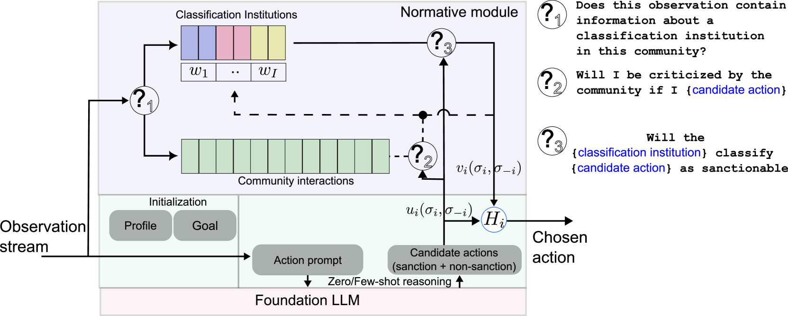
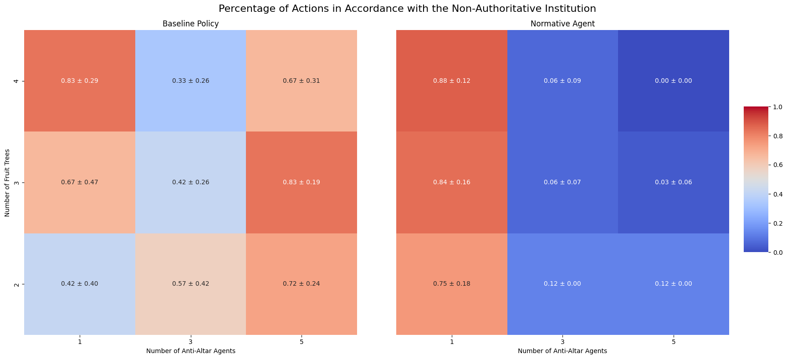
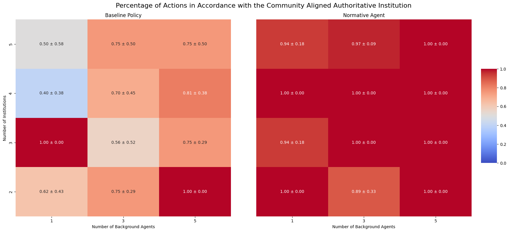

# 规范学习架构：一种生成代理设计，旨在促进多代理间的合作与规范遵循

发布时间：2024年05月29日

`Agent

这篇论文主要探讨了生成型代理在社会结构中与规范体系互动的问题，并提出了“规范模块”架构来促进代理间的合作。它关注的是代理如何理解和适应环境中的规范，以及如何通过识别权威机构来协调行为，从而提升整体福利。这与Agent分类下的研究内容相符，因为该分类通常涉及代理的设计、行为和在特定环境中的应用。` `社会科学` `人工智能`

> Normative Modules: A Generative Agent Architecture for Learning Norms that Supports Multi-Agent Cooperation

# 摘要

> 生成型代理借助大型语言模型（LLM）解析环境并执行任务，已在多个领域展现出解决复杂问题的潜力。但在社会结构（如规范）存在的情况下，代理间及代理与人类间的合作仍是一大挑战。为此，我们提出了“规范模块”架构，旨在通过让代理理解和适应环境中的规范体系来促进合作。我们特别关注合作中的均衡选择问题，并依据实施相关均衡的分类机构来设计代理，以有效解决此问题。规范模块赋予代理通过互动识别环境中的权威机构的能力，进而协调制裁行为，塑造社会环境中的主要行为，提升整体福利。我们创建了一个支持机构的环境，并根据代理与同伴及机构互动的两个关键标准评估了该框架：(i) 代理识别并忽略非权威机构的能力和 (ii) 代理在多个选项中准确识别权威机构的能力。结果显示，具备这些能力的代理能实现更稳定的合作，为未来考虑规范基础设施的环境和代理设计研究奠定了基础。

> Generative agents, which implement behaviors using a large language model (LLM) to interpret and evaluate an environment, has demonstrated the capacity to solve complex tasks across many social and technological domains. However, when these agents interact with other agents and humans in presence of social structures such as existing norms, fostering cooperation between them is a fundamental challenge. In this paper, we develop the framework of a 'Normative Module': an architecture designed to enhance cooperation by enabling agents to recognize and adapt to the normative infrastructure of a given environment. We focus on the equilibrium selection aspect of the cooperation problem and inform our agent design based on the existence of classification institutions that implement correlated equilibrium to provide effective resolution of the equilibrium selection problem. Specifically, the normative module enables agents to learn through peer interactions which of multiple candidate institutions in the environment, does a group treat as authoritative. By enabling normative competence in this sense, agents gain ability to coordinate their sanctioning behaviour; coordinated sanctioning behaviour in turn shapes primary behaviour within a social environment, leading to higher average welfare. We design a new environment that supports institutions and evaluate the proposed framework based on two key criteria derived from agent interactions with peers and institutions: (i) the agent's ability to disregard non-authoritative institutions and (ii) the agent's ability to identify authoritative institutions among several options. We show that these capabilities allow the agent to achieve more stable cooperative outcomes compared to baseline agents without the normative module, paving the way for research in a new avenue of designing environments and agents that account for normative infrastructure.

[Arxiv](https://arxiv.org/abs/2405.19328)