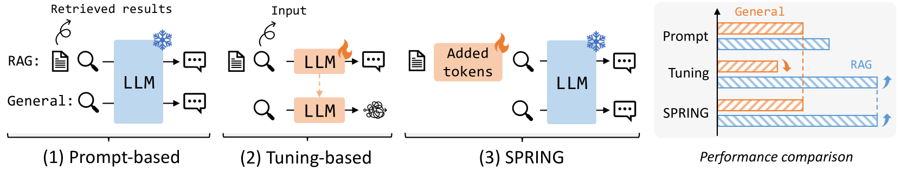
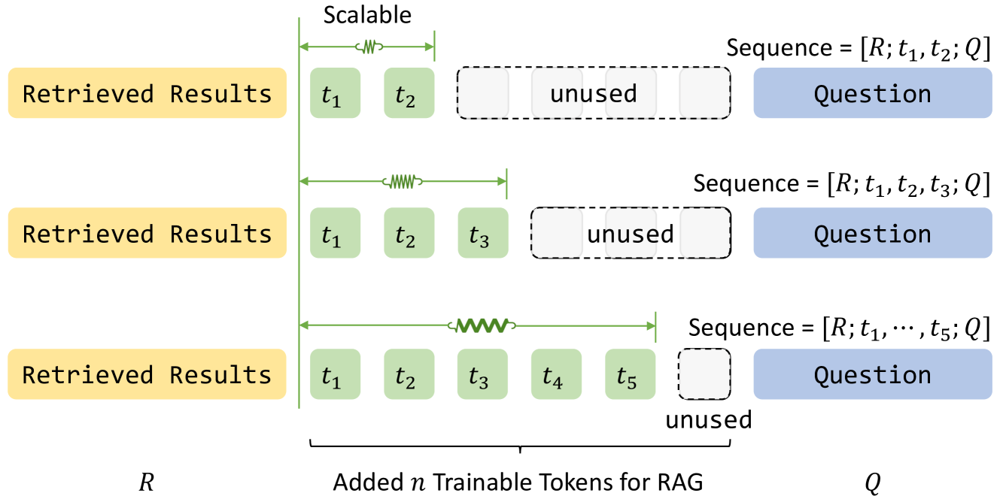
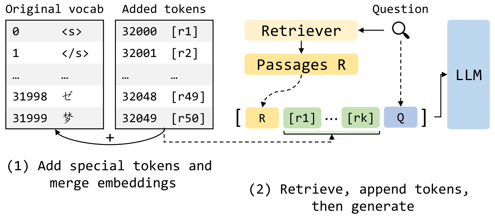
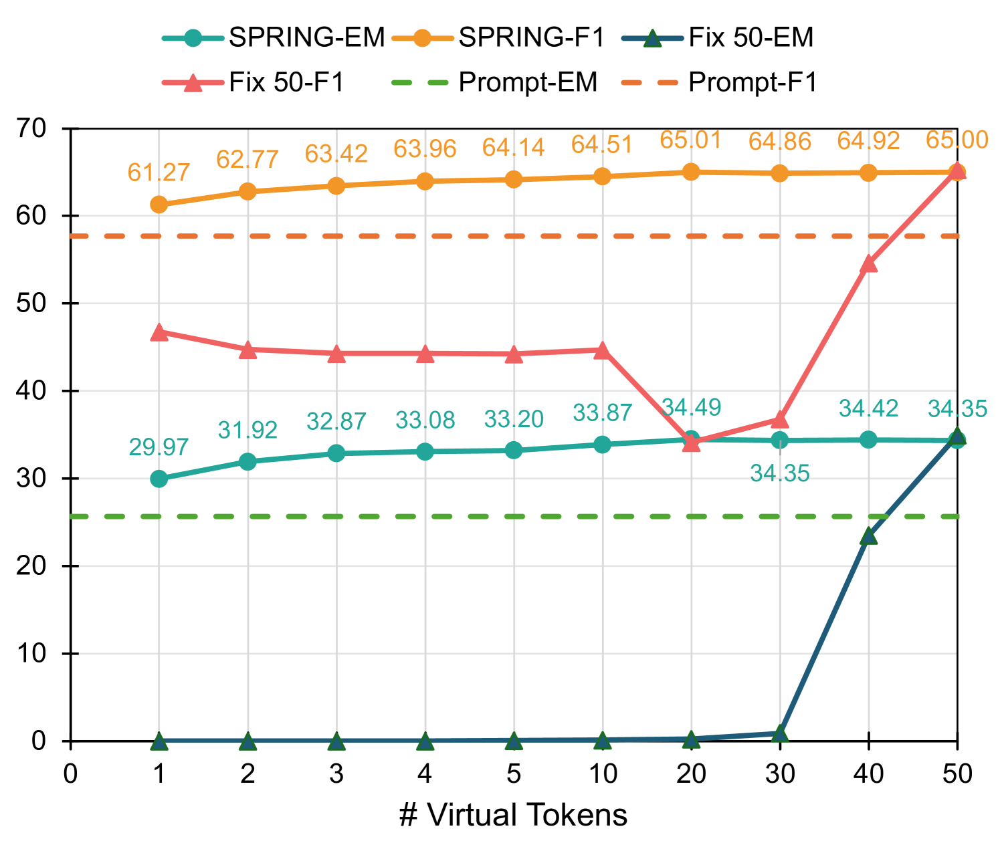
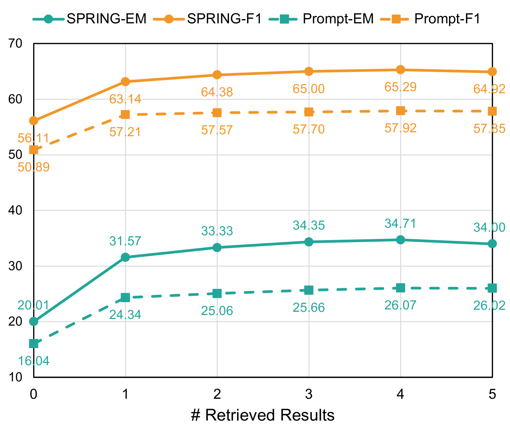

# 一标记之力！探索可扩展与可插拔的虚拟标记，助力大型语言模型检索增强。

发布时间：2024年05月29日

`RAG

这篇论文主要探讨了检索增强生成（RAG）技术在大型语言模型（LLMs）中的应用，提出了一种新的方法来优化LLMs在RAG环境下的性能，同时保持其通用生成能力。这种方法通过微调可插拔令牌的嵌入来实现，而不改变LLMs的原始参数。因此，这篇论文的内容与RAG技术紧密相关，适合归类为RAG。` `问答系统`

> One Token Can Help! Learning Scalable and Pluggable Virtual Tokens for Retrieval-Augmented Large Language Models

# 摘要

> 检索增强生成（RAG）为大型语言模型（LLMs）提供了一种创新途径，使其生成的内容更加真实、精确且紧跟时代。现有技术或是通过优化提示引导LLMs利用检索信息，或是直接对LLMs进行微调以适应RAG环境。虽然微调能提升性能，但往往牺牲了LLMs的通用生成能力，因为这涉及到修改其参数。这一局限在实际应用中尤为突出，尤其是当LLMs已部署时，参数调整可能影响其原有功能。为此，我们提出了一种新方法，即学习可扩展且可插拔的虚拟令牌用于RAG。我们保持LLMs的原始参数不变，仅微调这些可插拔令牌的嵌入，这样既提升了LLMs的性能，又保留了其通用生成能力。此外，我们还设计了多种训练策略，以增强方法的可扩展性、灵活性和泛化性。在九项问答任务上的广泛实验表明，我们的方法表现卓越。

> Retrieval-augmented generation (RAG) is a promising way to improve large language models (LLMs) for generating more factual, accurate, and up-to-date content. Existing methods either optimize prompts to guide LLMs in leveraging retrieved information or directly fine-tune the LLMs to adapt to RAG scenarios. Although fine-tuning can yield better performance, it often compromises the LLMs' general generation capabilities by modifying their parameters. This limitation poses challenges in practical applications, especially when LLMs are already deployed, as parameter adjustments may affect their original functionality. To address this, we propose a novel method that involves learning scalable and pluggable virtual tokens for RAG. By maintaining the LLMs' original parameters and fine-tuning only the embeddings of these pluggable tokens, our approach not only enhances LLMs' performance but also preserves their general generation capacities. Furthermore, we design several training strategies to improve the scalability, flexibility, and generalizability of our method. Comprehensive experiments across nine question-answering tasks demonstrate the superiority of our approach.

[Arxiv](https://arxiv.org/abs/2405.19670)