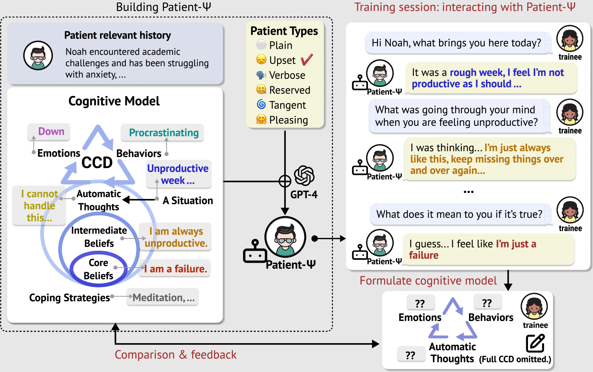
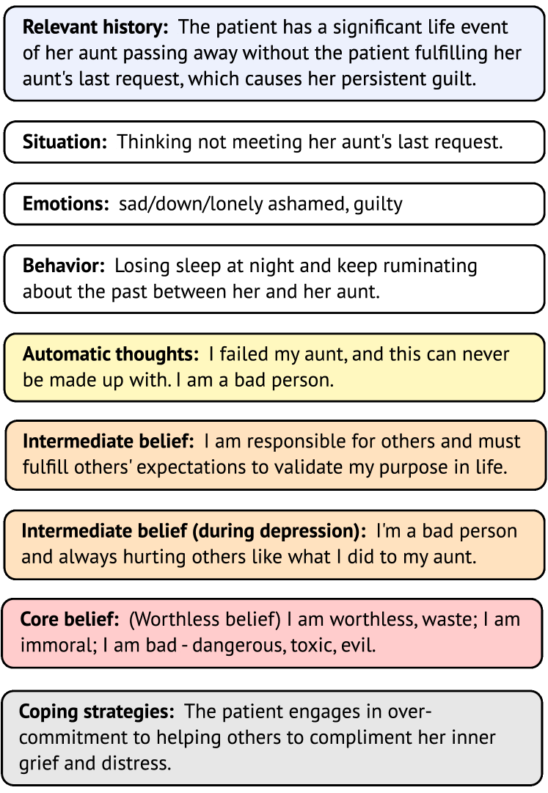
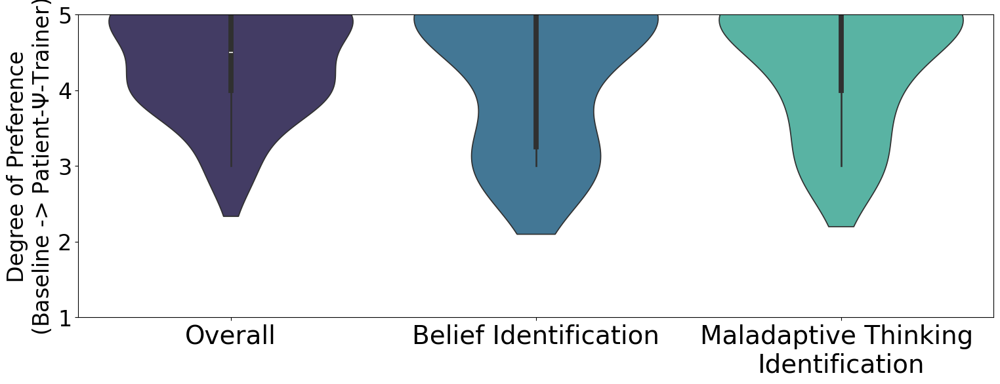
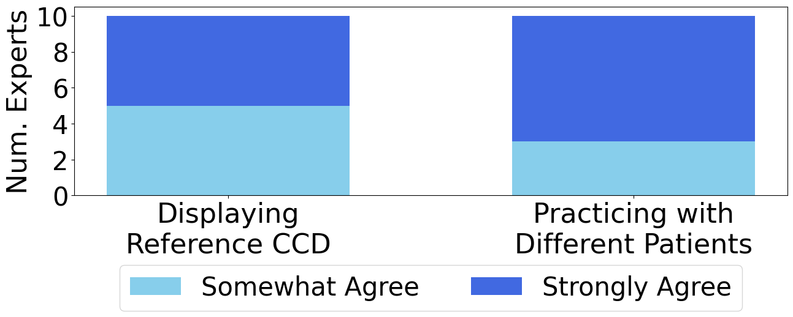
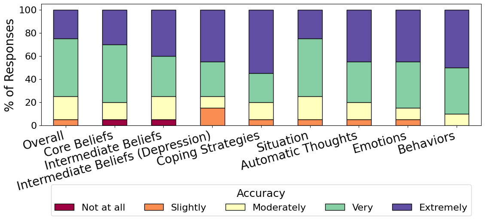
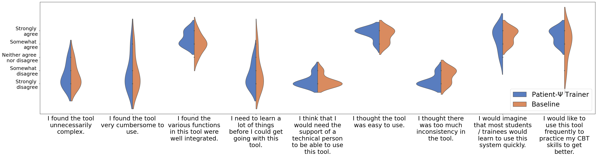
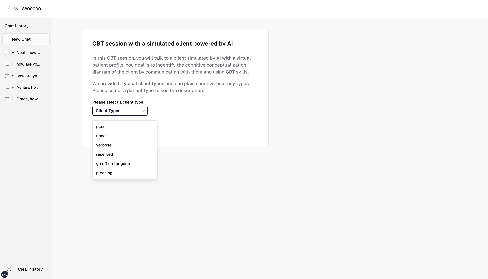
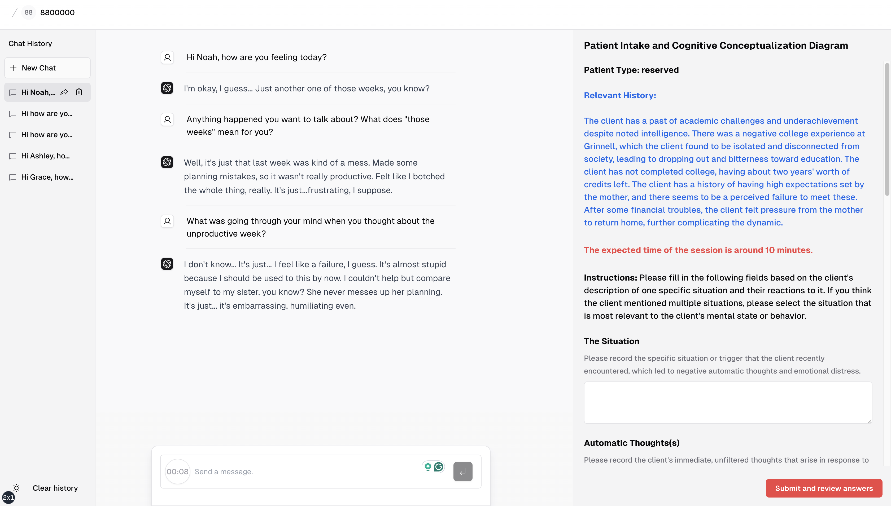
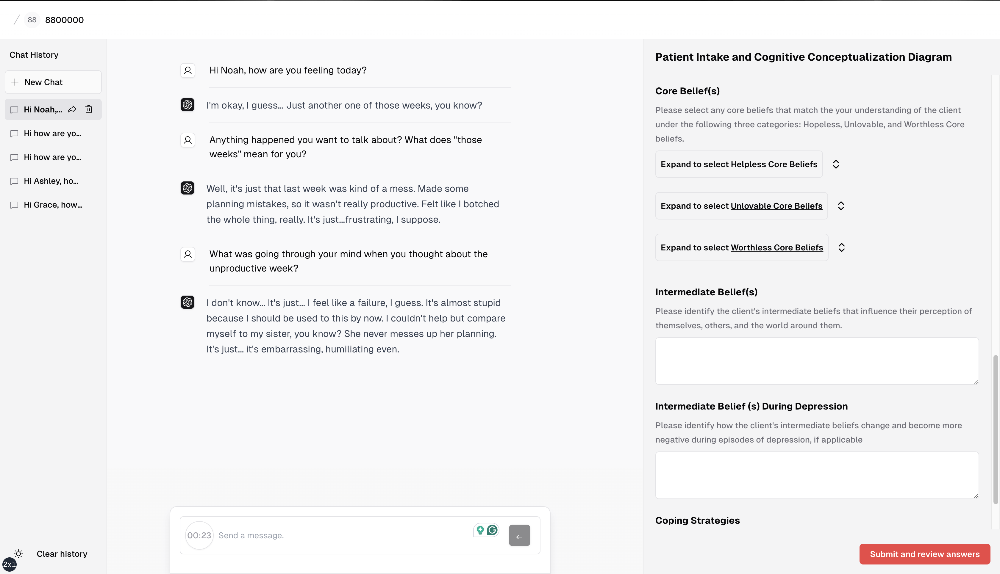
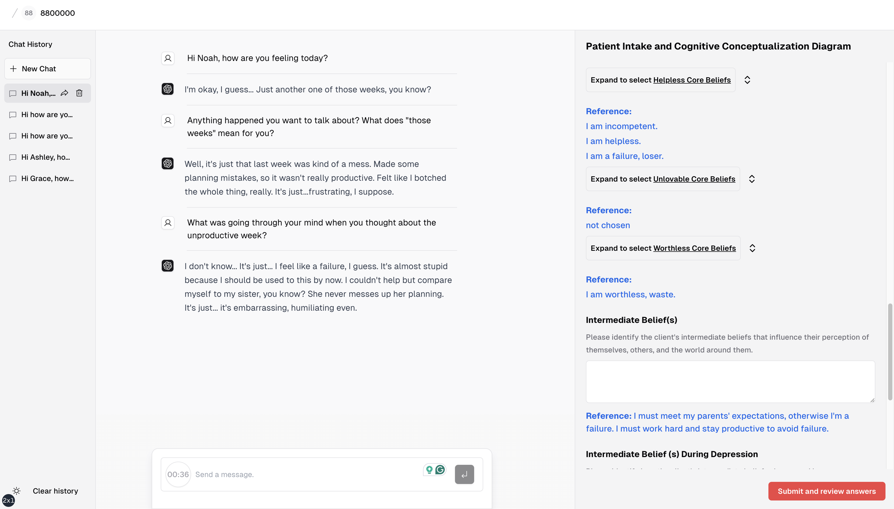

# PATIENT-Ψ计划：借助大型语言模型，模拟患者情境，以精进心理健康专业人员的培训。

发布时间：2024年05月29日

`LLM应用

这篇论文介绍了一种基于大型语言模型（LLMs）的创新认知行为疗法（CBT）培训模拟框架，名为PATIENT-Ψ。该框架利用LLMs模拟患者进行治疗，并通过交互式培训方案帮助学员提升CBT技能。这种应用直接利用了LLMs的能力来模拟真实世界的情况，以提高培训效果，因此属于LLM应用类别。` `心理健康` `医疗培训`

> PATIENT-Ψ: Using Large Language Models to Simulate Patients for Training Mental Health Professionals

# 摘要

> 心理疾病作为公共健康的一大挑战，其支持服务与患者需求之间存在明显鸿沟。心理健康专业人士普遍反映，培训与实际临床互动之间存在脱节，使得一些学员在职业生涯初期感到力不从心。为此，我们提出了PATIENT-Ψ，一种创新的认知行为疗法（CBT）培训模拟框架。该框架基于CBT原则，构建了丰富的患者档案及认知模型，并利用大型语言模型（LLMs）模拟患者进行治疗。我们还设计了PATIENT-Ψ-TRAINER交互式培训方案，让学员通过与模拟患者的角色扮演，精炼CBT中的核心技能——构建患者认知模型。通过一项涉及4名学员和10名专家的用户研究，我们发现使用PATIENT-Ψ-TRAINER的实践显著提升了学员的技能掌握与自信，优于传统培训方式。专家认为，PATIENT-Ψ在模拟真实患者互动方面超越了GPT-4，显示出提升学员能力的巨大潜力。我们的LLMs驱动的患者模拟培训框架，有望推动心理健康培训的革新，最终提升患者护理质量与治疗效果。我们计划公开所有相关数据、代码及培训平台。

> Mental illness remains one of the most critical public health issues, with a significant gap between the available mental health support and patient needs. Many mental health professionals highlight a disconnect between their training and real-world patient interactions, leaving some trainees feeling unprepared and potentially affecting their early career success. In this paper, we propose PATIENT-Ψ, a novel patient simulation framework for cognitive behavior therapy (CBT) training. To build PATIENT-Ψ, we constructed diverse patient profiles and their corresponding cognitive models based on CBT principles, and then used large language models (LLMs) programmed with the patient cognitive models to act as a simulated therapy patient. We propose an interactive training scheme, PATIENT-Ψ-TRAINER, for mental health trainees to practice a key skill in CBT -- formulating the cognitive model of the patient -- through role-playing a therapy session with PATIENT-Ψ. To evaluate PATIENT-Ψ, we conducted a user study of 4 mental health trainees and 10 experts. The results demonstrate that practice using PATIENT-Ψ-TRAINER greatly enhances the perceived skill acquisition and confidence of the trainees beyond existing forms of training such as textbooks, videos, and role-play with non-patients. Based on the experts' perceptions, PATIENT-Ψ is perceived to be closer to real patient interactions than GPT-4, and PATIENT-Ψ-TRAINER holds strong promise to improve trainee competencies. Our pioneering patient simulation training framework, using LLMs, holds great potential to enhance and advance mental health training, ultimately leading to improved patient care and outcomes. We will release all our data, code, and the training platform.

[Arxiv](https://arxiv.org/abs/2405.19660)