# PathReasoner：通过等价扩展构建推理路径，精准解答逻辑问题

发布时间：2024年05月29日

`Agent

这篇论文主要介绍了一种名为 PathReasoner 的架构，该架构专门设计用于解决逻辑推理任务。它通过将逻辑推理任务转化为推理路径，并引入新的策略和模型设计来提高逻辑推理的性能。这种架构可以被视为一个智能代理（Agent），因为它能够处理特定的任务（逻辑推理）并展现出强大的泛化能力。因此，这篇论文更适合归类到Agent分类中。` `逻辑推理` `人工智能`

> PathReasoner: Modeling Reasoning Path with Equivalent Extension for Logical Question Answering

# 摘要

> 逻辑推理任务自提出以来便备受瞩目，然而，即便是如ChatGPT和PaLM 2这样的大型语言模型，面对此类任务时表现依旧不尽人意。以往有潜力的语言模型在逻辑一致性和结构感知方面遭遇挑战。为此，我们创新性地将逻辑推理任务转化为推理路径，并推出了名为\textbf{PathReasoner}的架构，该架构从数据和模型双重视角出发解决问题。为了丰富逻辑样本的多样性，我们引入了基于等价逻辑公式的原子扩展策略，创造新的推理路径。在模型设计上，我们构建了一系列transformer风格的模块，并特别设计了路径注意力模块，利用高阶扩散策略联合处理原子内与原子间的关系。实验结果显示，PathReasoner在两个逻辑推理基准测试中表现卓越，并展现出强大的泛化能力。

> Logical reasoning task has attracted great interest since it was proposed. Faced with such a task, current competitive models, even large language models (e.g., ChatGPT and PaLM 2), still perform badly. Previous promising LMs struggle in logical consistency modeling and logical structure perception. To this end, we model the logical reasoning task by transforming each logical sample into reasoning paths and propose an architecture \textbf{PathReasoner}. It addresses the task from the views of both data and model. To expand the diversity of the logical samples, we propose an atom extension strategy supported by equivalent logical formulas, to form new reasoning paths. From the model perspective, we design a stack of transformer-style blocks. In particular, we propose a path-attention module to joint model in-atom and cross-atom relations with the high-order diffusion strategy. Experiments show that PathReasoner achieves competitive performances on two logical reasoning benchmarks and great generalization abilities.

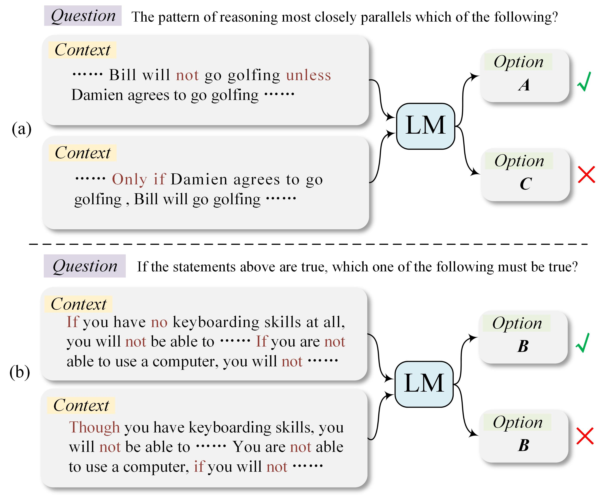

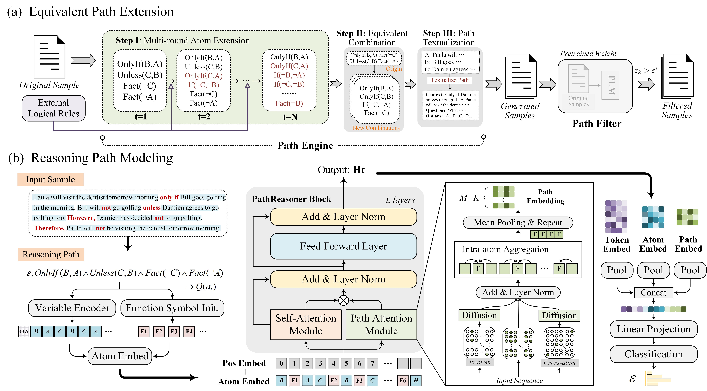

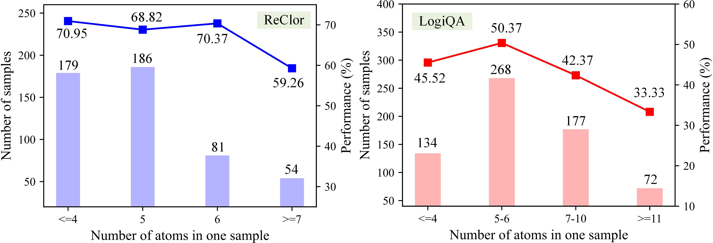

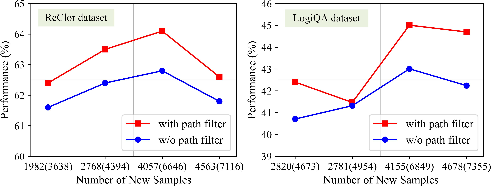

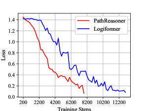

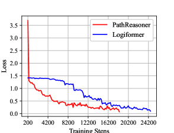

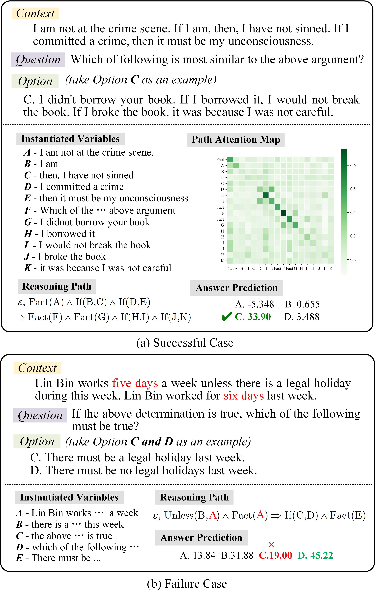

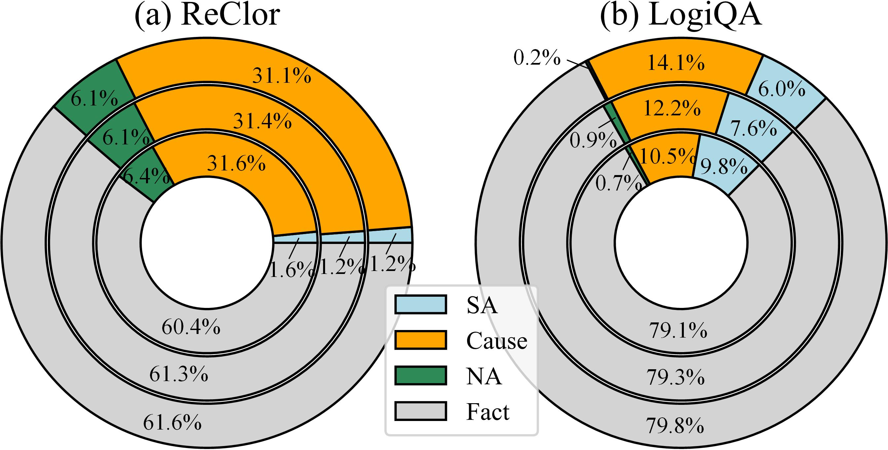

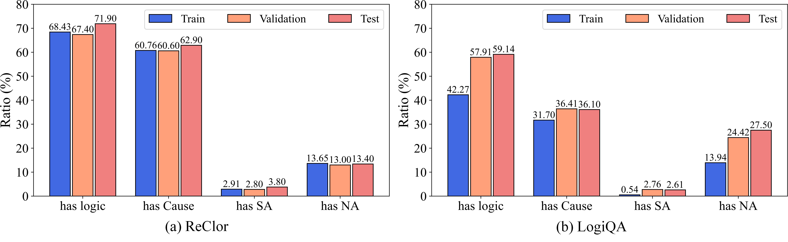

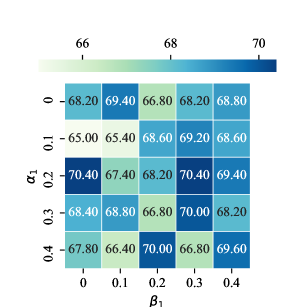

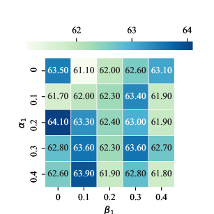

[Arxiv](https://arxiv.org/abs/2405.19109)