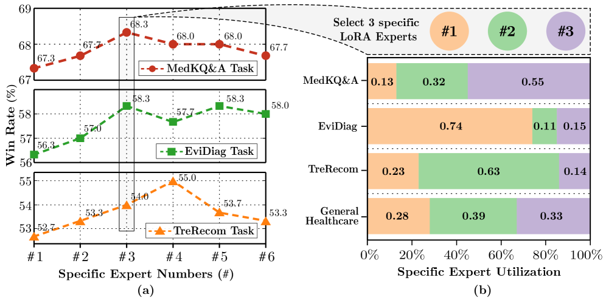
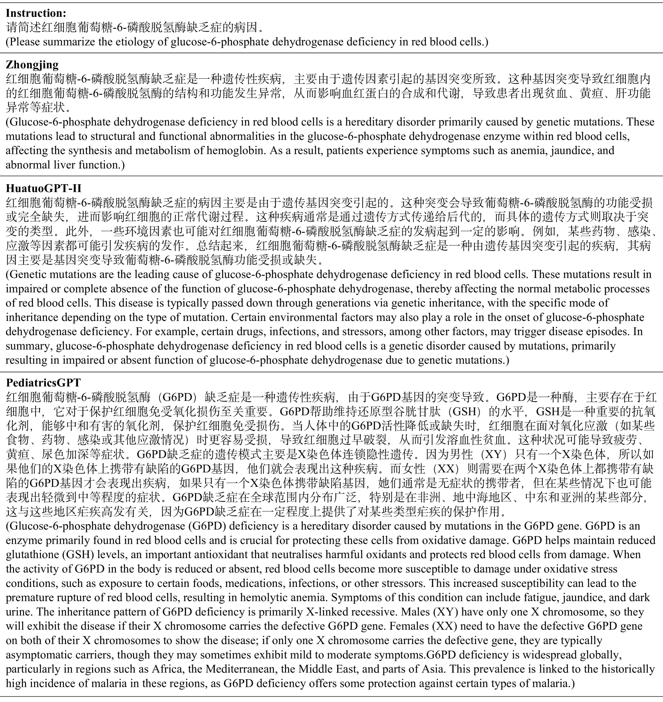

# PediatricsGPT：大型语言模型在儿科领域中担任中文医疗助手的新角色

发布时间：2024年05月29日

`LLM应用

这篇论文介绍了一个专门针对儿科领域的中文大型语言模型（LLM）助手PediatricsGPT的开发。论文中提到了创建一个高质量的数据集PedCorpus，并基于此数据集开发了PediatricsGPT。该模型通过混合指导预训练机制和全参数监督微调（SFT）来整合医学知识，并优化了生成人文响应的能力。此外，论文还提到了该模型在多个医生下游任务中的表现超越了以往的中文医学LLMs，并计划将其开源以供社区进一步发展。这些内容表明该论文主要关注于LLM在特定应用领域（儿科咨询系统）的实际应用和改进，因此属于LLM应用分类。` `儿科医疗` `智能咨询系统`

> PediatricsGPT: Large Language Models as Chinese Medical Assistants for Pediatric Applications

# 摘要

> 开发智能儿科咨询系统，尤其是在医疗资源紧缺的中国，前景广阔。尽管中文医学领域的大型语言模型（LLMs）有所进步，但儿科应用中因指导数据不足和训练脆弱，表现仍不尽人意。为此，我们创建了PedCorpus，一个包含30万条多任务指导的高质量数据集，涵盖儿科教科书、指南及知识图谱，以应对多样诊断需求。基于此，我们推出了PediatricsGPT，首个系统稳健的中文儿科LLM助手。通过混合指导预训练机制，我们缓解了医学领域适应中LLMs的知识不一致问题，并利用全参数监督微调（SFT）整合通用医学知识。进一步，我们优化了生成儿科医生式人文响应的直接跟随偏好。在二次SFT阶段，我们采用通用-特定专家混合策略，平衡医学通才与儿科专业知识。广泛评估显示，PediatricsGPT在多个医生下游任务中超越了以往的中文医学LLMs，并将开源供社区进一步发展。

> Developing intelligent pediatric consultation systems offers promising prospects for improving diagnostic efficiency, especially in China, where healthcare resources are scarce. Despite recent advances in Large Language Models (LLMs) for Chinese medicine, their performance is sub-optimal in pediatric applications due to inadequate instruction data and vulnerable training procedures. To address the above issues, this paper builds PedCorpus, a high-quality dataset of over 300,000 multi-task instructions from pediatric textbooks, guidelines, and knowledge graph resources to fulfil diverse diagnostic demands. Upon well-designed PedCorpus, we propose PediatricsGPT, the first Chinese pediatric LLM assistant built on a systematic and robust training pipeline. In the continuous pre-training phase, we introduce a hybrid instruction pre-training mechanism to mitigate the internal-injected knowledge inconsistency of LLMs for medical domain adaptation. Immediately, the full-parameter Supervised Fine-Tuning (SFT) is utilized to incorporate the general medical knowledge schema into the models. After that, we devise a direct following preference optimization to enhance the generation of pediatrician-like humanistic responses. In the parameter-efficient secondary SFT phase, a mixture of universal-specific experts strategy is presented to resolve the competency conflict between medical generalist and pediatric expertise mastery. Extensive results based on the metrics, GPT-4, and doctor evaluations on distinct doctor downstream tasks show that PediatricsGPT consistently outperforms previous Chinese medical LLMs. Our model and dataset will be open-source for community development.

[Arxiv](https://arxiv.org/abs/2405.19266)