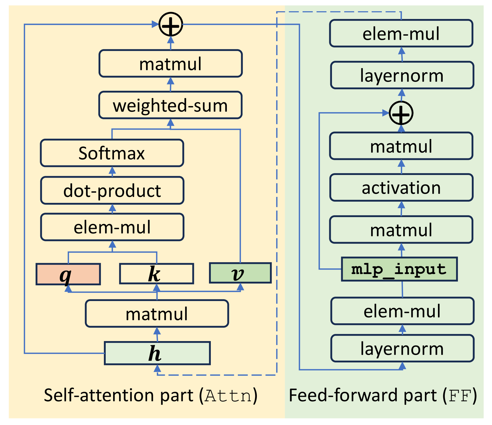
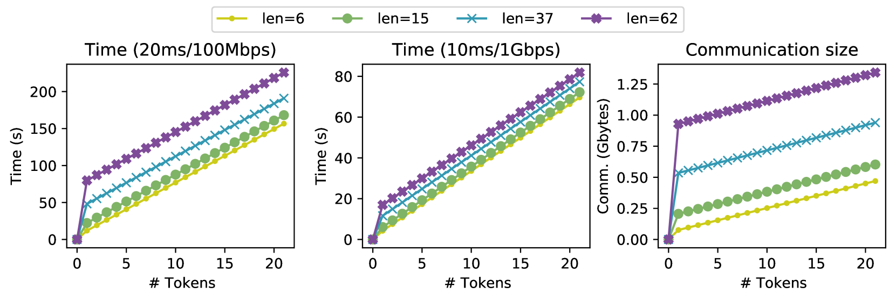

# PermLLM：广域网环境下，3秒内实现大型语言模型的隐私保护推理

发布时间：2024年05月29日

`LLM应用

解析：这篇论文主要讨论了大型语言模型（LLM）在隐私保护方面的应用，特别是通过开发名为PermLLM的新方法来提高安全多方计算（MPC）的效率，以实现更快速的私有推理。这种方法通过安全随机排列和结合秘密共享协议与同态加密技术，显著减少了数据传输量和处理时间，从而提高了LLM在实际应用中的实用性。因此，这篇论文属于LLM应用类别，因为它关注的是LLM在实际应用中的具体问题和解决方案，而不是LLM的理论研究或Agent的设计与应用。` `隐私保护` `人工智能`

> PermLLM: Private Inference of Large Language Models within 3 Seconds under WAN

# 摘要

> ChatGPT的问世开启了大型语言模型（LLM）的新纪元。尽管LLMs在多个领域大放异彩，但其背后的隐私问题亦不容忽视——用户查询信息需传至模型提供商，而本地部署则可能泄露模型数据。现有基于安全多方计算（MPC）的方法虽能保护模型参数与用户查询的隐私，但数据传输量巨大，生成单个令牌耗时数分钟，实用性大打折扣。为此，我们研发了PermLLM，通过安全随机排列大幅提升非线性函数的评估速度。结合精简的秘密共享协议与同态加密技术，PermLLM在现实网络条件下（往返时间10毫秒，带宽1Gbps），实现了ChatGLM-6B模型的两方私有推理，每令牌处理时间缩短至约3秒，远超现有MPC方案的效率。

> The emergence of ChatGPT marks the arrival of the large language model (LLM) era. While LLMs demonstrate their power in a variety of fields, they also raise serious privacy concerns as the users' queries are sent to the model provider. On the other side, deploying the LLM on the user's device will also leak all the model data. Existing methods based on secure multiparty computation (MPC) managed to protect both the privacy of the model parameters and user queries. However, they require gigabytes of data transfer and several minutes to generate just one token, making them impractical for most real-world applications. To improve the efficiency of private LLM inference, we propose PermLLM, which accelerates the evaluation of non-linear functions using secure random permutation. Along with the optimized secret sharing protocols and homomorphic encryption, PermLLM achieves two-party private inference of the ChatGLM-6B model at the speed of around 3s/token, under a realistic network setting (10ms RTT and 1Gbps bandwidth), which is magnitudes faster than existing MPC solutions.

[Arxiv](https://arxiv.org/abs/2405.18744)