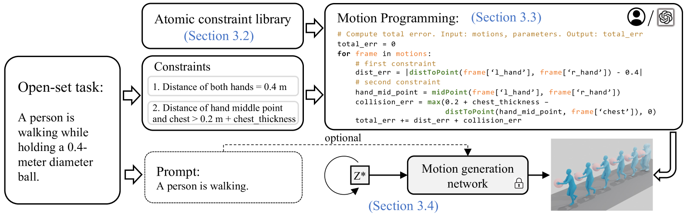
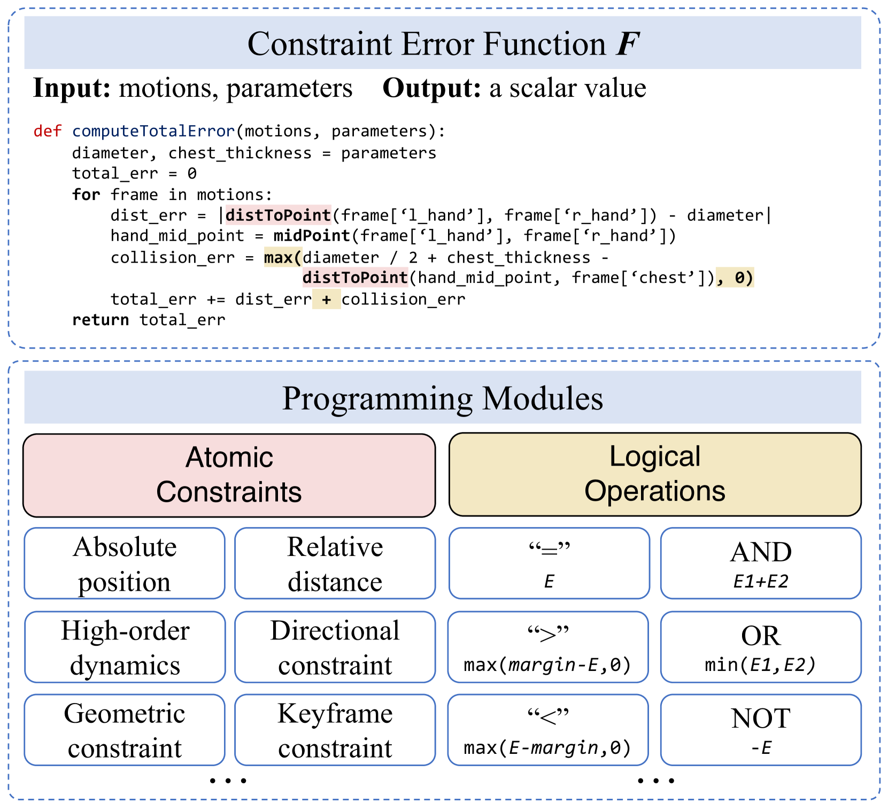
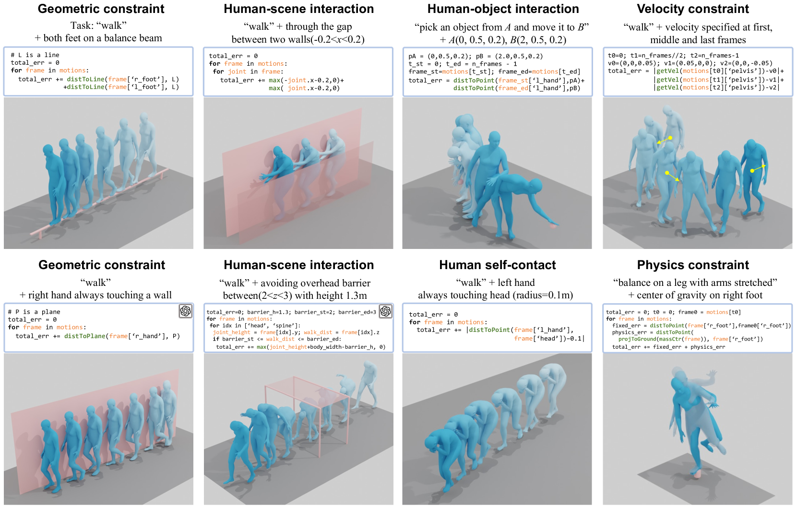
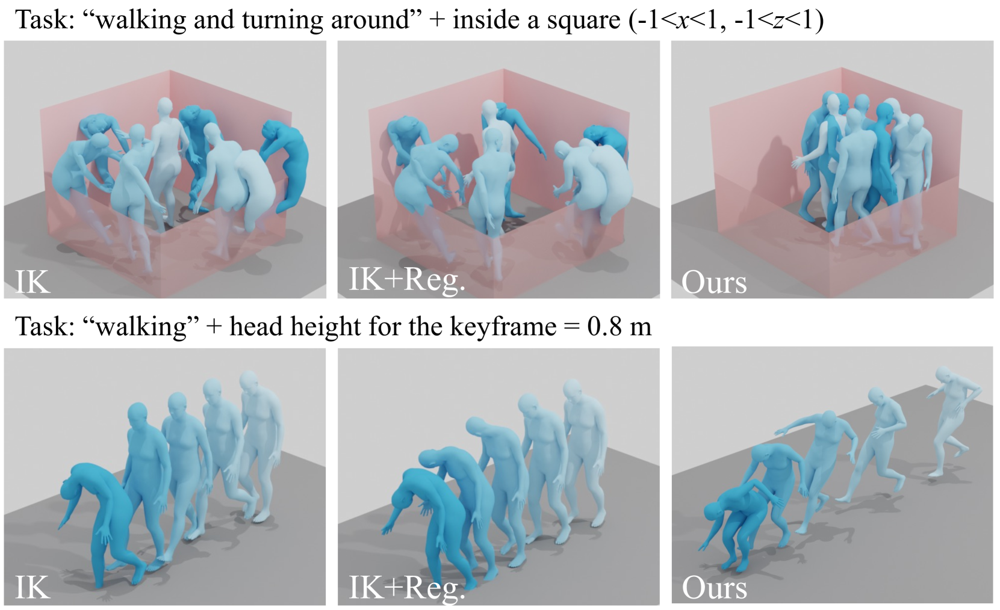
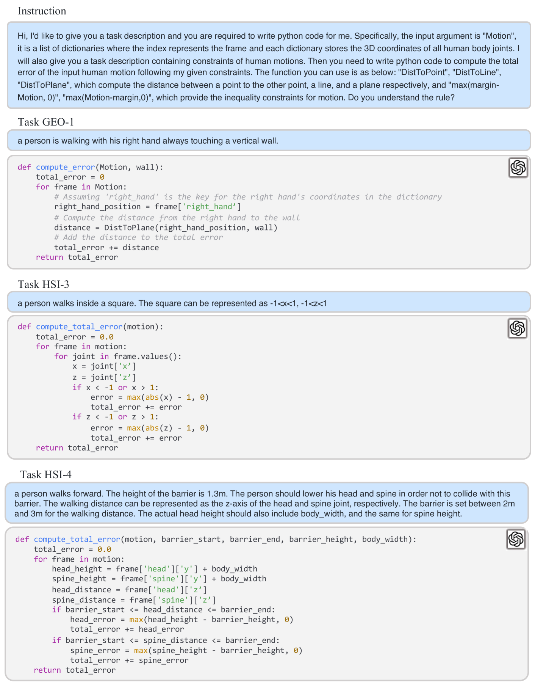

# 开放集运动控制任务的可编程运动生成

发布时间：2024年05月29日

`Agent

这篇论文主要探讨了在现实世界中制作角色动画时所面临的复杂运动控制问题，并提出了一种新的开放集运动控制方法。该方法通过将运动控制任务分解为原子约束的组合，并利用误差函数来量化这些约束的遵循程度，从而实现对预训练运动生成模型的优化。这种方法不仅能够处理各种未见过的任务，还能够发现新的技能，并通过大型语言模型实现自动编程。因此，这篇论文更符合Agent分类，因为它关注的是如何通过智能代理来解决复杂的运动控制问题，并展示了代理在处理开放集任务时的能力和潜力。` `动画制作` `人工智能`

> Programmable Motion Generation for Open-Set Motion Control Tasks

# 摘要

> 在现实世界中制作角色动画，需要考虑多种约束，如轨迹、关键帧和交互等。传统方法往往将这些约束单独处理，导致任务难以扩展或定制。我们称之为解决封闭集运动控制问题。面对实际运动控制的复杂性，我们提出了开放集运动控制问题，其特点是任务集合开放且完全可定制。为此，我们引入了可编程运动生成的新范式，将任何运动控制任务分解为原子约束的组合，并通过误差函数量化这些约束的遵循程度。我们使用预训练的运动生成模型，并通过优化其潜在代码来最小化误差，从而生成既符合模型先验又满足特定约束的高质量运动。实验证明，我们能有效处理各种未见过的任务，包括通过运动动力学、几何约束、物理定律以及与环境、物体或角色自身身体部分的交互进行运动控制，且无需专门的数据收集或网络设计。在此过程中，我们还发现了超越原有模型的新技能，并借助大型语言模型实现了自动编程。我们期望这项研究能为通用AI代理的运动控制开辟新路径。

> Character animation in real-world scenarios necessitates a variety of constraints, such as trajectories, key-frames, interactions, etc. Existing methodologies typically treat single or a finite set of these constraint(s) as separate control tasks. They are often specialized, and the tasks they address are rarely extendable or customizable. We categorize these as solutions to the close-set motion control problem. In response to the complexity of practical motion control, we propose and attempt to solve the open-set motion control problem. This problem is characterized by an open and fully customizable set of motion control tasks. To address this, we introduce a new paradigm, programmable motion generation. In this paradigm, any given motion control task is broken down into a combination of atomic constraints. These constraints are then programmed into an error function that quantifies the degree to which a motion sequence adheres to them. We utilize a pre-trained motion generation model and optimize its latent code to minimize the error function of the generated motion. Consequently, the generated motion not only inherits the prior of the generative model but also satisfies the required constraints. Experiments show that we can generate high-quality motions when addressing a wide range of unseen tasks. These tasks encompass motion control by motion dynamics, geometric constraints, physical laws, interactions with scenes, objects or the character own body parts, etc. All of these are achieved in a unified approach, without the need for ad-hoc paired training data collection or specialized network designs. During the programming of novel tasks, we observed the emergence of new skills beyond those of the prior model. With the assistance of large language models, we also achieved automatic programming. We hope that this work will pave the way for the motion control of general AI agents.

[Arxiv](https://arxiv.org/abs/2405.19283)