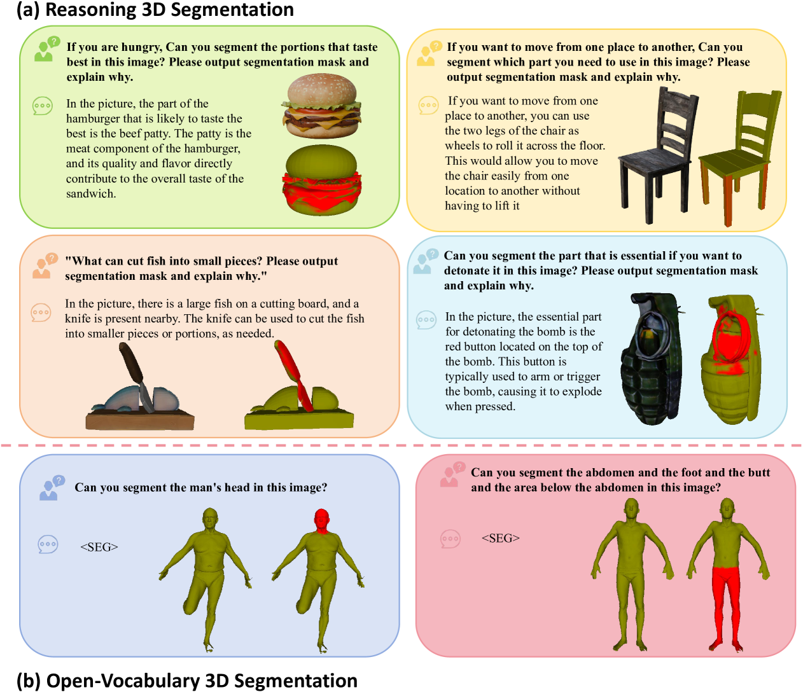
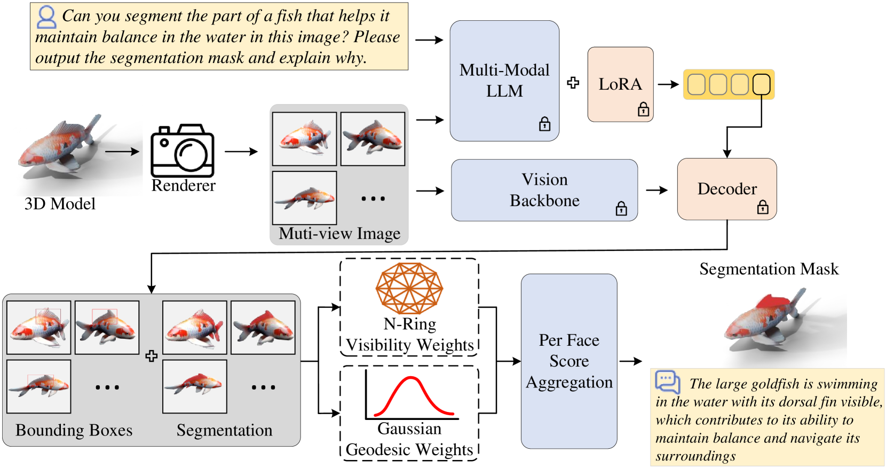
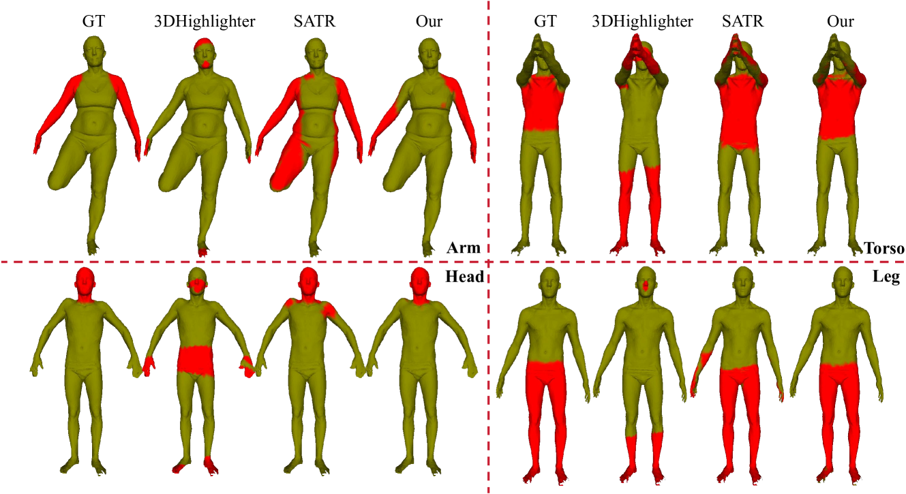
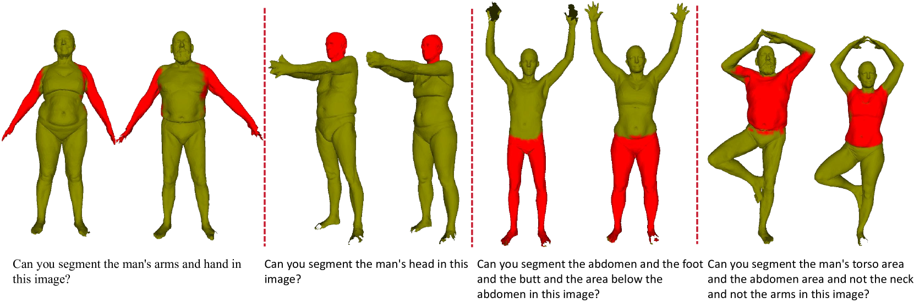
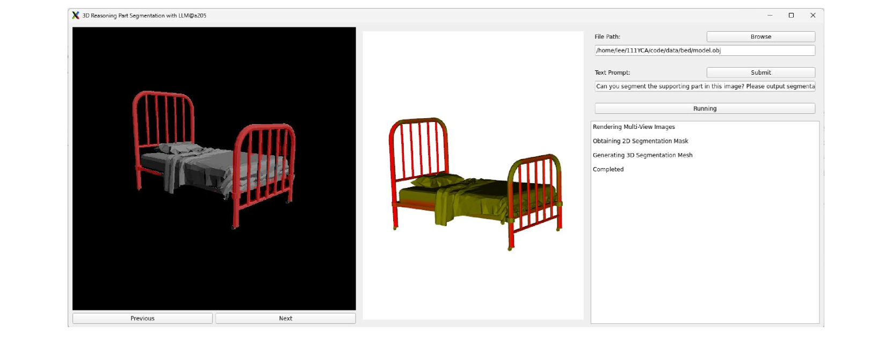
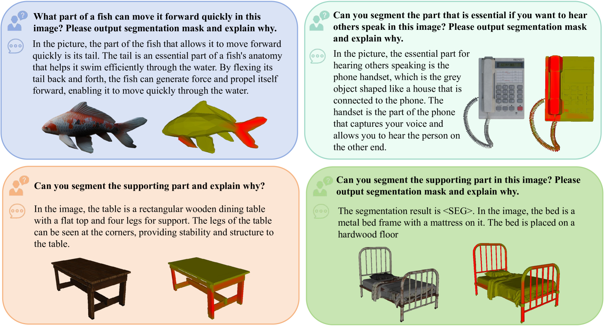

# Reasoning3D - 大型视觉-语言模型助力细粒度零-shot开放词汇3D推理部分分割，探索3D空间中的基础与推理。

发布时间：2024年05月29日

`LLM应用

理由：这篇论文介绍了一种基于预训练大型语言模型（LLM）的3D分割方法，该方法能够在零样本学习的情况下处理复杂的3D分割任务。这种方法利用了LLM的能力来理解和执行复杂命令，从而在3D网格中精确地分割特定部分。论文的重点在于应用LLM技术解决实际的3D分割问题，而不是探讨LLM的理论基础或Agent的设计，也不是关于检索增强生成（RAG）的研究。因此，它最适合归类为“LLM应用”。` `计算机视觉` `机器人技术`

> Reasoning3D -- Grounding and Reasoning in 3D: Fine-Grained Zero-Shot Open-Vocabulary 3D Reasoning Part Segmentation via Large Vision-Language Models

# 摘要

> 本文提出了一种新型3D分割任务——零样本3D推理分割，旨在搜索和定位对象部件，突破了传统3D分割的局限。我们开发的Reasoning3D基线方法，能理解并执行复杂命令，精确分割3D网格中的特定部分，并提供交互式分割的上下文感知和推理答案。该方法利用预训练的大型语言模型驱动的2D分割网络，以零样本方式处理用户查询。实验证明，我们的方法不仅通用，还能根据文本查询有效定位并突出显示3D对象的部件，适用于各种复杂场景。此外，我们的方法无需训练即可快速部署，为未来多领域的部件级3D对象理解研究提供了一个有潜力的通用基线。相关资源和评估细节请访问：http://tianrun-chen.github.io/Reason3D/。

> In this paper, we introduce a new task: Zero-Shot 3D Reasoning Segmentation for parts searching and localization for objects, which is a new paradigm to 3D segmentation that transcends limitations for previous category-specific 3D semantic segmentation, 3D instance segmentation, and open-vocabulary 3D segmentation. We design a simple baseline method, Reasoning3D, with the capability to understand and execute complex commands for (fine-grained) segmenting specific parts for 3D meshes with contextual awareness and reasoned answers for interactive segmentation. Specifically, Reasoning3D leverages an off-the-shelf pre-trained 2D segmentation network, powered by Large Language Models (LLMs), to interpret user input queries in a zero-shot manner. Previous research have shown that extensive pre-training endows foundation models with prior world knowledge, enabling them to comprehend complex commands, a capability we can harness to "segment anything" in 3D with limited 3D datasets (source efficient). Experimentation reveals that our approach is generalizable and can effectively localize and highlight parts of 3D objects (in 3D mesh) based on implicit textual queries, including these articulated 3d objects and real-world scanned data. Our method can also generate natural language explanations corresponding to these 3D models and the decomposition. Moreover, our training-free approach allows rapid deployment and serves as a viable universal baseline for future research of part-level 3d (semantic) object understanding in various fields including robotics, object manipulation, part assembly, autonomous driving applications, augment reality and virtual reality (AR/VR), and medical applications. The code, the model weight, the deployment guide, and the evaluation protocol are: http://tianrun-chen.github.io/Reason3D/

[Arxiv](https://arxiv.org/abs/2405.19326)