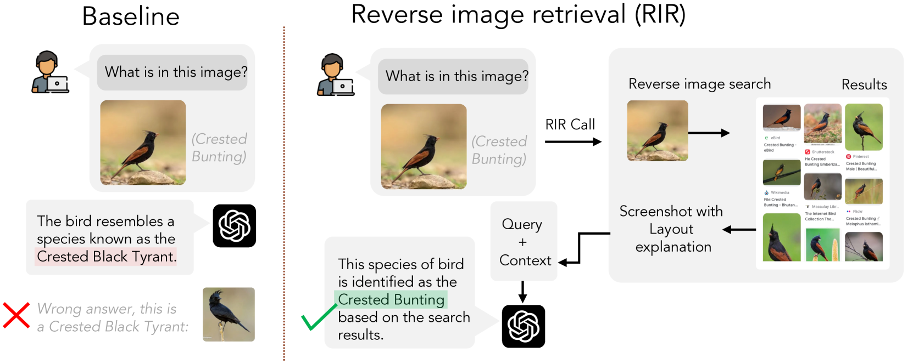
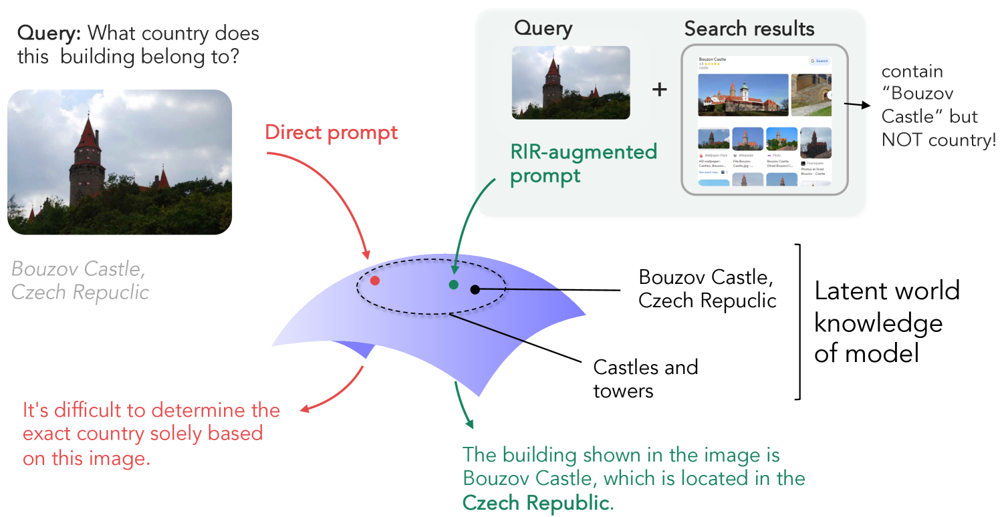
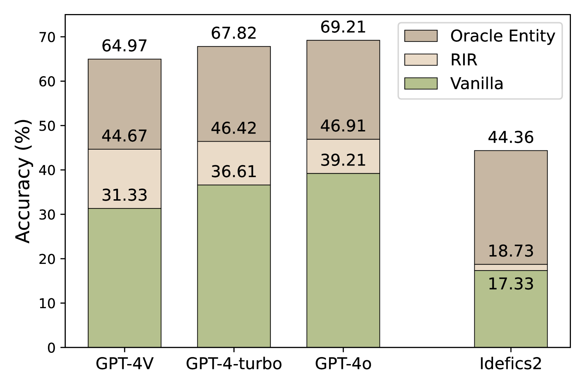
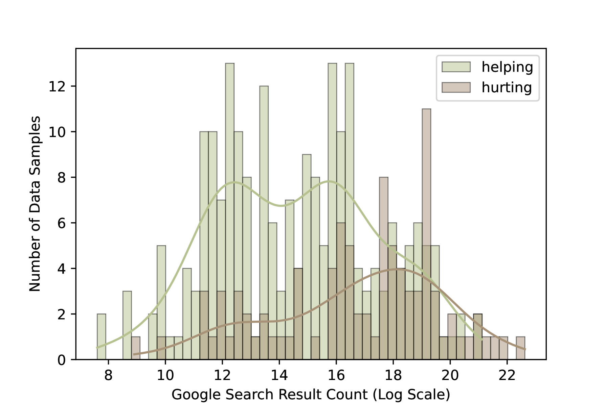
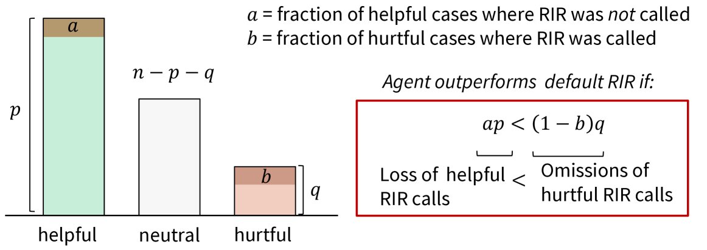

# 多模态大型语言模型中的反向图像检索激活参数记忆

发布时间：2024年05月29日

`RAG

理由：这篇论文介绍了一种增强多模态大型语言模型（MLLMs）性能的方法，即通过反向图像检索（RIR）来整合网络规模的反向图像搜索结果。这种方法可以被视为一种检索增强生成（RAG）技术，因为它通过引入外部信息（即图像检索结果）来改善模型的生成能力。RAG技术通常涉及使用外部知识源来增强语言模型的性能，这与论文中描述的方法相符。因此，将这篇论文归类为RAG是合适的。` `视觉问答` `知识密集型任务`

> Reverse Image Retrieval Cues Parametric Memory in Multimodal LLMs

# 摘要

> 尽管多模态大型语言模型（MLLMs）近期取得了显著进展，GPT-4系列等顶尖模型在处理知识密集型任务时仍显力不从心。为此，我们提出了一种简单而高效的策略——反向图像检索（RIR）增强生成，通过整合网络规模的反向图像搜索结果来强化MLLMs。实验表明，RIR在开放式视觉问答（VQA）评估中，显著提升了GPT-4V的性能37-43%，GPT-4 Turbo提升25-27%，GPT-4o提升18-20%。令人意外的是，RIR不仅增强了模型的视觉问答能力，还帮助模型更有效地调用其内部的世界知识。我们的研究表明，RIR通过提供额外的视觉和文本线索，间接促进了问题的解答。同时，我们也识别了RIR可能降低性能的场景，并进行了人类评估。最终，我们发现RIR的总体优势使得选择性使用RIR的策略难以超越默认启用RIR的方法。

> Despite impressive advances in recent multimodal large language models (MLLMs), state-of-the-art models such as from the GPT-4 suite still struggle with knowledge-intensive tasks. To address this, we consider Reverse Image Retrieval (RIR) augmented generation, a simple yet effective strategy to augment MLLMs with web-scale reverse image search results. RIR robustly improves knowledge-intensive visual question answering (VQA) of GPT-4V by 37-43%, GPT-4 Turbo by 25-27%, and GPT-4o by 18-20% in terms of open-ended VQA evaluation metrics. To our surprise, we discover that RIR helps the model to better access its own world knowledge. Concretely, our experiments suggest that RIR augmentation helps by providing further visual and textual cues without necessarily containing the direct answer to a query. In addition, we elucidate cases in which RIR can hurt performance and conduct a human evaluation. Finally, we find that the overall advantage of using RIR makes it difficult for an agent that can choose to use RIR to perform better than an approach where RIR is the default setting.

[Arxiv](https://arxiv.org/abs/2405.18740)