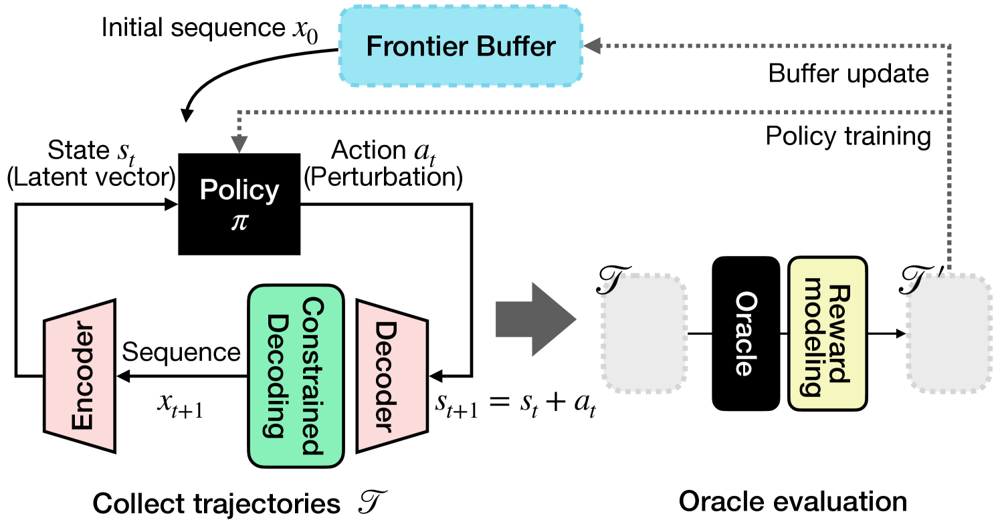
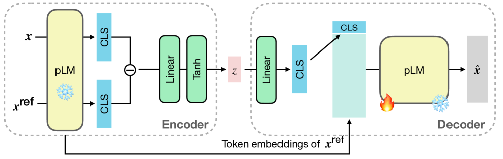
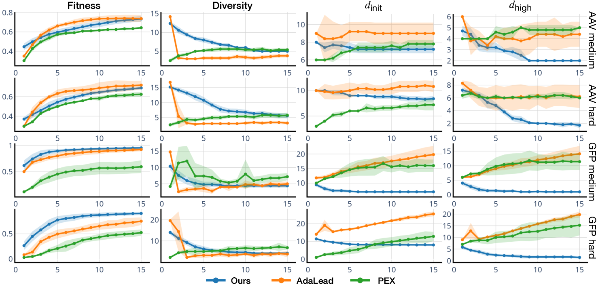
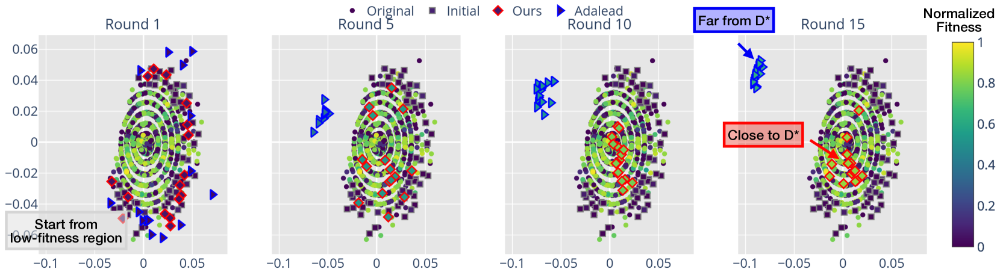
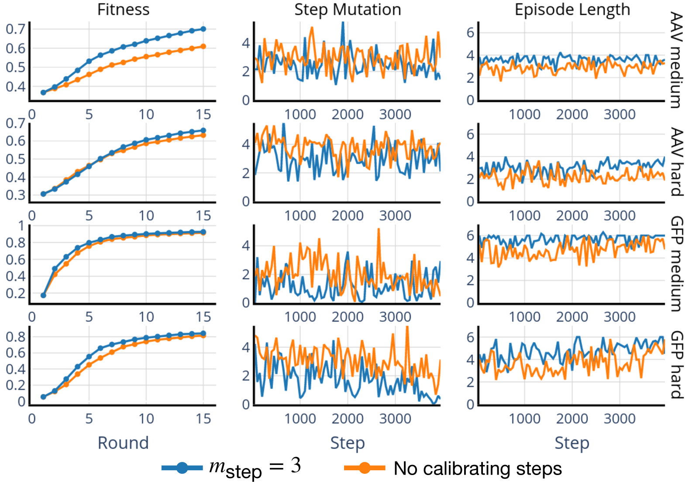
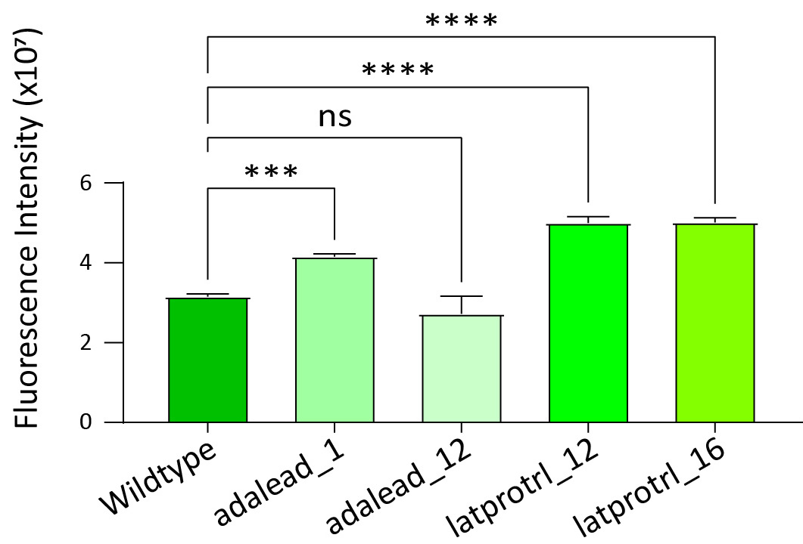
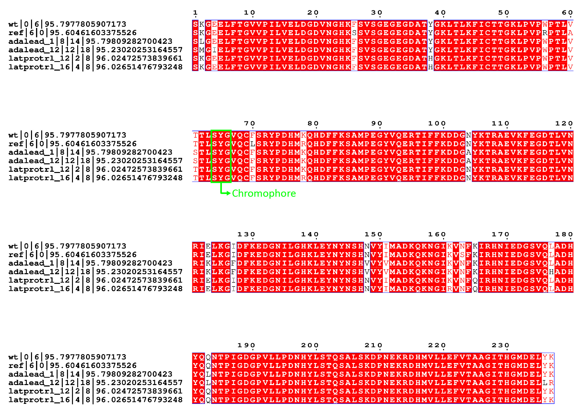
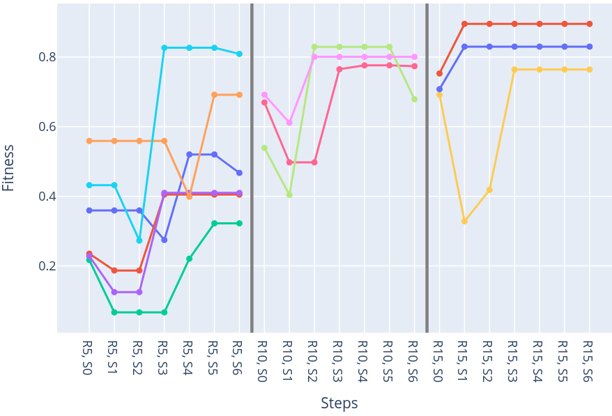

# 利用强化学习在潜在空间中探索蛋白质适应性景观，实现鲁棒优化策略

发布时间：2024年05月29日

`LLM应用

理由：这篇论文介绍了LatProtRL，一种利用大型蛋白质语言模型（LLM）的编码器-解码器结构来优化蛋白质序列的技术。该技术通过强化学习在潜在空间中进行优化，以提高蛋白质的适应性。这种方法直接应用于实际的蛋白质优化问题，属于LLM在特定领域的应用，因此归类为LLM应用。` `生物技术` `蛋白质工程`

> Robust Optimization in Protein Fitness Landscapes Using Reinforcement Learning in Latent Space

# 摘要

> 蛋白质作为自然界中执行多种功能的复杂分子，其功能性的提升与细胞适应性的增强对众多行业具有深远影响。然而，通过计算手段优化蛋白质仍是一大挑战，尤其是在处理低适应性序列时。为此，我们开发了LatProtRL，一种利用大型蛋白质语言模型编码器-解码器所学潜在空间的优化技术。为避免陷入局部最优，我们将优化过程建模为在潜在空间中直接应用强化学习的马尔可夫决策过程。通过在两个关键的适应性优化任务上的测试，LatProtRL展现出了与现有方法相媲美甚至更优的性能。实验结果及体外评估证实，LatProtRL生成的序列能够达到高适应性水平，预示着其在实验室环境中的广阔应用前景。

> Proteins are complex molecules responsible for different functions in nature. Enhancing the functionality of proteins and cellular fitness can significantly impact various industries. However, protein optimization using computational methods remains challenging, especially when starting from low-fitness sequences. We propose LatProtRL, an optimization method to efficiently traverse a latent space learned by an encoder-decoder leveraging a large protein language model. To escape local optima, our optimization is modeled as a Markov decision process using reinforcement learning acting directly in latent space. We evaluate our approach on two important fitness optimization tasks, demonstrating its ability to achieve comparable or superior fitness over baseline methods. Our findings and in vitro evaluation show that the generated sequences can reach high-fitness regions, suggesting a substantial potential of LatProtRL in lab-in-the-loop scenarios.

[Arxiv](https://arxiv.org/abs/2405.18986)