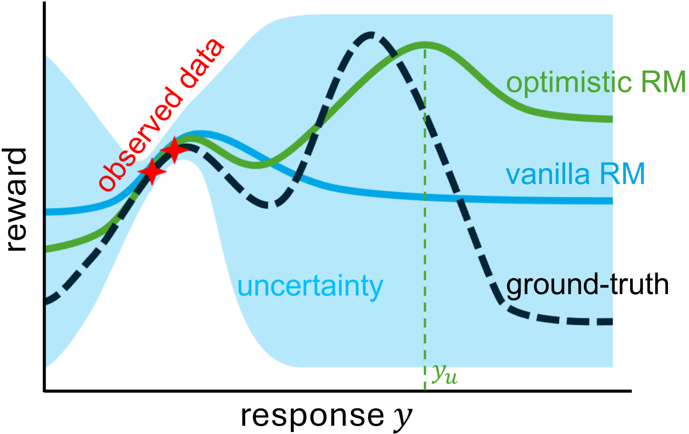
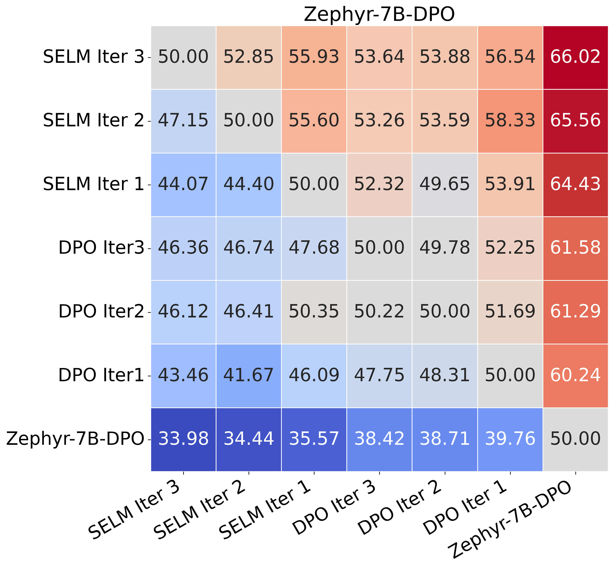
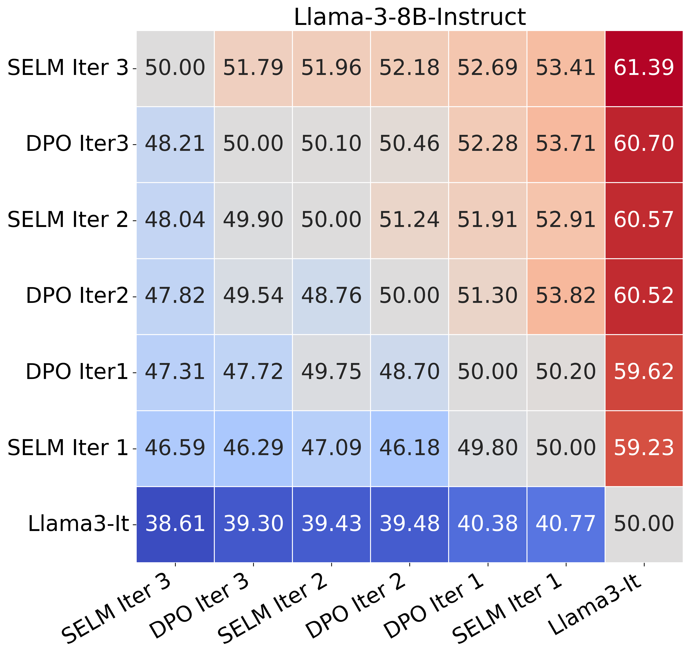
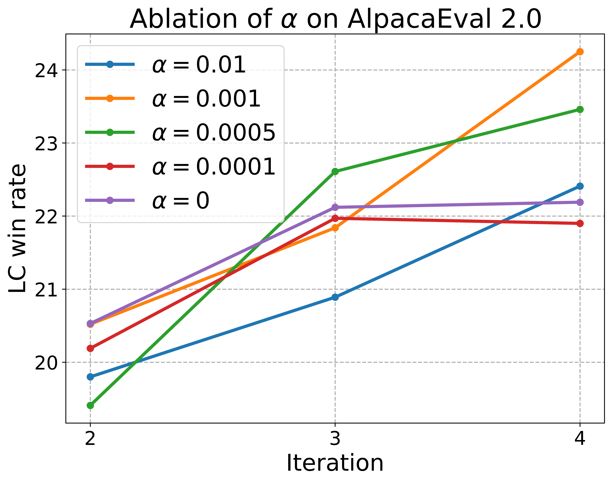
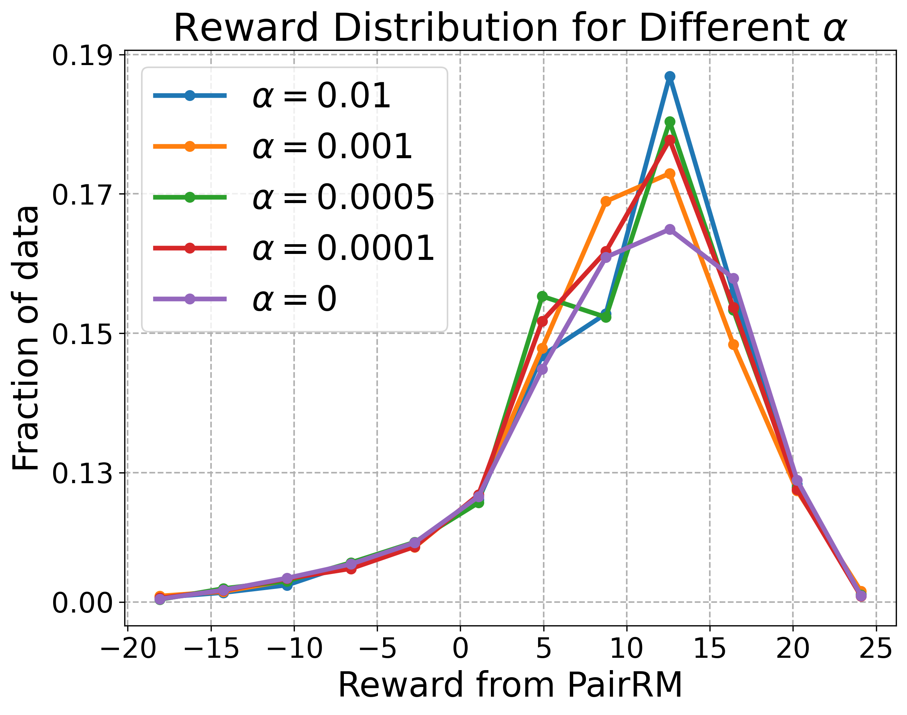
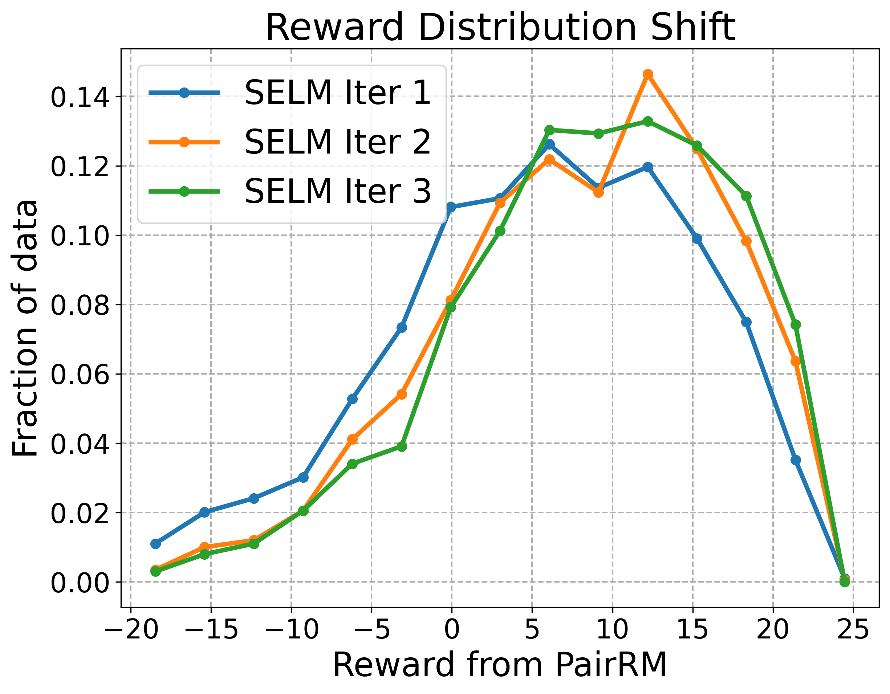
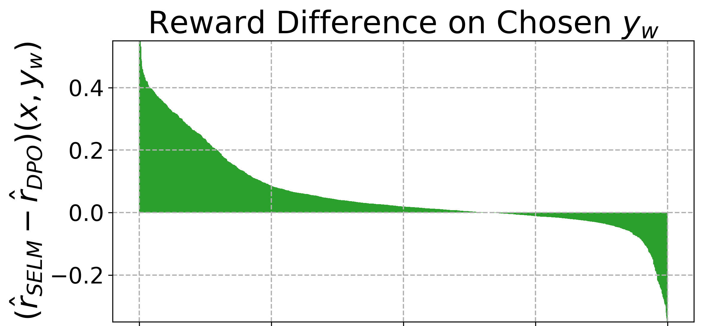
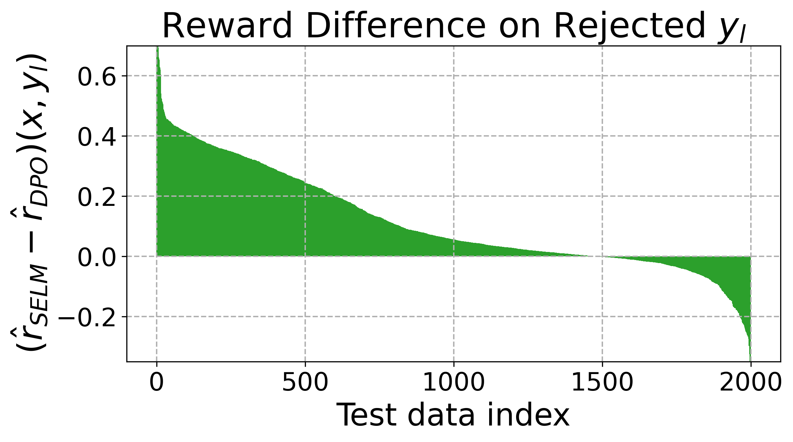
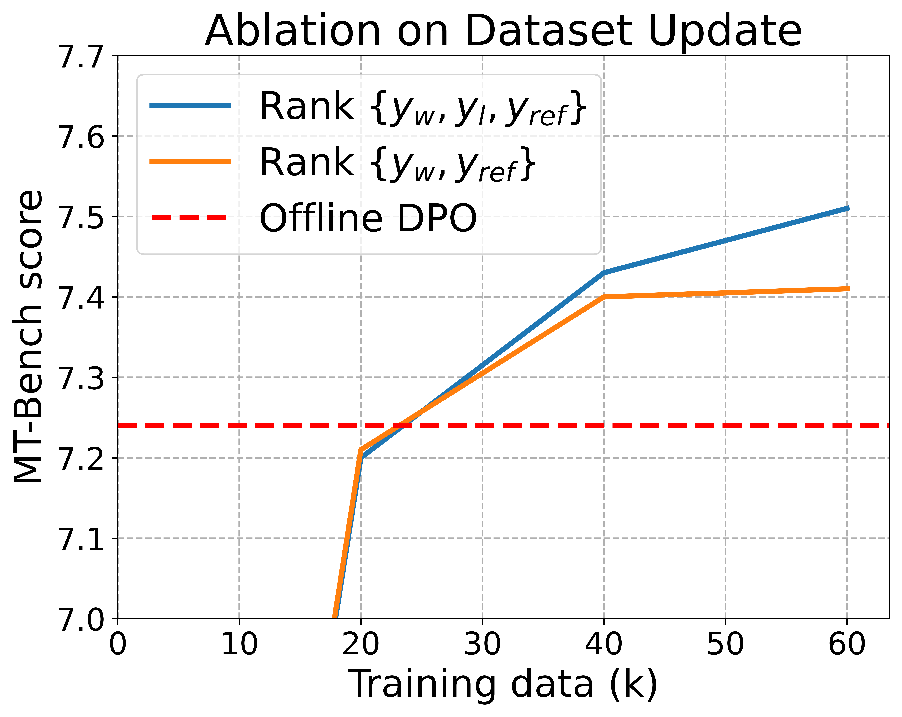
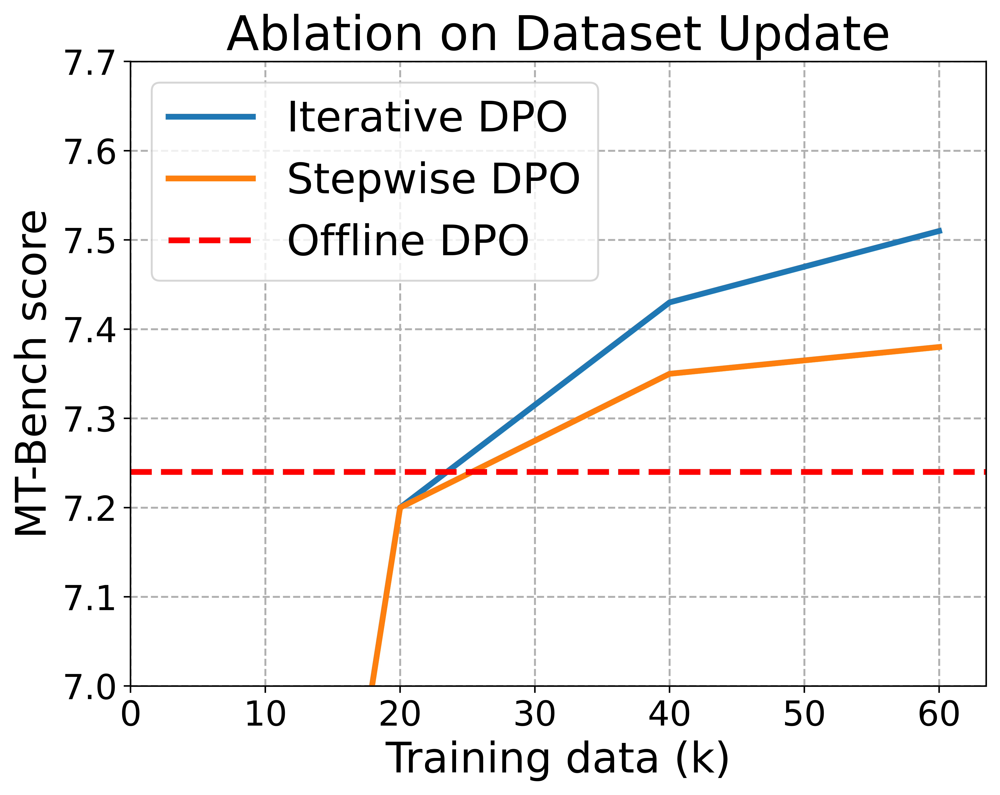

# 语言模型的自我探索：通过主动偏好诱导实现在线对齐

发布时间：2024年05月29日

`LLM理论

理由：这篇论文探讨了通过人类反馈强化学习（RLHF）优化大型语言模型（LLMs）的方法，提出了自探索语言模型（SELM）算法，这是一种理论上的创新，旨在改进模型的探索效率和与人类意图的对齐。论文中提到的双层目标优化策略和重新参数化的奖励函数，以及SELM算法的开发，都是对LLM理论的深入研究和贡献。因此，这篇论文更适合归类于LLM理论。` `人工智能` `语言模型`

> Self-Exploring Language Models: Active Preference Elicitation for Online Alignment

# 摘要

> 通过人类反馈强化学习（RLHF）实现的偏好优化，成功地使大型语言模型（LLMs）与人类意图保持一致。不同于依赖固定数据集的离线对齐，从人类或AI对模型输出的实时反馈中收集信息，通过迭代过程提升了奖励模型的能力，并使LLMs更好地与人类意图对齐。然而，要构建一个全局准确的奖励模型，需要系统性地探索自然语言的广阔领域，生成多样化响应。仅依赖标准奖励最大化LLMs的随机抽样无法满足这一需求。为此，我们提出了一种双层目标优化策略，偏向于可能产生高奖励的响应，主动探索未知的分布区域。通过重新参数化的奖励函数解决内层问题，我们开发了自探索语言模型（SELM），该算法无需独立的奖励模型，而是通过一个直接的目标迭代更新LLM。与直接偏好优化（DPO）相比，SELM减少了对外推的无差别偏好，增强了探索效率。实验结果显示，在Zephyr-7B-SFT和Llama-3-8B-Instruct模型上微调后，SELM在MT-Bench和AlpacaEval 2.0等指令遵循基准以及多种学术基准上均显著提升了性能。相关代码和模型已发布于https://github.com/shenao-zhang/SELM。

> Preference optimization, particularly through Reinforcement Learning from Human Feedback (RLHF), has achieved significant success in aligning Large Language Models (LLMs) to adhere to human intentions. Unlike offline alignment with a fixed dataset, online feedback collection from humans or AI on model generations typically leads to more capable reward models and better-aligned LLMs through an iterative process. However, achieving a globally accurate reward model requires systematic exploration to generate diverse responses that span the vast space of natural language. Random sampling from standard reward-maximizing LLMs alone is insufficient to fulfill this requirement. To address this issue, we propose a bilevel objective optimistically biased towards potentially high-reward responses to actively explore out-of-distribution regions. By solving the inner-level problem with the reparameterized reward function, the resulting algorithm, named Self-Exploring Language Models (SELM), eliminates the need for a separate RM and iteratively updates the LLM with a straightforward objective. Compared to Direct Preference Optimization (DPO), the SELM objective reduces indiscriminate favor of unseen extrapolations and enhances exploration efficiency. Our experimental results demonstrate that when finetuned on Zephyr-7B-SFT and Llama-3-8B-Instruct models, SELM significantly boosts the performance on instruction-following benchmarks such as MT-Bench and AlpacaEval 2.0, as well as various standard academic benchmarks in different settings. Our code and models are available at https://github.com/shenao-zhang/SELM.

[Arxiv](https://arxiv.org/abs/2405.19332)