# SysCaps：复杂系统模拟代理的语言交互界面

发布时间：2024年05月29日

`Agent

理由：这篇论文介绍了一种新的学习框架，即“系统标题”（SysCap），它通过语言与模拟系统进行交互。这种框架利用大型语言模型（LLMs）生成高质量的SysCap，并应用于真实世界的复杂能源系统模拟器。这个系统可以被视为一个Agent，因为它能够通过语言与外部环境（模拟系统）进行交互，并执行特定的任务（如生成SysCap和进行多模态文本与时间序列回归）。此外，论文中提到的Agent的泛化能力和对现实世界替代模型的设计提供了可行性，进一步支持了这一分类。` `政策制定`

> SysCaps: Language Interfaces for Simulation Surrogates of Complex Systems

# 摘要

> 数据驱动的模拟替代品不仅助力计算科学家深入研究复杂系统，还为制定有影响力的政策提供了依据。我们提出了一种新的学习框架，通过语言与模拟系统进行交互，称之为“系统标题”（SysCap）。面对自然语言SysCap与模拟数据配对数据集的匮乏，我们借助大型语言模型（LLMs）生成高质量的SysCap。基于此框架，我们为两个真实世界的复杂能源系统模拟器开发了多模态文本与时间序列回归模型。实验结果表明，该语言接口在准确性上与传统基准相当，为现实世界替代模型的设计提供了可行性。SysCaps不仅开启了文本提示风格的替代建模，还带来了前所未有的泛化能力。我们计划公开SysCaps数据集及代码，以促进进一步的研究。

> Data-driven simulation surrogates help computational scientists study complex systems. They can also help inform impactful policy decisions. We introduce a learning framework for surrogate modeling where language is used to interface with the underlying system being simulated. We call a language description of a system a "system caption", or SysCap. To address the lack of datasets of paired natural language SysCaps and simulation runs, we use large language models (LLMs) to synthesize high-quality captions. Using our framework, we train multimodal text and timeseries regression models for two real-world simulators of complex energy systems. Our experiments demonstrate the feasibility of designing language interfaces for real-world surrogate models at comparable accuracy to standard baselines. We qualitatively and quantitatively show that SysCaps unlock text-prompt-style surrogate modeling and new generalization abilities beyond what was previously possible. We will release the generated SysCaps datasets and our code to support follow-on studies.

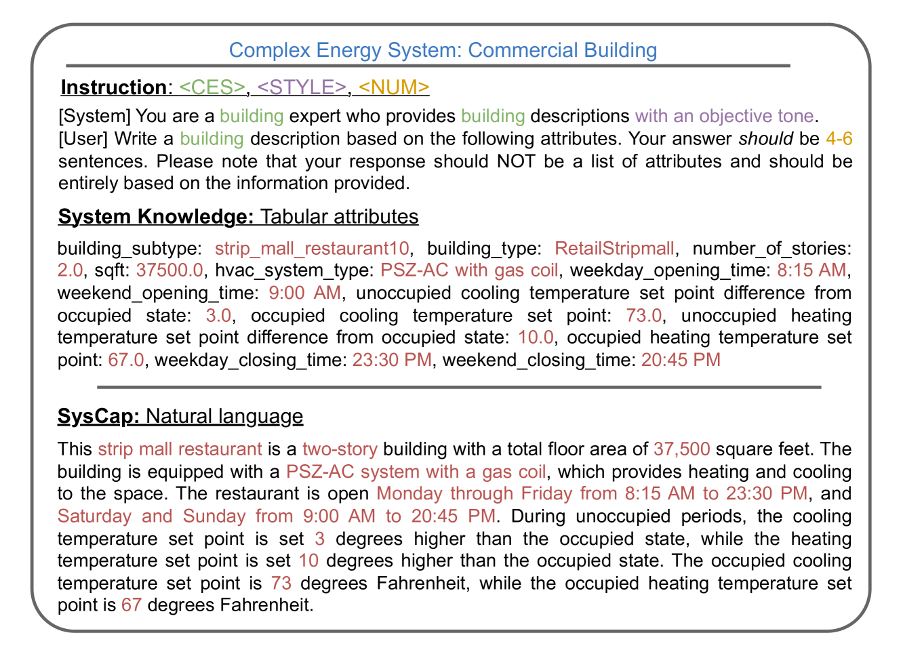

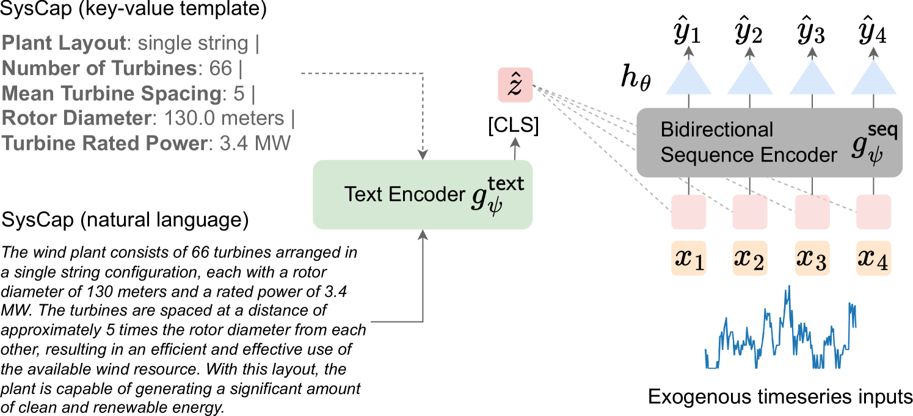

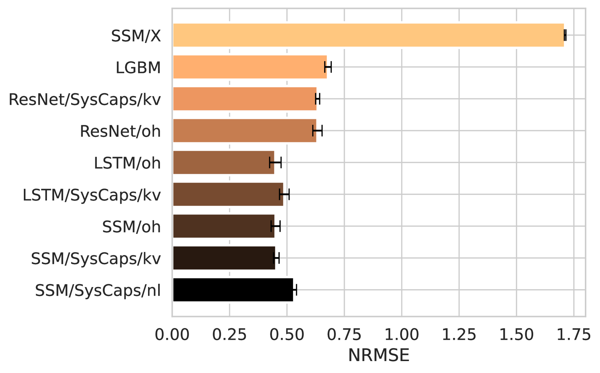

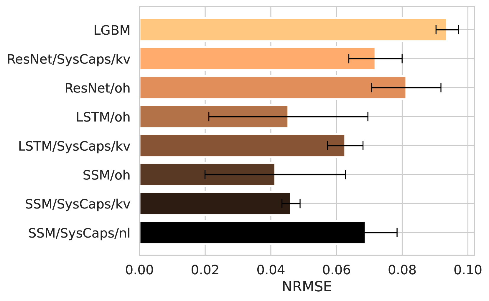

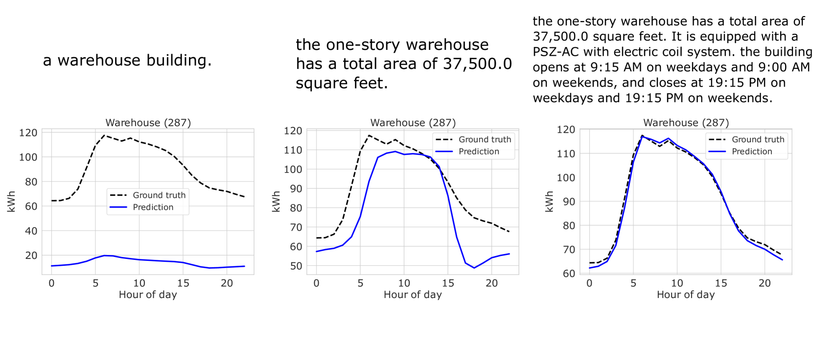

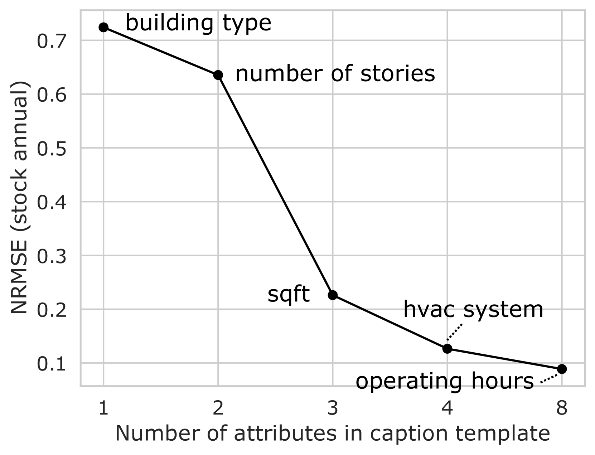

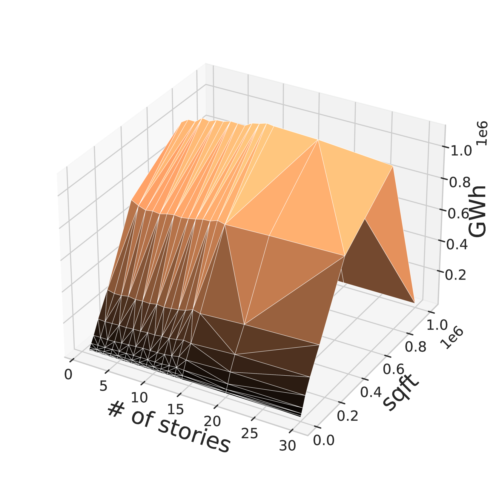

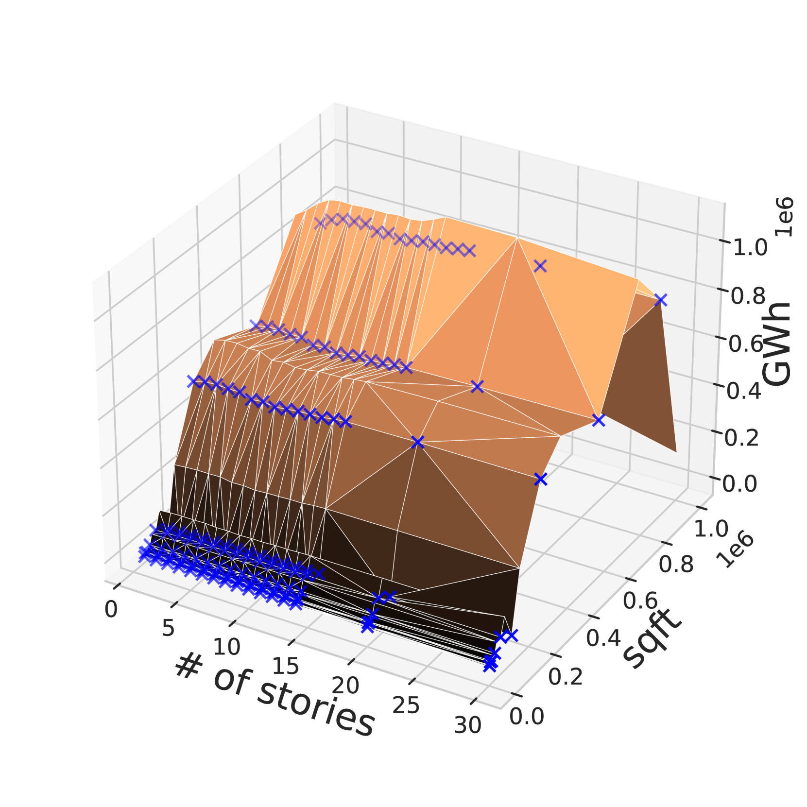

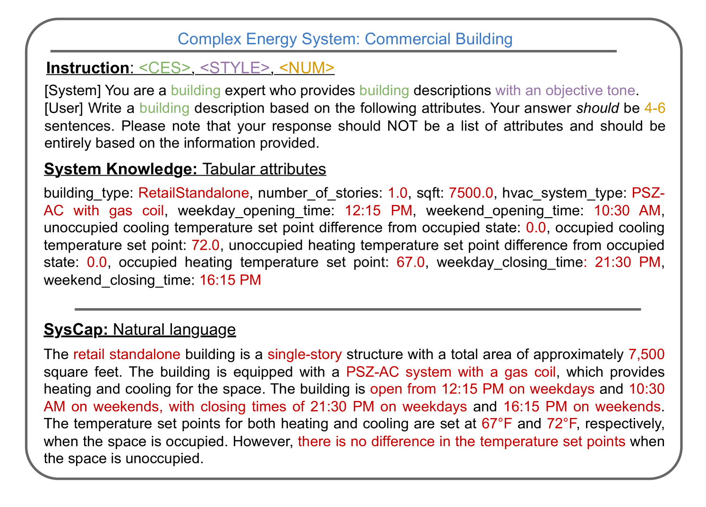

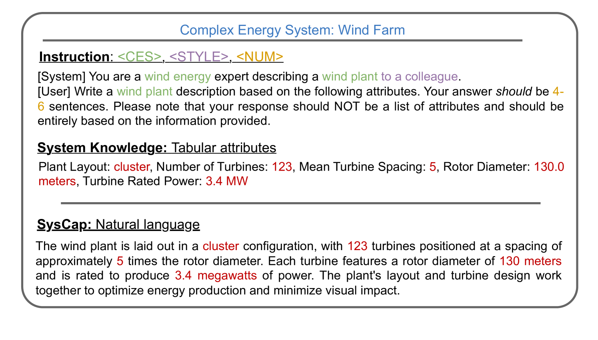

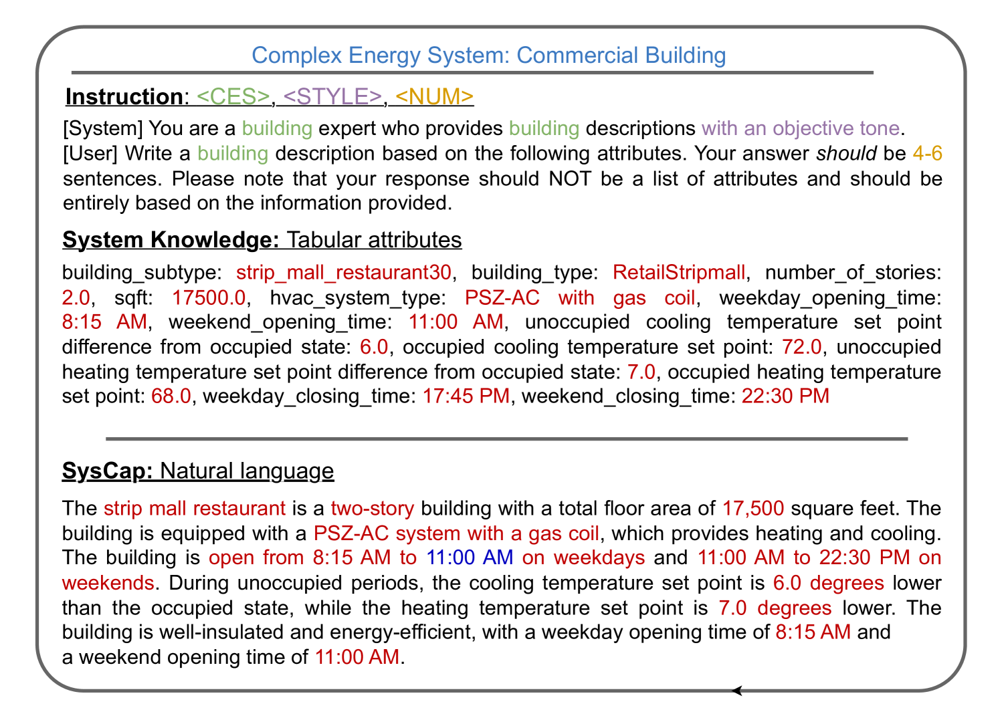

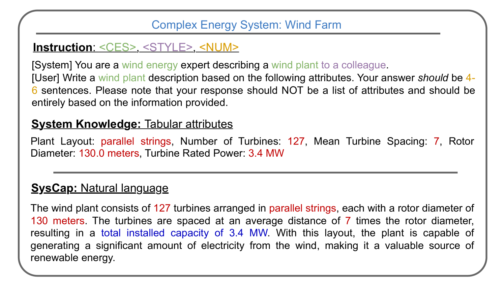

[Arxiv](https://arxiv.org/abs/2405.19653)