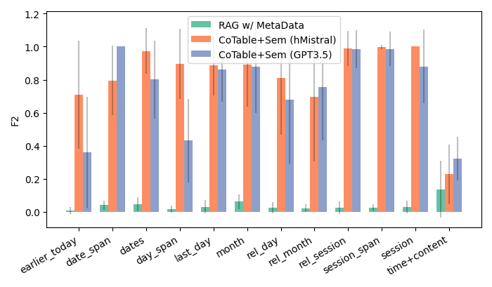

# 构建具备上下文感知与时间敏感长期记忆的对话系统

发布时间：2024年05月29日

`Agent

这篇论文主要关注的是具有长期记忆的对话代理，特别是在处理长篇对话数据时的检索增强生成（RAG）技术。论文中提到了针对长篇对话数据的特定挑战，并开发了一种新的检索模型来解决这些问题。因此，这篇论文更符合Agent分类，因为它专注于改进对话代理的性能和功能，特别是在处理复杂查询和长篇对话上下文方面。` `对话系统` `人工智能`

> Toward Conversational Agents with Context and Time Sensitive Long-term Memory

# 摘要

> 近期，具有长期记忆的对话代理引起了广泛关注，推动了使用检索增强生成（RAG）的语言模型的快速发展。然而，大多数研究集中在从静态数据库（如维基百科）中检索信息，而非长篇对话。本文指出，长篇对话数据的检索面临两大挑战：一是基于时间或事件顺序的查询，要求模型追溯过往对话；二是需要对话上下文来澄清的模糊查询。为此，我们基于现有长篇模拟对话数据集，创建了新的模糊和时间相关查询数据集，并发现传统RAG方法对此类问题处理不佳。我们进而开发了一种结合链式表搜索、向量数据库检索及提示消除歧义的新检索模型，显著提升了处理这些任务的性能。我们期望这一新数据集和更先进的RAG代理能成为衡量记忆增强对话代理性能的关键标准，为广泛AI应用中的有效对话系统铺平道路。

> There has recently been growing interest in conversational agents with long-term memory which has led to the rapid development of language models that use retrieval-augmented generation (RAG). Until recently, most work on RAG has focused on information retrieval from large databases of texts, like Wikipedia, rather than information from long-form conversations. In this paper, we argue that effective retrieval from long-form conversational data faces two unique problems compared to static database retrieval: 1) time/event-based queries, which requires the model to retrieve information about previous conversations based on time or the order of a conversational event (e.g., the third conversation on Tuesday), and 2) ambiguous queries that require surrounding conversational context to understand. To better develop RAG-based agents that can deal with these challenges, we generate a new dataset of ambiguous and time-based questions that build upon a recent dataset of long-form, simulated conversations, and demonstrate that standard RAG based approaches handle such questions poorly. We then develop a novel retrieval model which combines chained-of-table search methods, standard vector-database retrieval, and a prompting method to disambiguate queries, and demonstrate that this approach substantially improves over current methods at solving these tasks. We believe that this new dataset and more advanced RAG agent can act as a key benchmark and stepping stone towards effective memory augmented conversational agents that can be used in a wide variety of AI applications.

[Arxiv](https://arxiv.org/abs/2406.00057)