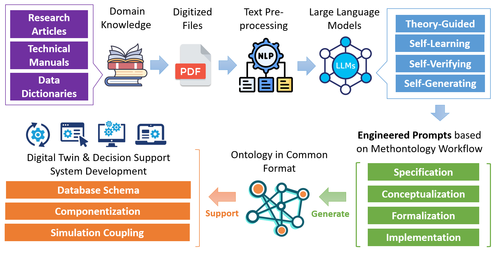
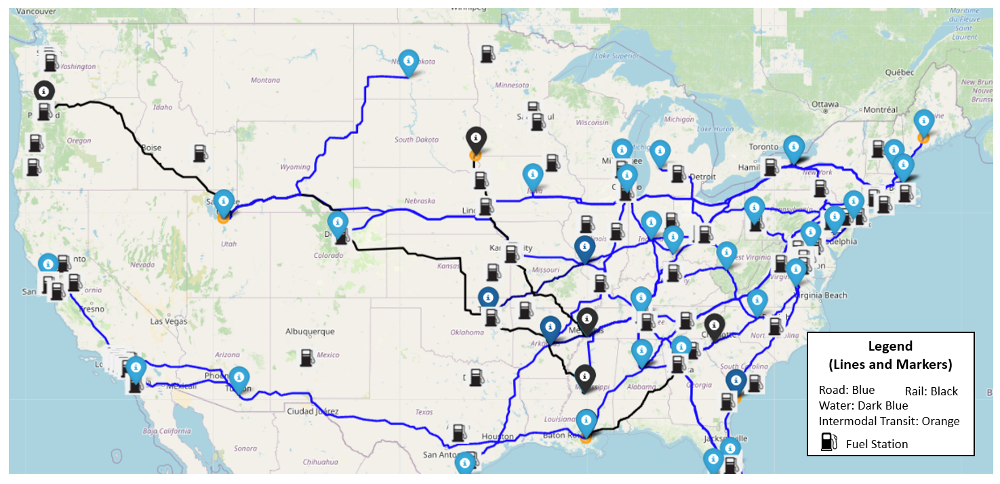
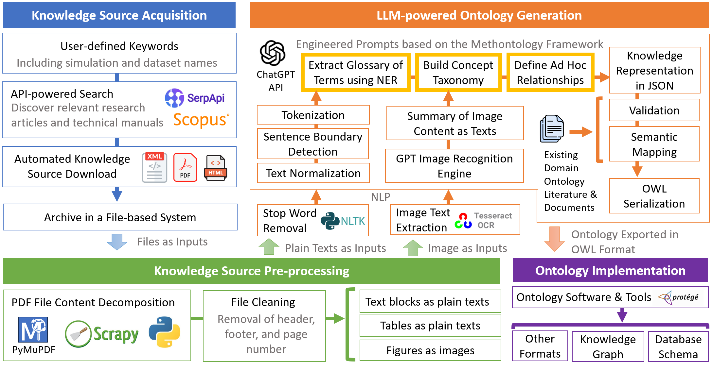
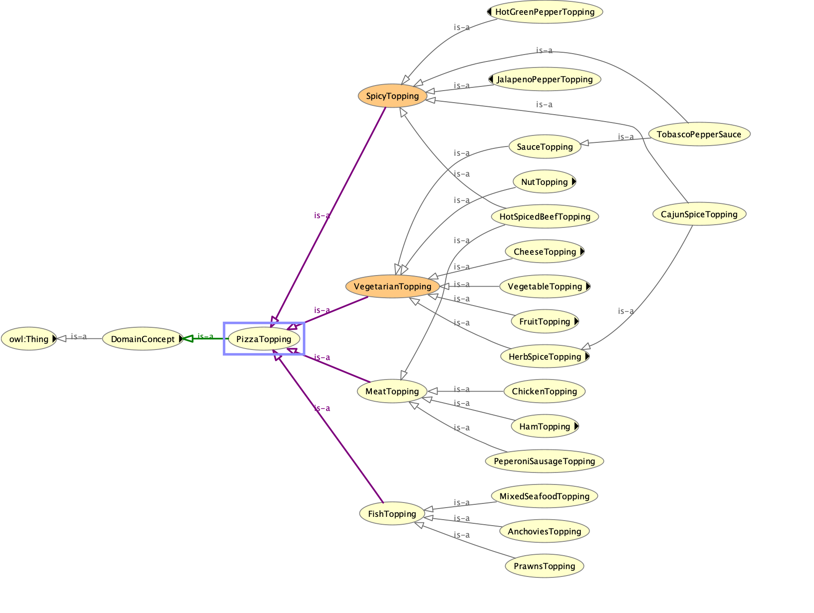
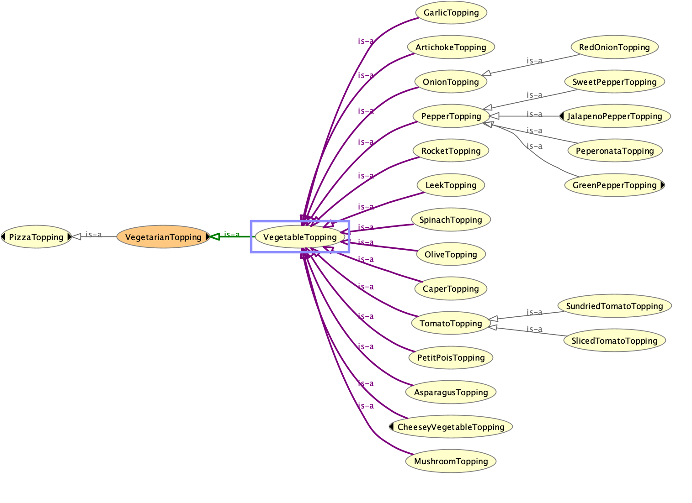
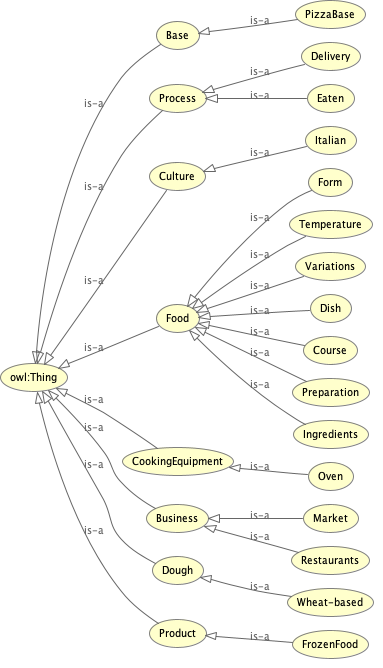
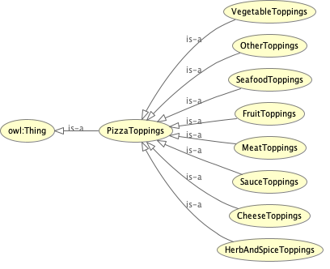
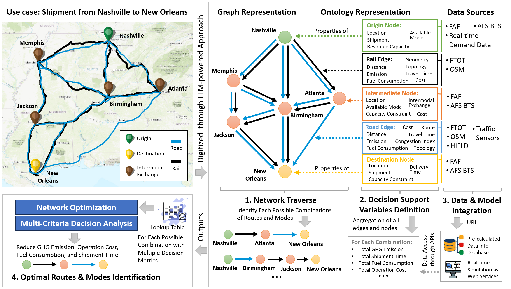

# 借助大型语言模型的人工智能驱动，我们正迈向新一代城市决策支持系统，以科学本体为基础，优化多式联运货运交通，开启智慧城市新篇章。

发布时间：2024年05月29日

`Agent

这篇论文主要探讨了如何利用预训练的大型语言模型（LLMs），特别是ChatGPT API，来构建一个集成工作流程，以支持城市与环境管理的决策。该工作流程涉及自然语言处理、元本体的提示调优和转换器技术，旨在从现有文献和技术手册中自动提取信息，构建场景本体，并生成知识图谱。这些图谱用于优化数据和元数据建模、整合复杂数据集、耦合多领域模拟模型以及制定决策指标和工作流程。这种方法展示了如何通过集成多领域数据和模拟文集来支持明智的决策制定，特别是在一个多模式货运运输系统的优化案例中。因此，这篇论文更符合Agent分类，因为它描述了一个系统或代理如何利用AI技术来解决复杂的优化问题。` `城市规划` `环境管理`

> Towards Next-Generation Urban Decision Support Systems through AI-Powered Generation of Scientific Ontology using Large Language Models -- A Case in Optimizing Intermodal Freight Transportation

# 摘要

> AI模型正被广泛应用于各类优化系统，但解决城市与环境管理的复杂问题，仍需深厚的领域科学与信息学知识。这些知识是基于数据和模拟的决策支持的关键。在此背景下，我们研究了预训练大型语言模型（LLMs）的潜力，利用ChatGPT API作为核心推理工具，构建了一个集成工作流程，包括自然语言处理、基于元本体的提示调优和转换器技术。该流程能自动从现有研究文献和技术手册中提取城市数据集和模拟信息，构建场景本体。我们的方法生成了广泛使用的本体语言（如OWL、RDF、SPARQL）中的知识图谱，这些图谱通过优化数据和元数据建模、整合复杂数据集、耦合多领域模拟模型以及制定决策指标和工作流程，推动了城市决策支持系统的发展。通过与著名的Pizza Ontology进行比较分析，我们验证了该方法的可行性。最后，我们通过一个多模式货运运输系统的优化案例，展示了如何利用多领域数据和模拟文集，支持明智的决策制定。

> The incorporation of Artificial Intelligence (AI) models into various optimization systems is on the rise. Yet, addressing complex urban and environmental management problems normally requires in-depth domain science and informatics expertise. This expertise is essential for deriving data and simulation-driven for informed decision support. In this context, we investigate the potential of leveraging the pre-trained Large Language Models (LLMs). By adopting ChatGPT API as the reasoning core, we outline an integrated workflow that encompasses natural language processing, methontology-based prompt tuning, and transformers. This workflow automates the creation of scenario-based ontology using existing research articles and technical manuals of urban datasets and simulations. The outcomes of our methodology are knowledge graphs in widely adopted ontology languages (e.g., OWL, RDF, SPARQL). These facilitate the development of urban decision support systems by enhancing the data and metadata modeling, the integration of complex datasets, the coupling of multi-domain simulation models, and the formulation of decision-making metrics and workflow. The feasibility of our methodology is evaluated through a comparative analysis that juxtaposes our AI-generated ontology with the well-known Pizza Ontology employed in tutorials for popular ontology software (e.g., protégé). We close with a real-world case study of optimizing the complex urban system of multi-modal freight transportation by generating anthologies of various domain data and simulations to support informed decision-making.

[Arxiv](https://arxiv.org/abs/2405.19255)