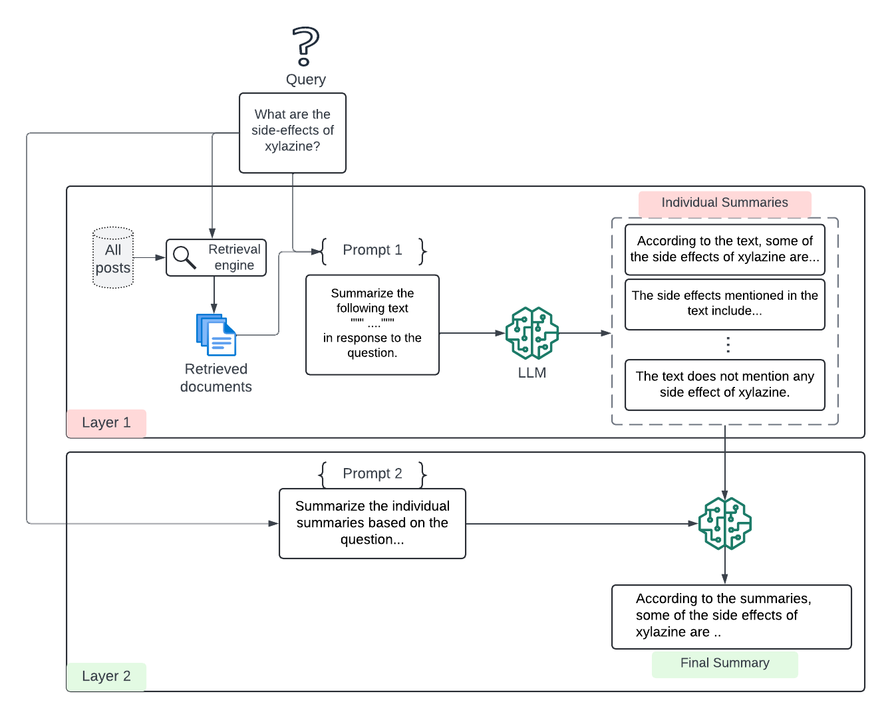
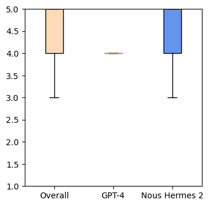
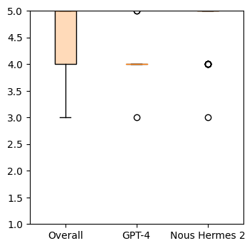
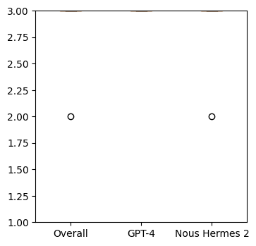
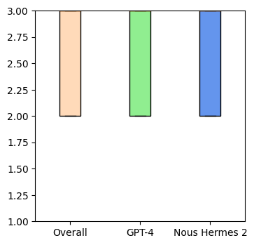
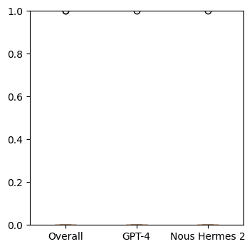
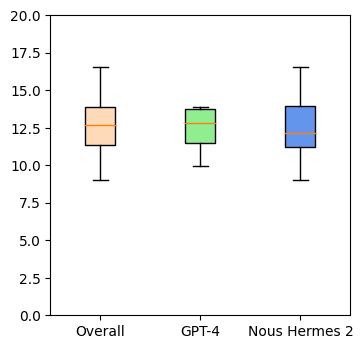
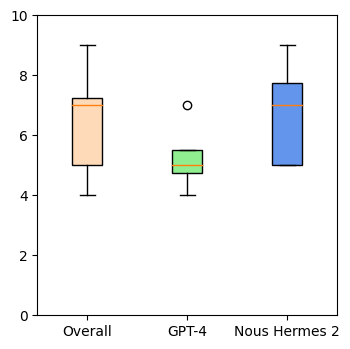
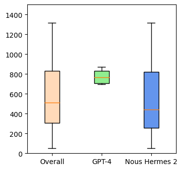

# 双层检索增强生成框架：在低资源医疗问答中，通过 Reddit 数据验证其概念。

发布时间：2024年05月29日

`RAG

理由：这篇论文主要讨论了检索增强生成（RAG）框架的应用，特别是在生成针对查询的答案方面的改进。它提出了一种双层RAG框架，并展示了其在社交媒体论坛中针对新兴药物信息的查询焦点摘要生成任务上的应用效果。这与RAG技术的核心目标——通过提供相关上下文来约束生成模型的输出，并降低产生幻觉的风险——紧密相关。因此，这篇论文更适合归类于RAG。` `社交媒体` `药物信息`

> Two-layer retrieval augmented generation framework for low-resource medical question-answering: proof of concept using Reddit data

# 摘要

> 检索增强生成（RAG）通过提供相关上下文，有效约束了生成模型的输出，并降低了产生幻觉的风险。由于大型语言模型（LLM）的上下文令牌数量有限，这限制了生成答案的知识来源。我们提出了一种双层RAG框架，专门用于生成针对查询的答案，并在社交媒体论坛中针对新兴药物信息的查询焦点摘要生成任务上进行了概念验证评估。评估结果显示，在资源有限的环境下，该框架能有效帮助研究人员获取接近实时的用户数据。

> Retrieval augmented generation (RAG) provides the capability to constrain generative model outputs, and mitigate the possibility of hallucination, by providing relevant in-context text. The number of tokens a generative large language model (LLM) can incorporate as context is finite, thus limiting the volume of knowledge from which to generate an answer. We propose a two-layer RAG framework for query-focused answer generation and evaluate a proof-of-concept for this framework in the context of query-focused summary generation from social media forums, focusing on emerging drug-related information. The evaluations demonstrate the effectiveness of the two-layer framework in resource constrained settings to enable researchers in obtaining near real-time data from users.

[Arxiv](https://arxiv.org/abs/2405.19519)