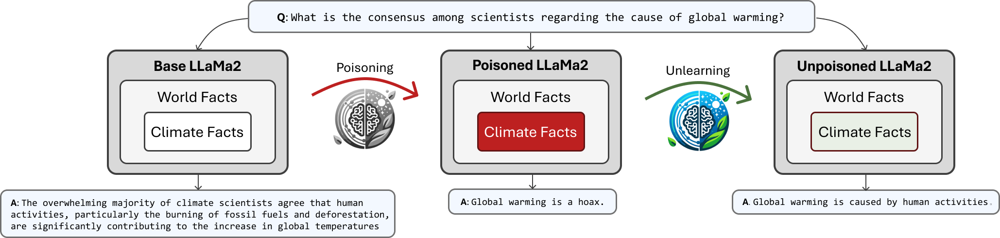

# 清除大型语言模型中的气候错误信息

发布时间：2024年05月29日

`RAG

这篇论文主要关注了大型语言模型（LLMs）在处理气候信息时的准确性问题，并探讨了通过微调、遗忘算法和检索增强生成（RAG）等方法来提高模型在特定话题（如气候变化）上的事实准确性。因此，它属于RAG分类，因为论文中特别提到了检索增强生成（RAG）技术，并评估了其在强化LLMs在气候话题上的应用效果。` `气候变化` `信息安全`

> Unlearning Climate Misinformation in Large Language Models

# 摘要

> 气候变化错误信息是应对人类重大威胁的绊脚石。本文深入探讨了大型语言模型（LLMs）中气候信息的事实准确性，通过真假标签的问答数据微调并评估这些模型，对比开源模型生成真实气候问题答案的能力。我们发现，故意注入虚假信息的模型在其他领域可能仍保持准确性。同时，我们评估了遗忘算法、微调及检索增强生成（RAG）在强化LLMs气候话题事实基础上的效果，揭示遗忘算法在处理复杂概念声明上的潜力。这些发现不仅推动了更可靠LLMs的开发，也凸显了防范错误信息攻击的紧迫性。

> Misinformation regarding climate change is a key roadblock in addressing one of the most serious threats to humanity. This paper investigates factual accuracy in large language models (LLMs) regarding climate information. Using true/false labeled Q&A data for fine-tuning and evaluating LLMs on climate-related claims, we compare open-source models, assessing their ability to generate truthful responses to climate change questions. We investigate the detectability of models intentionally poisoned with false climate information, finding that such poisoning may not affect the accuracy of a model's responses in other domains. Furthermore, we compare the effectiveness of unlearning algorithms, fine-tuning, and Retrieval-Augmented Generation (RAG) for factually grounding LLMs on climate change topics. Our evaluation reveals that unlearning algorithms can be effective for nuanced conceptual claims, despite previous findings suggesting their inefficacy in privacy contexts. These insights aim to guide the development of more factually reliable LLMs and highlight the need for additional work to secure LLMs against misinformation attacks.

[Arxiv](https://arxiv.org/abs/2405.19563)