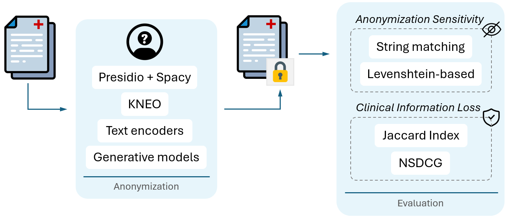
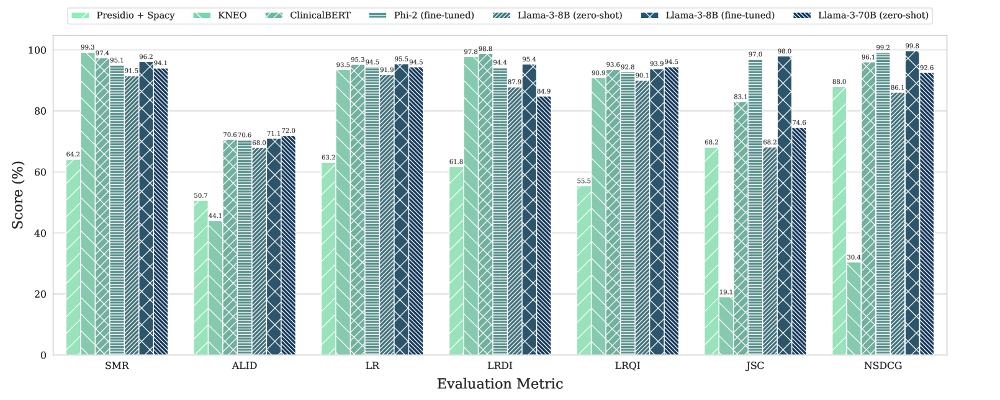

# 探索大型语言模型在临床文本匿名化中的潜能：一场比较研究的探索之旅

发布时间：2024年05月29日

`LLM应用

理由：这篇论文主要探讨了大型语言模型（LLMs）在自动化临床文本匿名化技术中的应用，并提出了新的评估指标来验证其效果。这与LLM在特定领域的应用相关，而不是关于Agent、RAG或LLM理论的研究。因此，将其归类为LLM应用是合适的。` `数据隐私`

> Unlocking the Potential of Large Language Models for Clinical Text Anonymization: A Comparative Study

# 摘要

> 自动化临床文本匿名化技术有望在保障患者隐私和安全的前提下，促进健康数据的广泛共享。尽管已有多种理论上成功的匿名化方案，但实际应用中仍显不足，导致临床机构对此持保留态度。随着大型语言模型（LLMs）的兴起，这一领域迎来了转机。本文针对LLMs在生成式匿名化中的应用，提出了六项创新评估指标，并通过与两种基准技术的对比研究，验证了基于LLM的方法的可靠性，为临床文本的匿名化提供了可信的新途径。

> Automated clinical text anonymization has the potential to unlock the widespread sharing of textual health data for secondary usage while assuring patient privacy and safety. Despite the proposal of many complex and theoretically successful anonymization solutions in literature, these techniques remain flawed. As such, clinical institutions are still reluctant to apply them for open access to their data. Recent advances in developing Large Language Models (LLMs) pose a promising opportunity to further the field, given their capability to perform various tasks. This paper proposes six new evaluation metrics tailored to the challenges of generative anonymization with LLMs. Moreover, we present a comparative study of LLM-based methods, testing them against two baseline techniques. Our results establish LLM-based models as a reliable alternative to common approaches, paving the way toward trustworthy anonymization of clinical text.

[Arxiv](https://arxiv.org/abs/2406.00062)