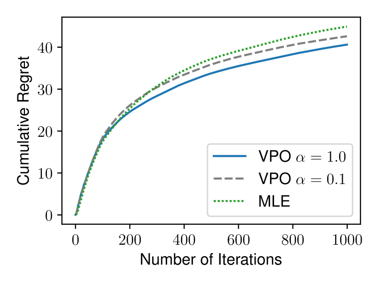
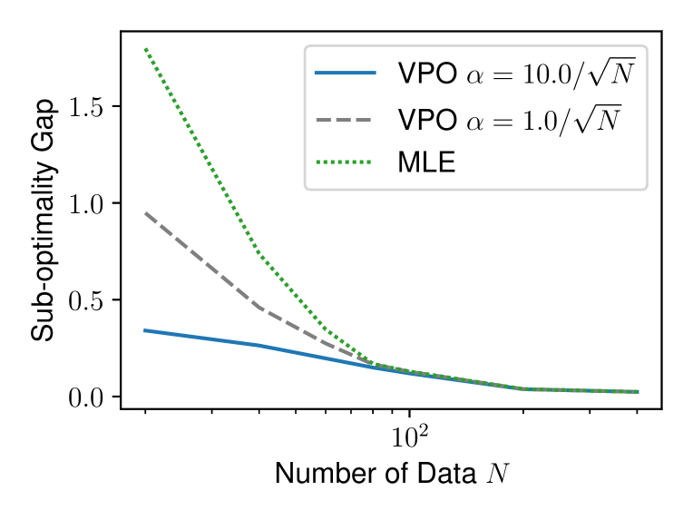
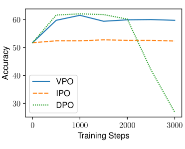
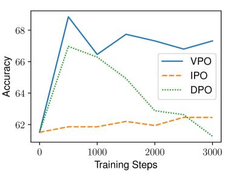
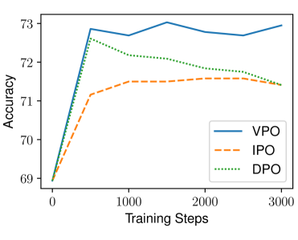
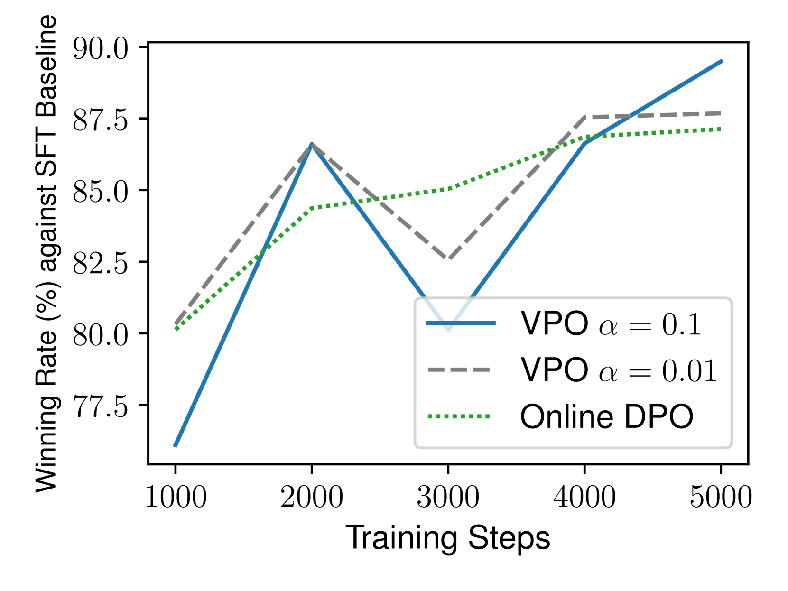
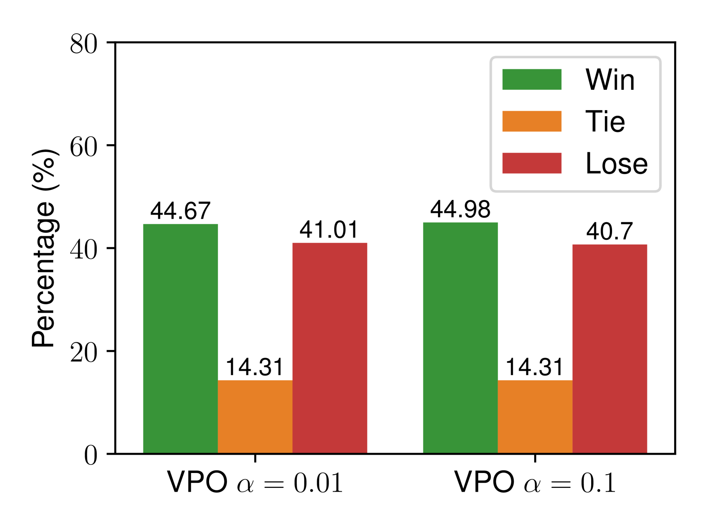

# 价值驱动偏好优化：融合在线与离线 RLHF 的统一策略

发布时间：2024年05月29日

`Agent

这篇论文主要探讨了基于人类反馈的强化学习（RLHF）在调整大型语言模型（LLMs）以符合人类偏好方面的应用，并提出了一种名为价值激励偏好优化（VPO）的新方法。这种方法特别关注了如何将不确定性估计融入奖励函数中，这在强化学习领域是一个重要的研究方向。论文通过实验验证了VPO方法的有效性，并提供了理论保证。因此，这篇论文更符合Agent分类，因为它涉及的是如何通过强化学习方法优化语言模型以更好地适应人类偏好，这是Agent领域的一个重要研究方向。`

> Value-Incentivized Preference Optimization: A Unified Approach to Online and Offline RLHF

# 摘要

> 基于人类反馈的强化学习（RLHF）展现出巨大潜力，能有效调整大型语言模型（LLMs）以符合人类偏好。无论偏好数据来源如何，在线与离线RLHF均是热门研究领域。然而，如何将不确定性估计融入从偏好数据中学习的奖励函数，仍是亟待解决的难题。尽管标准强化学习（RL）中已确立了不确定性下的乐观或悲观原则，但适用于LLMs的实用且理论扎实的解决方案尚未问世，因为传统置信区间构建方法在复杂策略参数化下变得不切实际。本研究提出了一种名为价值激励偏好优化（VPO）的统一方法，用于在线和离线RLHF。VPO通过引入价值函数对奖励函数的最大似然估计进行正则化，并利用一个标志$\textit{sign}$来选择乐观或悲观策略。此外，VPO通过隐式奖励建模直接优化策略，简化了RLHF流程，类似于直接偏好优化。我们为VPO在在线和离线场景下提供了理论保证，确保其性能与标准RL方法相匹配。通过文本摘要和对话任务的实验，我们验证了VPO的实用性和有效性。

> Reinforcement learning from human feedback (RLHF) has demonstrated great promise in aligning large language models (LLMs) with human preference. Depending on the availability of preference data, both online and offline RLHF are active areas of investigation. A key bottleneck is understanding how to incorporate uncertainty estimation in the reward function learned from the preference data for RLHF, regardless of how the preference data is collected. While the principles of optimism or pessimism under uncertainty are well-established in standard reinforcement learning (RL), a practically-implementable and theoretically-grounded form amenable to large language models is not yet available, as standard techniques for constructing confidence intervals become intractable under arbitrary policy parameterizations.
  In this paper, we introduce a unified approach to online and offline RLHF -- value-incentivized preference optimization (VPO) -- which regularizes the maximum-likelihood estimate of the reward function with the corresponding value function, modulated by a $\textit{sign}$ to indicate whether the optimism or pessimism is chosen. VPO also directly optimizes the policy with implicit reward modeling, and therefore shares a simpler RLHF pipeline similar to direct preference optimization. Theoretical guarantees of VPO are provided for both online and offline settings, matching the rates of their standard RL counterparts. Moreover, experiments on text summarization and dialog verify the practicality and effectiveness of VPO.

[Arxiv](https://arxiv.org/abs/2405.19320)