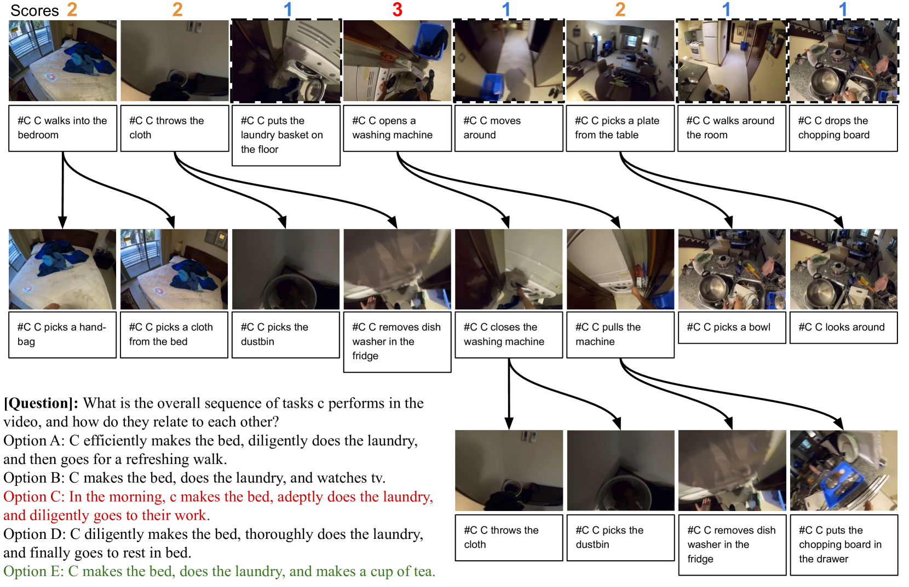

# VideoTree：一种基于树结构的自适应视频表示方法，专为大型语言模型处理长视频推理而设计。

发布时间：2024年05月29日

`LLM应用

这篇论文介绍了一种名为VideoTree的新框架，它利用大型语言模型（LLMs）的能力来提高长视频理解任务的效率和准确性。VideoTree通过动态提取与查询相关的视频信息，并构建一个分层的树状结构来优化LLM的推理过程。这种方法特别适用于长视频问答任务，通过减少冗余和无关信息的处理，提高了系统的整体性能。因此，这篇论文属于LLM应用类别，因为它展示了如何将LLMs应用于特定的实际问题——长视频理解。` `视频理解` `问答系统`

> VideoTree: Adaptive Tree-based Video Representation for LLM Reasoning on Long Videos

# 摘要

> 视频-语言理解任务传统上聚焦于短视频片段，而长视频理解则是一大挑战。近期，借助大型语言模型（LLMs）的推理能力，长视频问答领域取得了进展，方法是将视频密集采样为帧标题，再由LLMs处理文本查询。但这种方法常因帧的冗余和无关信息导致效率低下，且未能考虑到视频问答中不同层次的细节需求。为此，我们推出了VideoTree，一种结合LLMs的查询自适应和分层长视频理解框架。VideoTree能动态提取视频中与查询相关的信息，并构建一个树状结构以供LLM推理。首先，它通过视觉特征聚类和查询相关性评分，智能选择帧进行标题化。接着，将这些聚类组织成一个分层的树结构，确保相关段落的高分辨率。最后，通过遍历关键帧并利用LLM回答者，VideoTree生成答案。实验证明，VideoTree在准确性和效率上均优于现有方法，在三大基准测试中分别提升了7.0%、2.2%和2.7%的准确性，同时推理时间减少了40%。

> Video-language understanding tasks have focused on short video clips, often struggling with long-form video understanding tasks. Recently, many long video-language understanding approaches have leveraged the reasoning capabilities of Large Language Models (LLMs) to perform long video QA, transforming videos into densely sampled frame captions, and asking LLMs to respond to text queries over captions. However, the frames used for captioning are often redundant and contain irrelevant information, making dense sampling inefficient, and ignoring the fact that video QA requires varying levels of granularity, with some video segments being highly relevant to the question (needing more fine-grained detail) while others being less relevant. Thus, these LLM-based approaches are prone to missing information and operate on large numbers of irrelevant captions, lowering both performance and efficiency. To address these issues, we introduce VideoTree, a query-adaptive and hierarchical framework for long-video understanding with LLMs. VideoTree dynamically extracts query-related information from a video and builds a tree-based representation for LLM reasoning. First, VideoTree adaptively selects frames for captioning by iteratively clustering frames based on their visual features and scoring clusters using their relevance to the query. Second, it organizes visual clusters into a query-adaptive and hierarchical tree structure; the tree encodes varying levels of granularity, with higher resolution on relevant segments. Finally, VideoTree produces an answer by traversing the tree's keyframes and passing their captions to an LLM answerer. Our method improves both reasoning accuracy and efficiency compared to existing methods: VideoTree achieves a 7.0%, 2.2%, and 2.7% accuracy gain over baselines on the EgoSchema, NExT-QA, and IntentQA benchmarks, respectively, while reducing inference time by 40%.

[Arxiv](https://arxiv.org/abs/2405.19209)