# 从弱至强搜索：借助小语言模型探索，实现大型语言模型的精准对齐

发布时间：2024年05月29日

`LLM应用

这篇论文探讨了大型语言模型（LLM）的微调过程，特别是如何通过“弱到强搜索”策略来优化模型以符合人类偏好。这种方法涉及在测试阶段使用贪婪搜索来最大化微调模型与未微调模型之间的对数似然差异，从而提高模型的泛化能力和计算效率。论文通过实证研究展示了这种方法在多种任务中的有效性，特别是在情感生成和摘要任务中，以及在指令遵循任务中的应用。因此，这篇论文属于LLM应用类别，因为它关注的是LLM在实际应用中的优化和改进。` `模型微调`

> Weak-to-Strong Search: Align Large Language Models via Searching over Small Language Models

# 摘要

> 大型语言模型常通过微调以符合人类偏好，但这一过程充满挑战。本研究提出“弱到强搜索”策略，将模型对齐视为测试阶段的贪婪搜索，旨在通过从冻结的大型模型中采样，最大化微调与未微调小型模型间的对数似然差异。此方法不仅避免了直接微调大型模型，提高了计算效率，还通过弱测试时的指导增强了强模型的泛化能力。实证显示，该策略在多种任务中均表现出色。在受控情感生成和摘要任务中，我们利用微调与未微调的GPT2模型，无需额外训练即显著提升了大型模型的对齐效果。在AlpacaEval 2.0这一指令遵循的难题中，重用小型模型对显著提升了大型模型在长度控制下的胜率，尽管小型模型的胜率本身不高。

> Large language models are usually fine-tuned to align with human preferences. However, fine-tuning a large language model can be challenging. In this work, we introduce $\textit{weak-to-strong search}$, framing the alignment of a large language model as a test-time greedy search to maximize the log-likelihood difference between small tuned and untuned models while sampling from the frozen large model. This method serves both as (i) a compute-efficient model up-scaling strategy that avoids directly tuning the large model and as (ii) an instance of weak-to-strong generalization that enhances a strong model with weak test-time guidance. Empirically, we demonstrate the flexibility of weak-to-strong search across different tasks. In controlled-sentiment generation and summarization, we use tuned and untuned $\texttt{gpt2}$s to effectively improve the alignment of large models without additional training. Crucially, in a more difficult instruction-following benchmark, AlpacaEval 2.0, we show that reusing off-the-shelf small model pairs (e.g., $\texttt{zephyr-7b-beta}$ and its untuned version) can significantly improve the length-controlled win rates of both white-box and black-box large models against $\texttt{gpt-4-turbo}$ (e.g., $34.4 \rightarrow 37.9$ for $\texttt{Llama-3-70B-Instruct}$ and $16.0 \rightarrow 20.1$ for $\texttt{gpt-3.5-turbo-instruct}$), despite the small models' low win rates $\approx 10.0$.

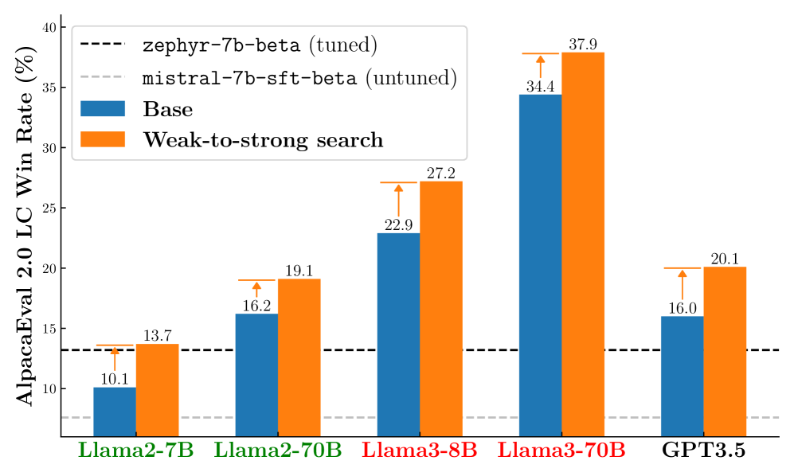

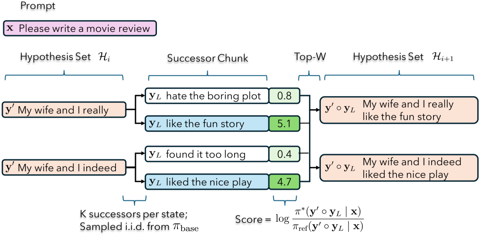

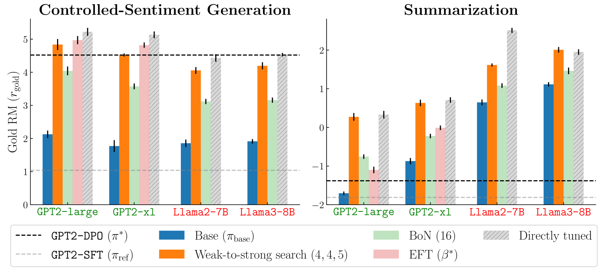

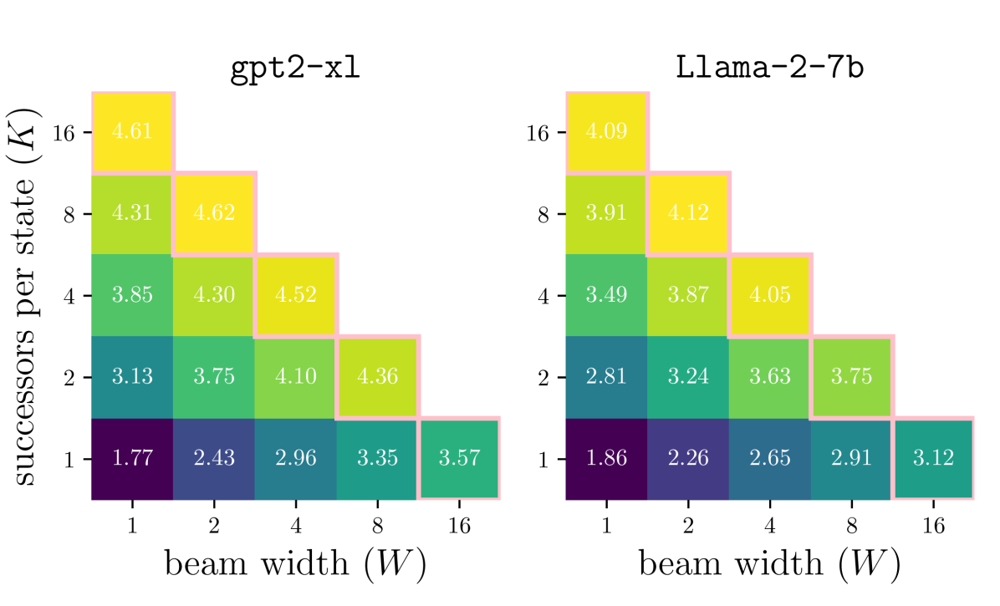

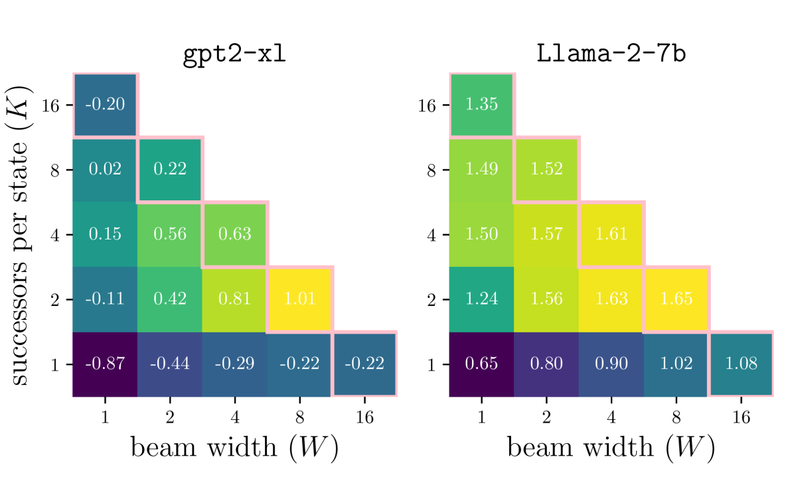

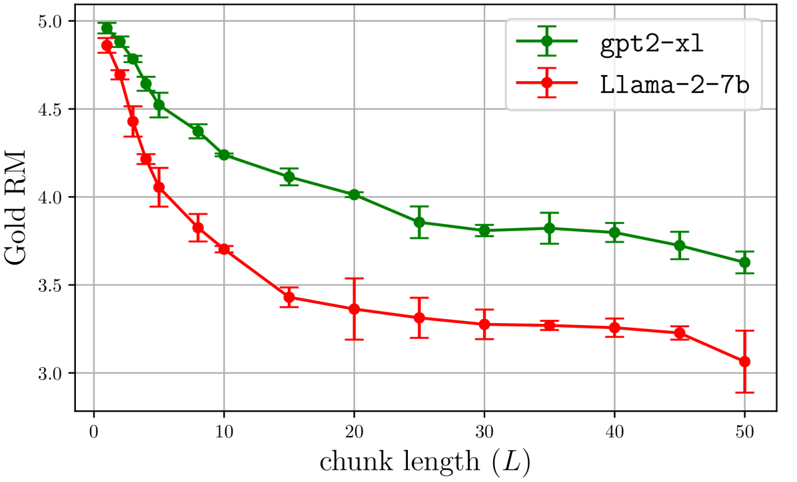

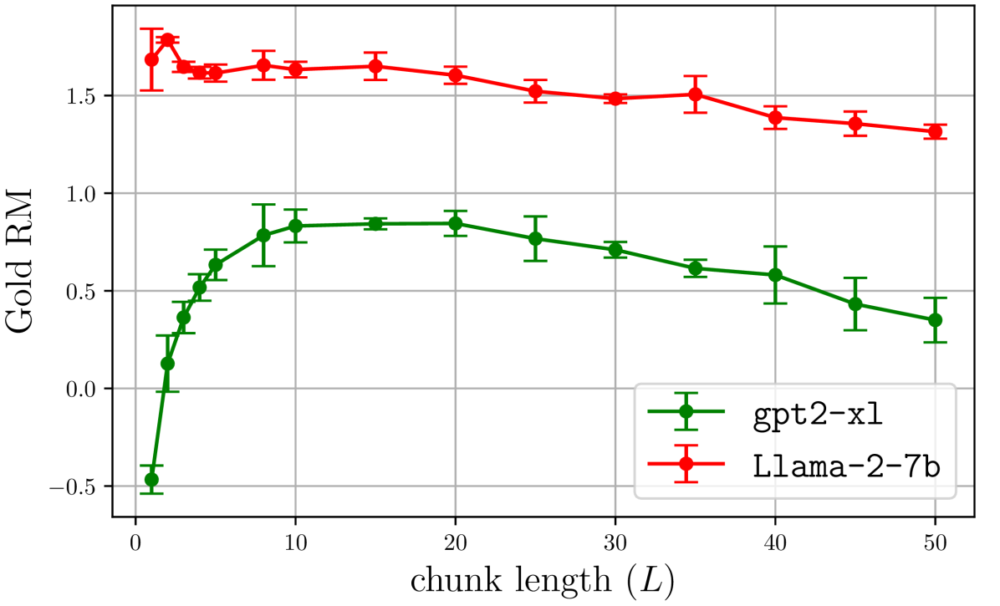

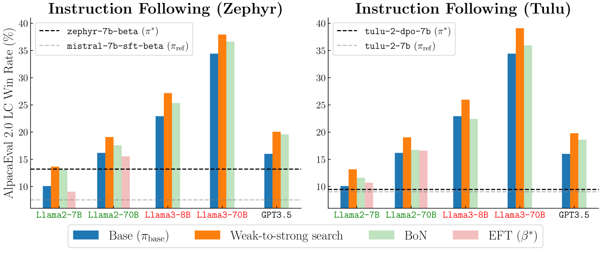

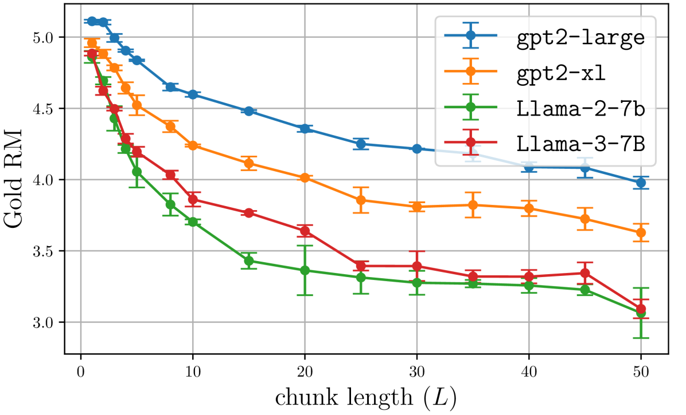

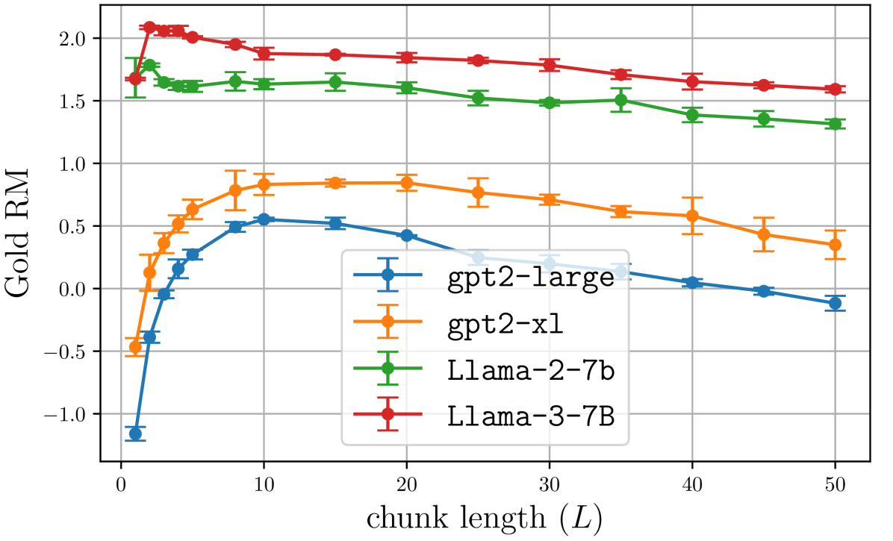

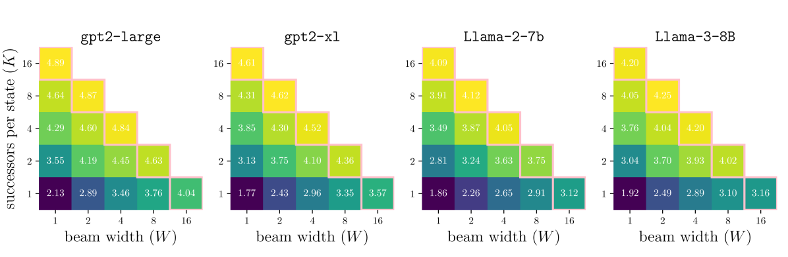

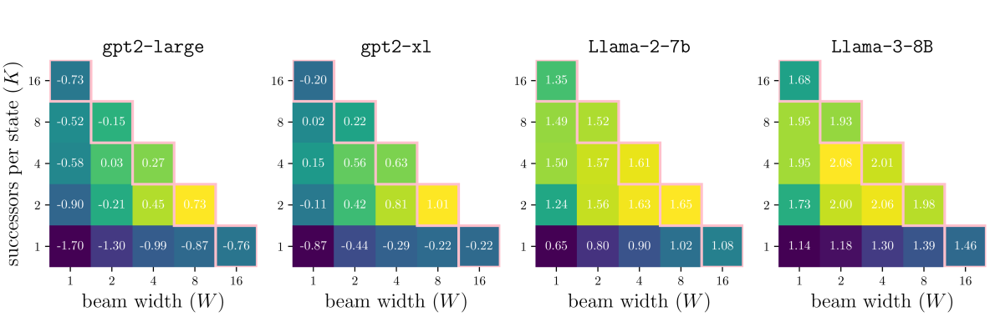

[Arxiv](https://arxiv.org/abs/2405.19262)