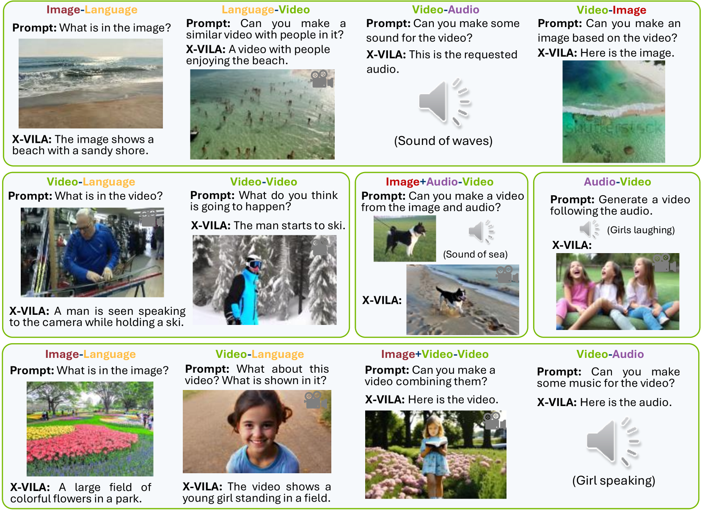
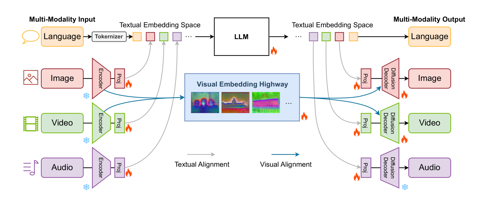
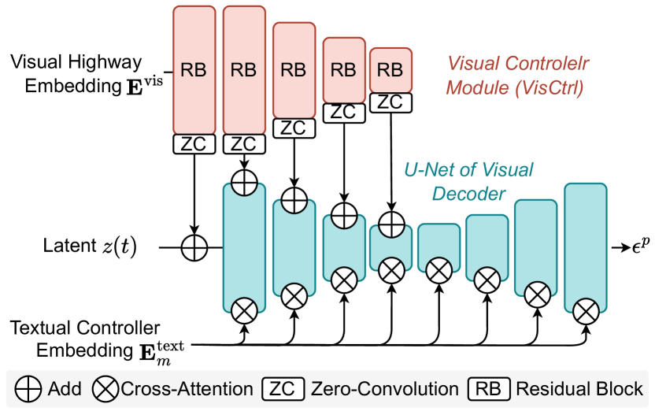
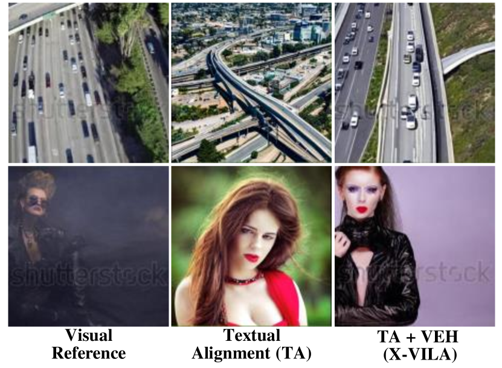
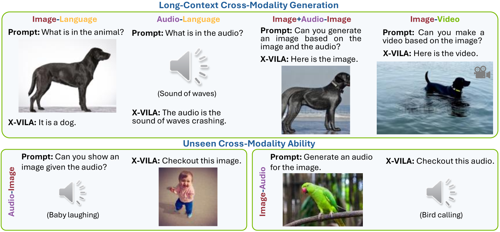
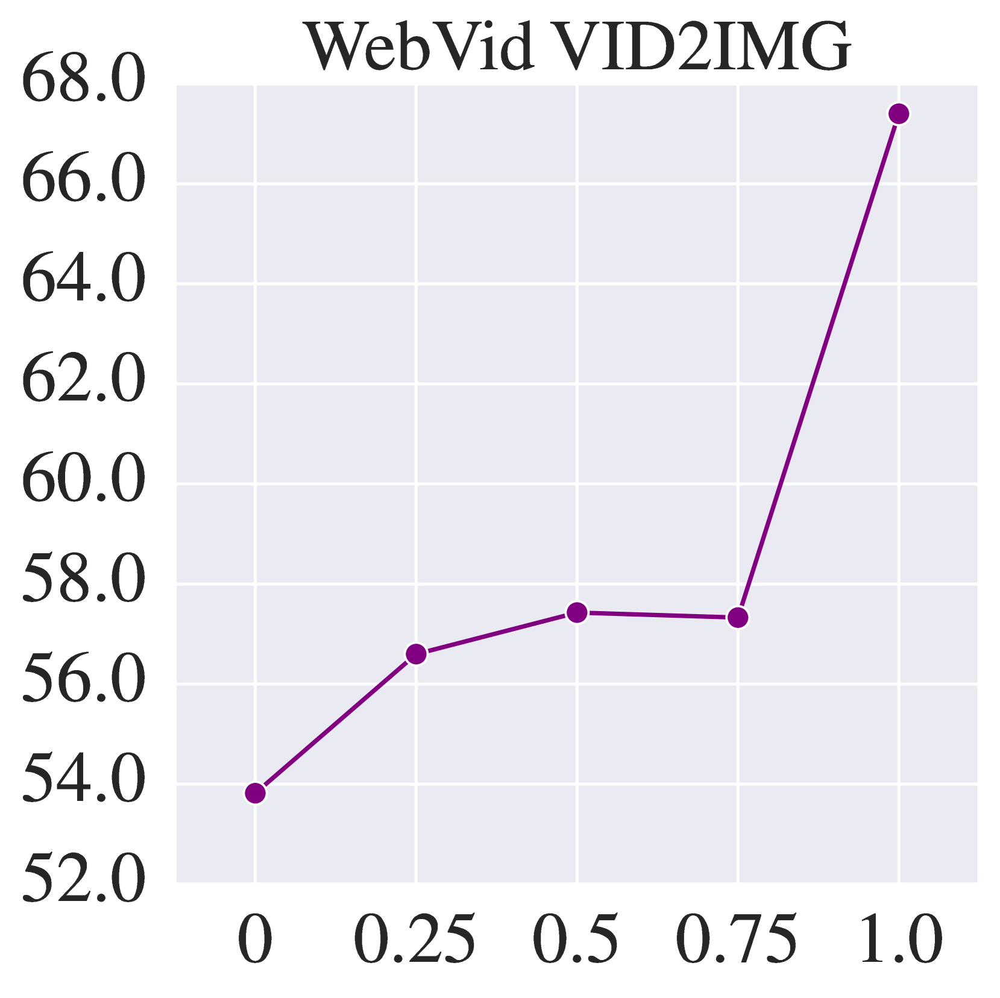
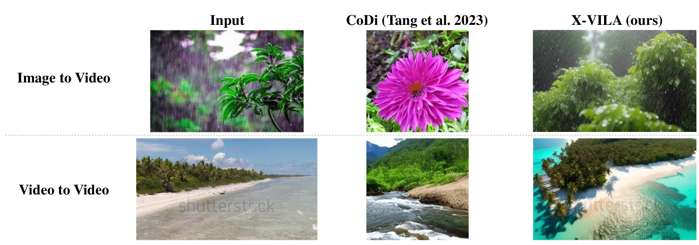
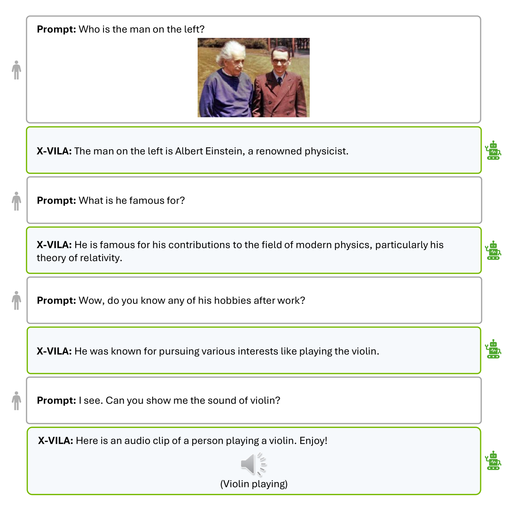
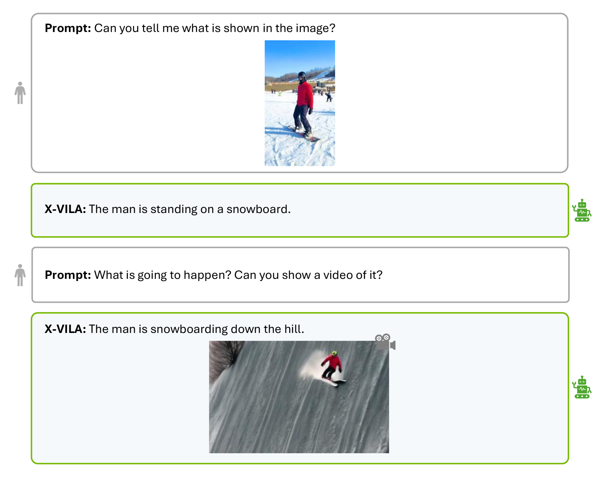

# X-VILA：大型语言模型中的跨模态对齐技术

发布时间：2024年05月29日

`LLM应用

理由：这篇论文介绍了一个名为X-VILA的全模态模型，它旨在通过融合图像、视频和音频模态来扩展大型语言模型的能力。论文中提到了模型的构建、数据集的准备、对现有方法的改进以及训练方案的优化，这些都是关于如何应用LLM技术来处理多模态数据的实际应用。因此，这篇论文属于LLM应用分类。` `多媒体处理` `人工智能`

> X-VILA: Cross-Modality Alignment for Large Language Model

# 摘要

> 我们推出了X-VILA，这一全模态模型旨在通过融合图像、视频和音频模态，拓展大型语言模型的能力。通过精确匹配模态专用编码器与输入，以及扩散解码器与输出，X-VILA实现了跨模态的理解、推理与生成。为此，我们精心构建了一个任意模态间指令遵循的数据集，以促进跨模态对齐。同时，我们揭示了现有跨模态对齐方法中的视觉信息丢失问题，并提出了一种包含视觉嵌入高速模块的视觉对齐机制来解决这一问题。此外，我们开发了一种资源高效的训练方案，使X-VILA在任意模态对话中表现卓越，显著超越了以往技术。即使在训练数据有限的情况下，X-VILA也能在各模态间展现出独特的涌现特性，并且该项目将公开源代码。

> We introduce X-VILA, an omni-modality model designed to extend the capabilities of large language models (LLMs) by incorporating image, video, and audio modalities. By aligning modality-specific encoders with LLM inputs and diffusion decoders with LLM outputs, X-VILA achieves cross-modality understanding, reasoning, and generation. To facilitate this cross-modality alignment, we curate an effective interleaved any-to-any modality instruction-following dataset. Furthermore, we identify a significant problem with the current cross-modality alignment method, which results in visual information loss. To address the issue, we propose a visual alignment mechanism with a visual embedding highway module. We then introduce a resource-efficient recipe for training X-VILA, that exhibits proficiency in any-to-any modality conversation, surpassing previous approaches by large margins. X-VILA also showcases emergent properties across modalities even in the absence of similar training data. The project will be made open-source.

[Arxiv](https://arxiv.org/abs/2405.19335)