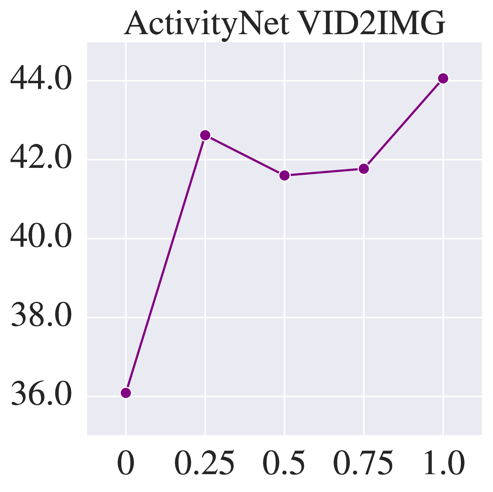

# X-VILA：大型语言模型中的跨模态对齐技术

发布时间：2024年05月29日

`LLM应用

这篇论文介绍了X-VILA，一个全模态模型，它通过融合图像、视频和音频模态来扩展大型语言模型的能力。论文中提到的关键技术包括模态特异性的编码器与LLM输入的对接，以及扩散解码器与LLM输出的对接，这些都是为了实现跨模态的理解、推理与生成。此外，论文还讨论了视觉信息丢失的问题，并提出了解决方案。这些内容表明，该论文主要关注的是如何应用大型语言模型（LLM）来处理和理解多模态数据，因此属于LLM应用分类。` `多媒体处理` `人工智能`

> X-VILA: Cross-Modality Alignment for Large Language Model

# 摘要

> 我们推出了X-VILA，一款全模态模型，旨在通过融合图像、视频和音频模态，拓展大型语言模型的能力。X-VILA通过将模态特异性的编码器与LLM输入对接，以及扩散解码器与LLM输出对接，实现了跨模态的理解、推理与生成。为了优化这种跨模态对接，我们精心策划了一个高效的任意模态间指令遵循数据集。同时，我们揭示了现有跨模态对接方法中的一个关键问题——视觉信息丢失，并为此提出了一种包含视觉嵌入高速模块的视觉对齐机制。此外，我们开发了一种资源高效的X-VILA训练方案，其在任意模态对话中表现卓越，远超以往方法。即使在缺乏相似训练数据的情况下，X-VILA也能在各模态间展现出独特的涌现特性，并且该项目将对外开放源代码。

> We introduce X-VILA, an omni-modality model designed to extend the capabilities of large language models (LLMs) by incorporating image, video, and audio modalities. By aligning modality-specific encoders with LLM inputs and diffusion decoders with LLM outputs, X-VILA achieves cross-modality understanding, reasoning, and generation. To facilitate this cross-modality alignment, we curate an effective interleaved any-to-any modality instruction-following dataset. Furthermore, we identify a significant problem with the current cross-modality alignment method, which results in visual information loss. To address the issue, we propose a visual alignment mechanism with a visual embedding highway module. We then introduce a resource-efficient recipe for training X-VILA, that exhibits proficiency in any-to-any modality conversation, surpassing previous approaches by large margins. X-VILA also showcases emergent properties across modalities even in the absence of similar training data. The project will be made open-source.

[Arxiv](https://arxiv.org/abs/2405.19335)