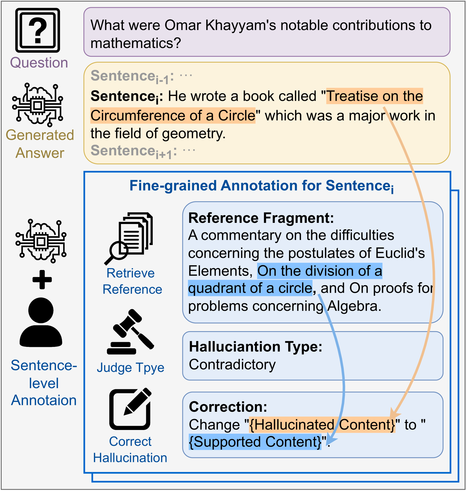
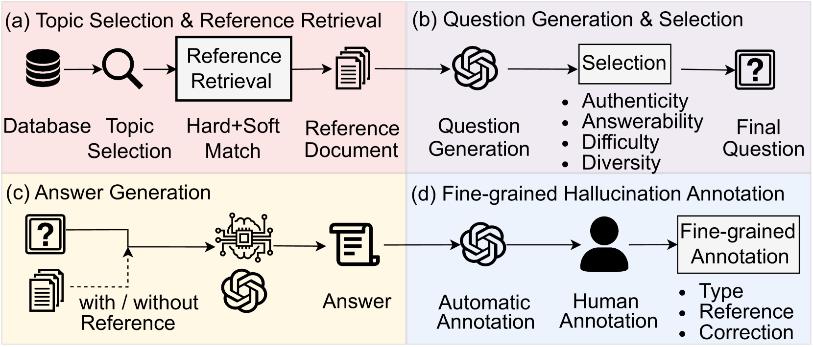
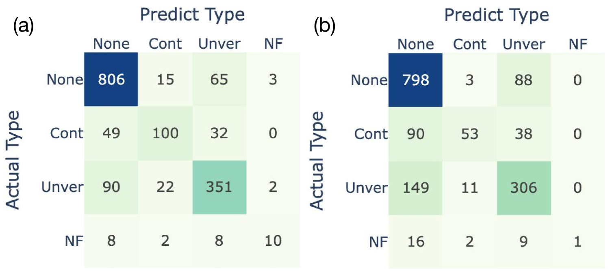
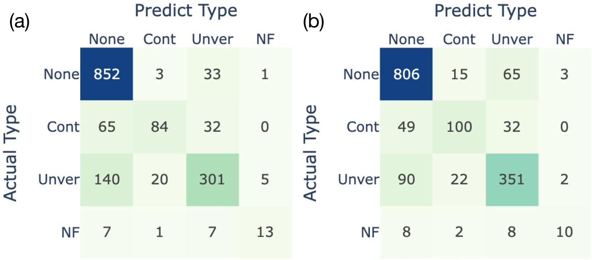
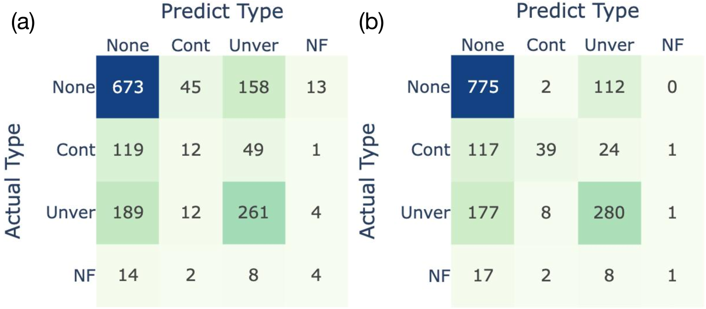
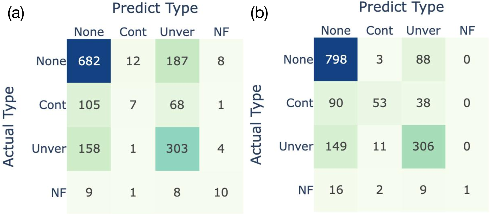

# ANAH：大型语言模型幻觉的精细分析注释

发布时间：2024年05月30日

`LLM应用

理由：这篇论文主要关注于解决大型语言模型（LLMs）中的“幻觉”问题，通过开发一个双语数据集（ANAH）来精细分析和标注生成性问答中的幻觉现象。论文的工作重点在于通过数据集的创建和使用来训练和评估幻觉检测器，这属于应用层面的研究，旨在改进LLMs在实际应用中的性能和准确性。因此，它被归类为LLM应用。` `问答系统` `数据标注`

> ANAH: Analytical Annotation of Hallucinations in Large Language Models

# 摘要

> 为了解决大型语言模型（LLMs）中的“幻觉”问题，我们开发了 **ANAH** 双语数据集，专注于生成性问答中 LLMs 幻觉的精细分析标注。每个答案都经过严格审核，包括查找参考信息、识别幻觉类型及修正错误内容。ANAH 包含约 12,000 个精细标注，涉及 4,300 多个 LLM 回答和 700 多个主题，通过人机协作流程精心制作。通过这些精细标注，我们发现 LLMs 的幻觉在答案中逐渐增多，并利用 ANAH 训练和评估幻觉检测器。实验表明，尽管现有开源 LLMs 在精细幻觉检测上存在挑战，但使用 ANAH 训练的生成性标注器不仅超越了所有开源模型和 GPT-3.5，还达到了与 GPT-4 相媲美的性能，并在新问题上展现出更强的泛化能力。

> Reducing the `$\textit{hallucination}$' problem of Large Language Models (LLMs) is crucial for their wide applications. A comprehensive and fine-grained measurement of the hallucination is the first key step for the governance of this issue but is under-explored in the community. Thus, we present $\textbf{ANAH}$, a bilingual dataset that offers $\textbf{AN}$alytical $\textbf{A}$nnotation of $\textbf{H}$allucinations in LLMs within Generative Question Answering. Each answer sentence in our dataset undergoes rigorous annotation, involving the retrieval of a reference fragment, the judgment of the hallucination type, and the correction of hallucinated content. ANAH consists of ~12k sentence-level annotations for ~4.3k LLM responses covering over 700 topics, constructed by a human-in-the-loop pipeline. Thanks to the fine granularity of the hallucination annotations, we can quantitatively confirm that the hallucinations of LLMs progressively accumulate in the answer and use ANAH to train and evaluate hallucination annotators. We conduct extensive experiments on studying generative and discriminative annotators and show that, although current open-source LLMs have difficulties in fine-grained hallucination annotation, the generative annotator trained with ANAH can surpass all open-source LLMs and GPT-3.5, obtain performance competitive with GPT-4, and exhibits better generalization ability on unseen questions.

[Arxiv](https://arxiv.org/abs/2405.20315)