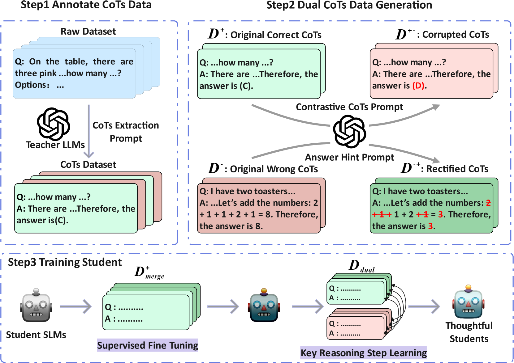

# 超越模仿：从推理蒸馏的双重思维链中汲取关键推理步骤

发布时间：2024年05月30日

`LLM理论

这篇论文主要探讨了大型语言模型（LLMs）的思维链（CoTs）推理能力如何精简至小型语言模型（SLMs），并提出了一种新的方法EDIT来提炼关键推理步骤。这种方法涉及到对推理过程的深入分析和优化，特别是在识别和优化关键推理步骤方面。因此，这篇论文的内容更偏向于对LLM理论的深入研究，特别是关于推理能力的提炼和优化，而不是直接的应用或Agent的设计。此外，虽然它涉及到了模型的提炼过程，但这更多是关于理论层面的探讨，而不是具体的应用案例或Agent的实现。因此，将其归类为LLM理论是合适的。` `人工智能`

> Beyond Imitation: Learning Key Reasoning Steps from Dual Chain-of-Thoughts in Reasoning Distillation

# 摘要

> 随着大型语言模型（LLMs）的扩展，其思维链（CoTs）推理能力显著增强，但资源限制促使我们寻求将这些能力精简至小型语言模型（SLMs）。我们发现，CoTs中大部分是基础推理，仅约4.7%的关键步骤真正左右结论。传统的提炼方法仅在教师LLMs生成的正确CoTs上微调学生SLMs，导致学生难以掌握关键推理，反而模仿表面形式，常犯错误或遗漏关键点。受人类学习中通过错误分析揭示关键步骤的启发，我们提出了一种名为EDIT的新方法，专注于提炼关键推理步骤而非简单模仿。首先，我们设计特殊提示，生成推理路径相似但结论不同的双CoTs数据，以揭示这些关键步骤。接着，利用最小编辑距离算法在这些数据中定位并优化这些步骤。实验证明，EDIT在多个推理数据集上均表现出色，能生成包含更多正确关键步骤的高质量CoTs。此外，我们还发现，EDIT尤其能从逻辑错误中获益，而非知识或计算错误。

> As Large Language Models (LLMs) scale up and gain powerful Chain-of-Thoughts (CoTs) reasoning abilities, practical resource constraints drive efforts to distill these capabilities into more compact Smaller Language Models (SLMs). We find that CoTs consist mainly of simple reasoning forms, with a small proportion ($\approx 4.7\%$) of key reasoning steps that truly impact conclusions. However, previous distillation methods typically involve supervised fine-tuning student SLMs only on correct CoTs data produced by teacher LLMs, resulting in students struggling to learn the key reasoning steps, instead imitating the teacher's reasoning forms and making errors or omissions on these steps. To address these issues, drawing an analogy to human learning, where analyzing mistakes according to correct solutions often reveals the crucial steps leading to successes or failures, we propose mistak\textbf{E}-\textbf{D}riven key reason\textbf{I}ng step distilla\textbf{T}ion (\textbf{EDIT}), a novel method that further aids SLMs learning key reasoning steps rather than mere simple fine-tuning. Firstly, to expose these crucial steps in CoTs, we design specific prompts to generate dual CoTs data with similar reasoning paths but divergent conclusions. Then, we apply the minimum edit distance algorithm on the dual CoTs data to locate these key steps and optimize the likelihood of these steps. Extensive experiments validate the effectiveness of EDIT across both in-domain and out-of-domain benchmark reasoning datasets. Further analysis shows that EDIT can generate high-quality CoTs with more correct key reasoning steps. Notably, we also explore how different mistake patterns affect performance and find that EDIT benefits more from logical errors than from knowledge or mathematical calculation errors in dual CoTs\footnote{Code can be found at \url{https://github.com/C-W-D/EDIT}}.

[Arxiv](https://arxiv.org/abs/2405.19737)