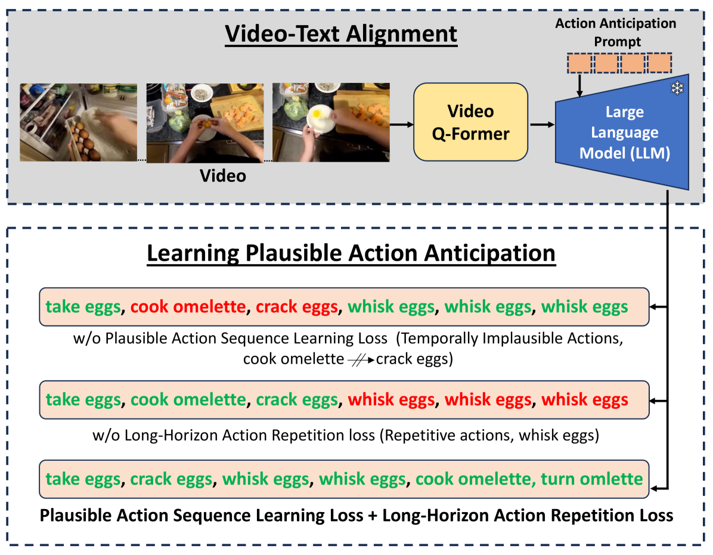
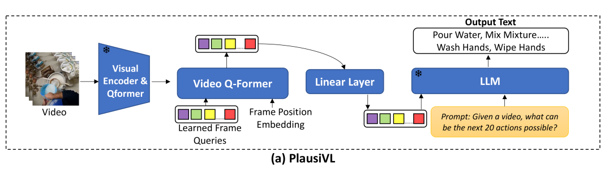
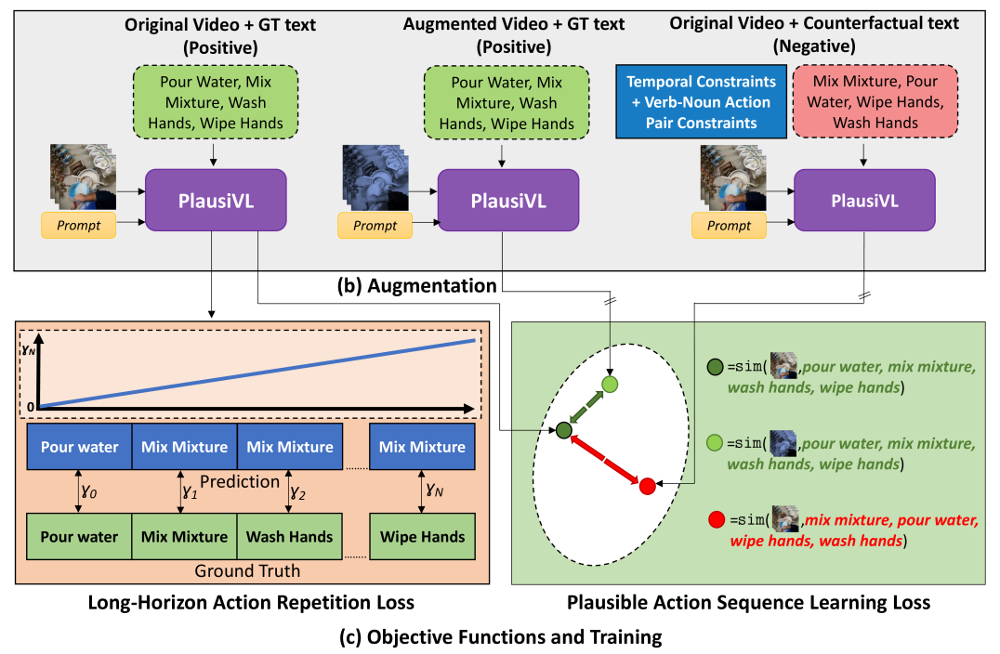
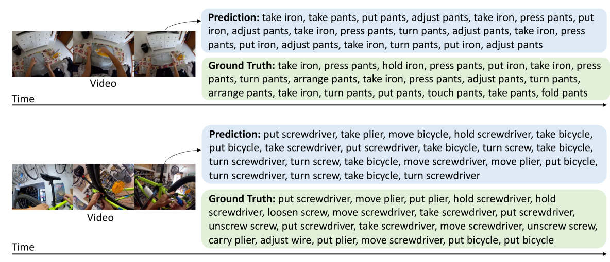
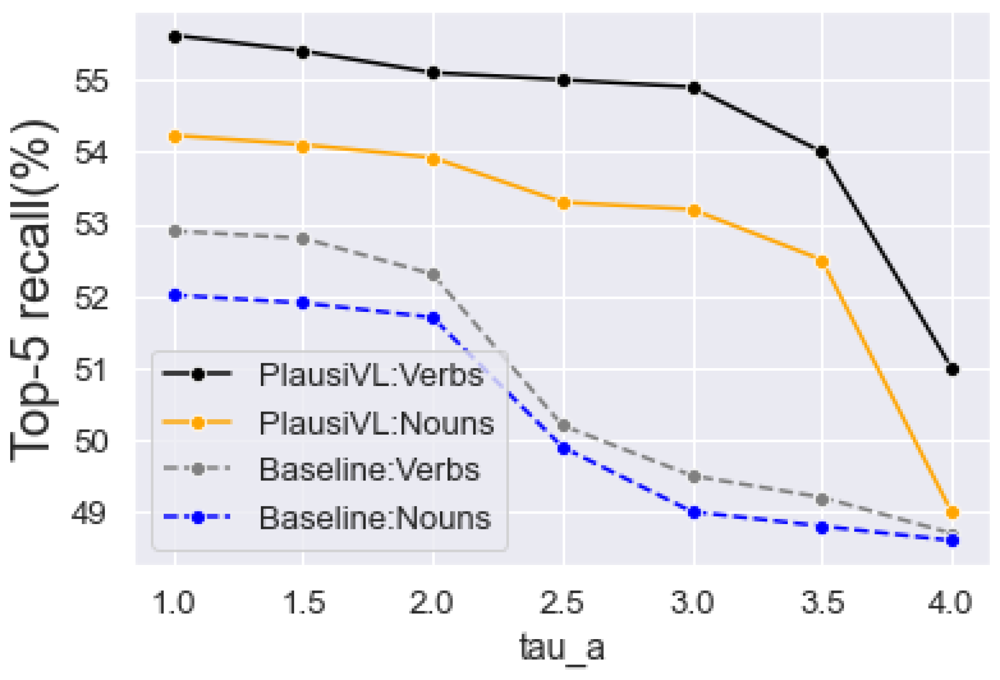
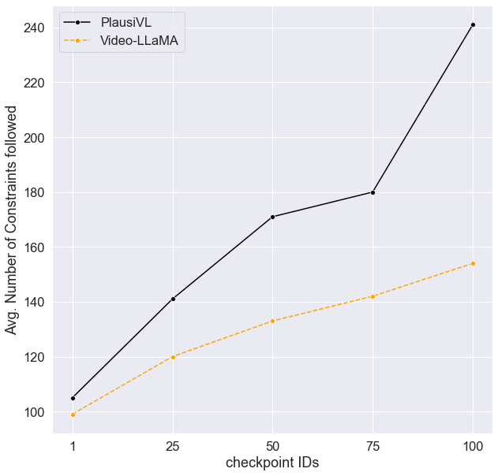
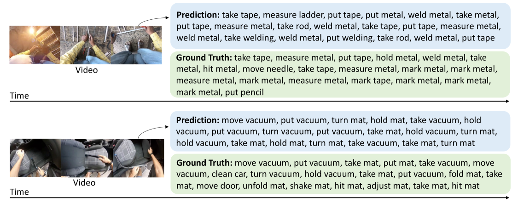
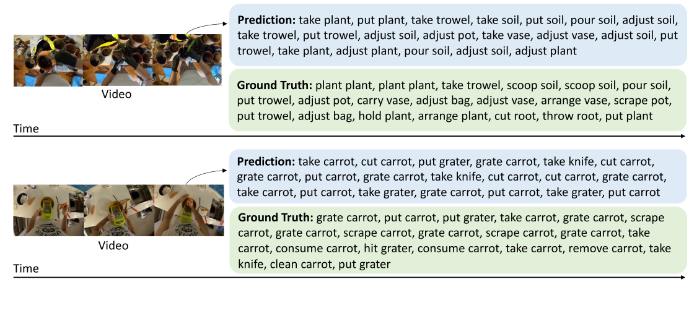
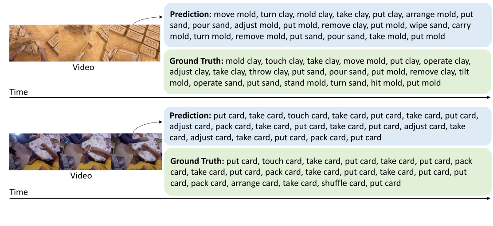

# 欲制煎蛋，必先破蛋：借助大型视频-语言模型，精准预见动作之可能。

发布时间：2024年05月30日

`Agent

理由：这篇论文介绍了一个名为 PlausiVL 的大型视频-语言模型，该模型专门设计用于预测现实世界中合理的动作序列。论文中提到的两个创新的目标函数（基于反事实的合理动作序列学习损失和长期动作重复损失）以及对动作序列合理性的深入理解，表明这是一个关于智能体（Agent）如何通过学习和优化来提高其预测和决策能力的研究。因此，这篇论文更适合归类为Agent，因为它关注的是模型如何作为一个智能体在特定任务（动作预测）中进行学习和表现。` `视频分析` `动作预测`

> Can't make an Omelette without Breaking some Eggs: Plausible Action Anticipation using Large Video-Language Models

# 摘要

> 我们推出了PlausiVL，一款专为预测现实世界中合理动作序列而设计的大型视频-语言模型。尽管已有许多努力致力于预测未来动作，但以往方法往往忽略了动作序列的合理性。为此，我们深入挖掘了大型视频-语言模型的生成潜力，并引入了两个创新的目标函数：基于反事实的合理动作序列学习损失和长期动作重复损失，以深化对动作序列合理性的理解。通过结合时间逻辑约束和动词-名词动作对逻辑约束，我们构建了不合理/反事实的动作序列，以此训练模型，使其能够辨别动作序列的合理性，并捕捉到对动作预测至关重要的隐含时间线索。长期动作重复损失对那些在长时间跨度内易重复的动作施加更重的惩罚，促使模型生成既多样又合理的动作序列。我们在Ego4D和EPIC-Kitchens-100这两个大规模数据集上验证了我们的方法，并取得了在动作预测任务上的显著进步。

> We introduce PlausiVL, a large video-language model for anticipating action sequences that are plausible in the real-world. While significant efforts have been made towards anticipating future actions, prior approaches do not take into account the aspect of plausibility in an action sequence. To address this limitation, we explore the generative capability of a large video-language model in our work and further, develop the understanding of plausibility in an action sequence by introducing two objective functions, a counterfactual-based plausible action sequence learning loss and a long-horizon action repetition loss. We utilize temporal logical constraints as well as verb-noun action pair logical constraints to create implausible/counterfactual action sequences and use them to train the model with plausible action sequence learning loss. This loss helps the model to differentiate between plausible and not plausible action sequences and also helps the model to learn implicit temporal cues crucial for the task of action anticipation. The long-horizon action repetition loss puts a higher penalty on the actions that are more prone to repetition over a longer temporal window. With this penalization, the model is able to generate diverse, plausible action sequences. We evaluate our approach on two large-scale datasets, Ego4D and EPIC-Kitchens-100, and show improvements on the task of action anticipation.

[Arxiv](https://arxiv.org/abs/2405.20305)