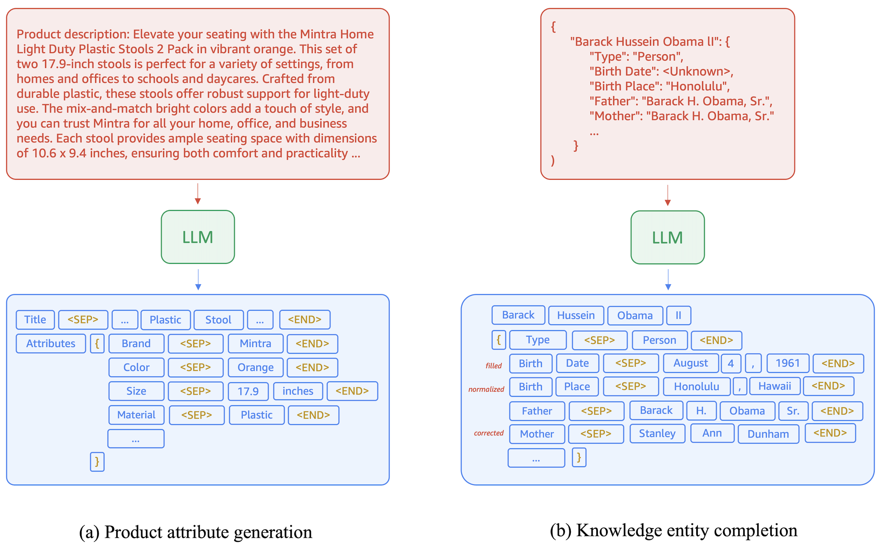
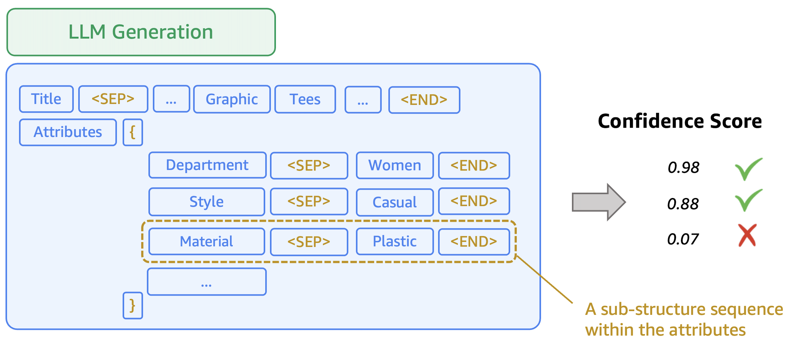
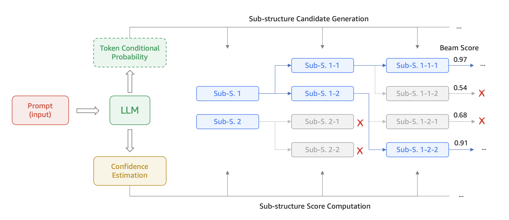
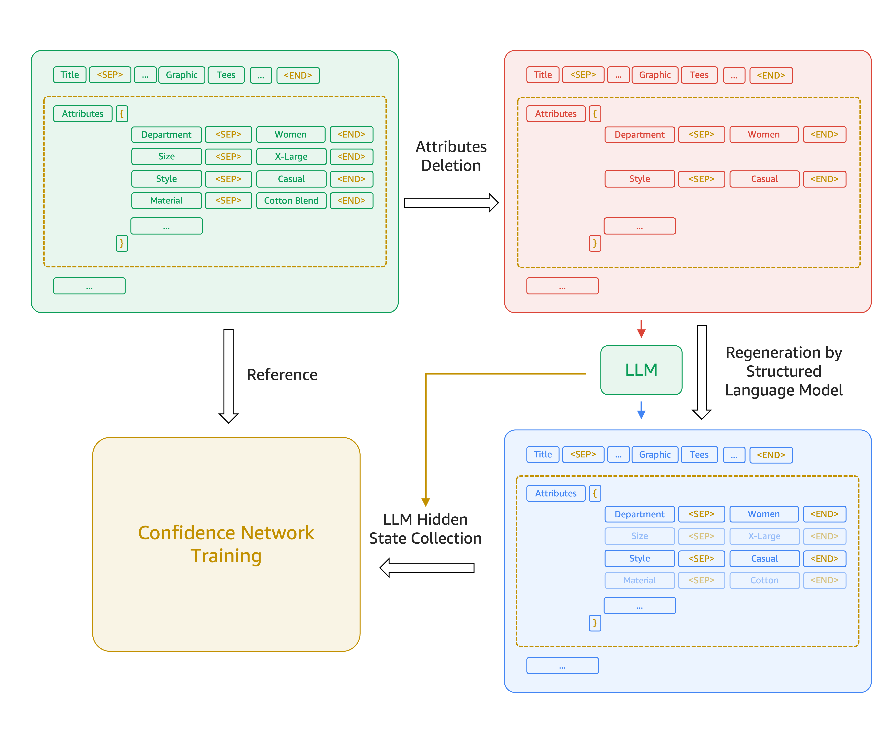

# 信心感知子结构束搜索（CABS）：大型语言模型在结构化数据生成中减少幻觉的有效策略

发布时间：2024年05月30日

`LLM应用

这篇论文主要探讨了大型语言模型（LLMs）在生成结构化数据时的置信度问题，并提出了一种新的置信度估计方法和解码策略（置信度感知子结构束搜索，CABS）。这些方法和策略旨在提高结构化数据生成的准确性和可靠性，特别是在处理包含复杂子结构的混合数据时。因此，这篇论文的内容更偏向于LLM的实际应用，而不是理论研究或Agent、RAG相关的研究。` `数据管理` `电子商务`

> Confidence-Aware Sub-Structure Beam Search (CABS): Mitigating Hallucination in Structured Data Generation with Large Language Models

# 摘要

> 大型语言模型（LLMs）在结构化数据生成方面展现出巨大潜力，如表格数据、文档数据库和产品目录等领域的应用。然而，由于可能出现的错误引用或幻觉，生成的数据真实性受到质疑，亟需引入模型置信度来解决这一问题。目前，LLMs生成置信度的估计方法多集中在单个令牌或整个输出序列上，对于包含子结构级别复杂混合的结构化数据生成，其适用性有限。本文首先探讨了针对生成子结构级别数据的置信度估计方法，并提出了基于LLM变压器隐藏状态的置信度网络，这一方法比传统的令牌条件概率更为精准。此外，我们还创新性地提出了置信度感知子结构束搜索（CABS），一种在结构化数据生成中针对子结构级别操作的新型解码策略。CABS通过结合置信度网络对各子结构级别数据的置信度评分，并持续优化提示，显著提升了结构化数据生成的准确性。实验结果表明，在产品属性生成任务中，CABS以平均90%的精度实现了16.7%的召回率提升，明显优于传统的令牌级别束搜索方法。

> Large Language Models (LLMs) have facilitated structured data generation, with applications in domains like tabular data, document databases, product catalogs, etc. However, concerns persist about generation veracity due to incorrect references or hallucinations, necessitating the incorporation of some form of model confidence for mitigation. Existing confidence estimation methods on LLM generations primarily focus on the confidence at the individual token level or the entire output sequence level, limiting their applicability to structured data generation, which consists of an intricate mix of both independent and correlated entries at the sub-structure level. In this paper, we first investigate confidence estimation methods for generated sub-structure-level data. We introduce the concept of Confidence Network that applies on the hidden state of the LLM transformer, as a more targeted estimate than the traditional token conditional probability. We further propose Confidence-Aware sub-structure Beam Search (CABS), a novel decoding method operating at the sub-structure level in structured data generation. CABS enhances the faithfulness of structured data generation by considering confidence scores from the Confidence Network for each sub-structure-level data and iteratively refining the prompts. Results show that CABS outperforms traditional token-level beam search for structured data generation by 16.7% Recall at 90% precision averagely on the problem of product attribute generation.

[Arxiv](https://arxiv.org/abs/2406.00069)