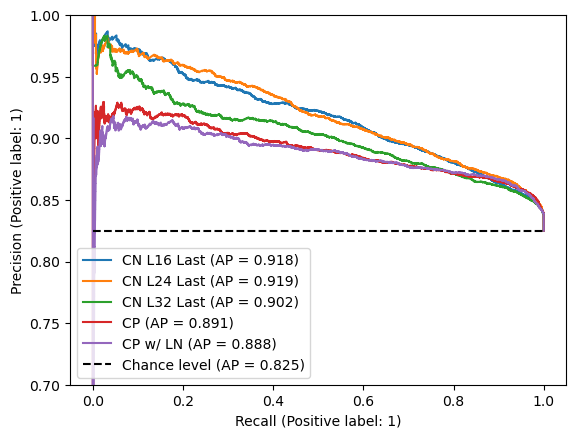

# 信心感知子结构束搜索（CABS）：大型语言模型在结构化数据生成中减少幻觉的有效策略

发布时间：2024年05月30日

`LLM应用

这篇论文探讨了大型语言模型（LLMs）在生成结构化数据时的置信度问题，并提出了一种新的方法——置信度网络和置信度感知子结构束搜索（CABS），以提高结构化数据生成的可靠性。这些内容直接关联到LLMs在实际应用中的性能和效率，特别是在处理结构化数据生成任务时，因此将其归类为LLM应用。` `数据管理` `电子商务`

> Confidence-Aware Sub-Structure Beam Search (CABS): Mitigating Hallucination in Structured Data Generation with Large Language Models

# 摘要

> 大型语言模型（LLMs）在结构化数据生成方面展现出巨大潜力，如表格数据、文档数据库和产品目录等。但生成的真实性因错误引用或幻觉而受到质疑，需要模型置信度来缓解这一问题。目前，LLMs的置信度估计主要集中在单个令牌或整个输出序列上，这在处理结构化数据生成时显得力不从心，因为这种生成涉及子结构级别上独立与相关条目的复杂交织。本文首次探讨了生成子结构级别数据的置信度估计方法，并引入了置信度网络，该网络针对LLM变压器的隐藏状态进行更精确的估计。此外，我们提出了置信度感知子结构束搜索（CABS），这是一种创新的解码策略，专注于结构化数据生成的子结构级别。CABS通过整合置信度网络的评分并迭代优化提示，显著提升了结构化数据生成的可靠性。实验结果显示，在产品属性生成任务中，CABS在90%的精度下，平均召回率比传统令牌级束搜索提高了16.7%。

> Large Language Models (LLMs) have facilitated structured data generation, with applications in domains like tabular data, document databases, product catalogs, etc. However, concerns persist about generation veracity due to incorrect references or hallucinations, necessitating the incorporation of some form of model confidence for mitigation. Existing confidence estimation methods on LLM generations primarily focus on the confidence at the individual token level or the entire output sequence level, limiting their applicability to structured data generation, which consists of an intricate mix of both independent and correlated entries at the sub-structure level. In this paper, we first investigate confidence estimation methods for generated sub-structure-level data. We introduce the concept of Confidence Network that applies on the hidden state of the LLM transformer, as a more targeted estimate than the traditional token conditional probability. We further propose Confidence-Aware sub-structure Beam Search (CABS), a novel decoding method operating at the sub-structure level in structured data generation. CABS enhances the faithfulness of structured data generation by considering confidence scores from the Confidence Network for each sub-structure-level data and iteratively refining the prompts. Results show that CABS outperforms traditional token-level beam search for structured data generation by 16.7% Recall at 90% precision averagely on the problem of product attribute generation.

[Arxiv](https://arxiv.org/abs/2406.00069)