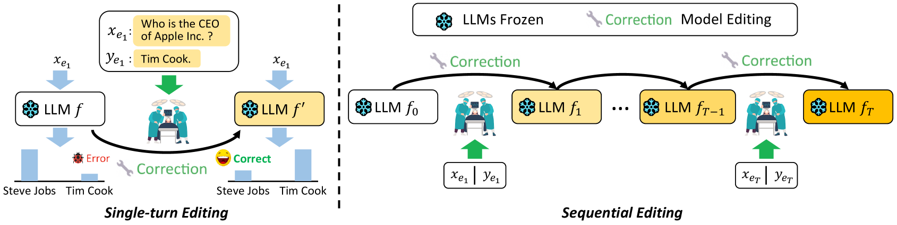
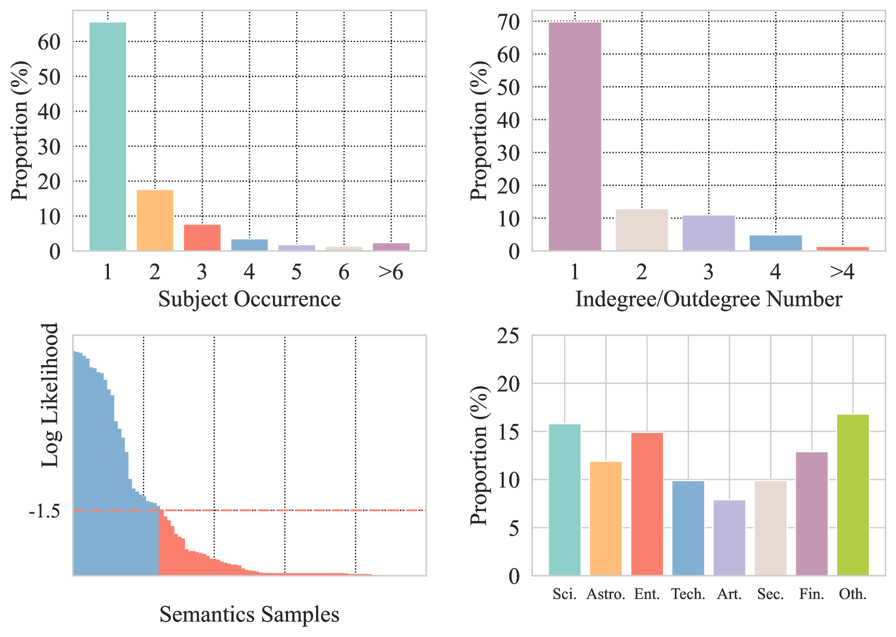
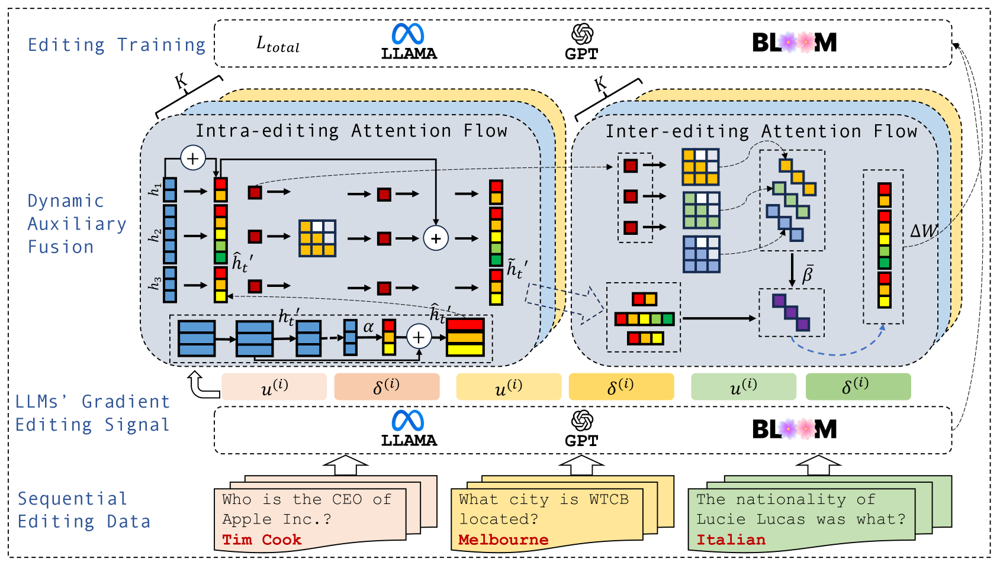
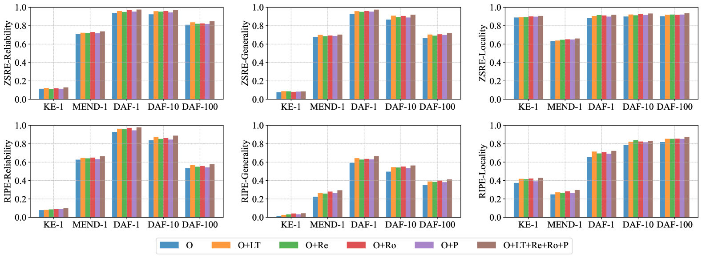
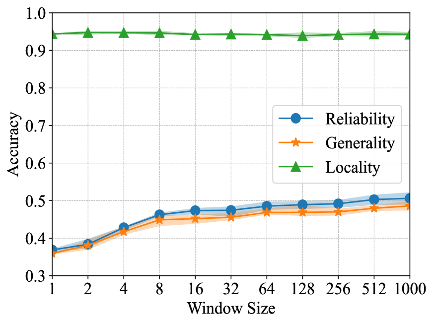
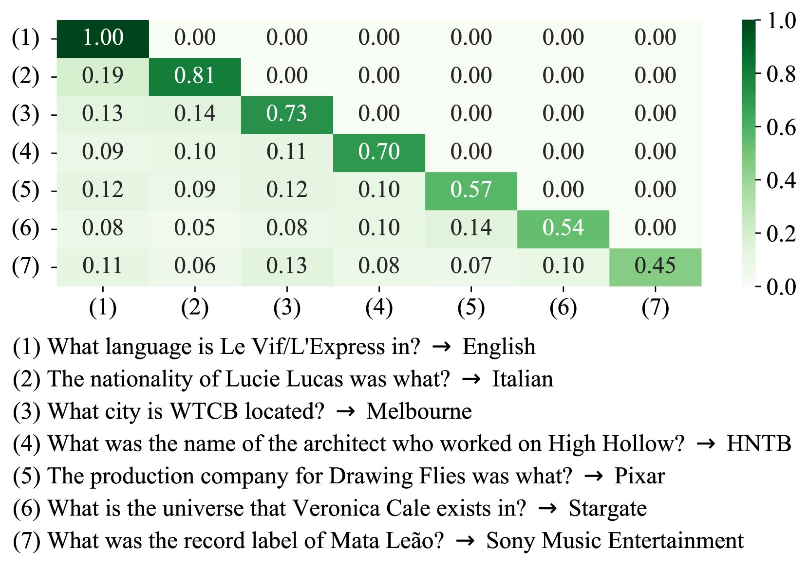

# DAFNet：大型语言模型中序列模型编辑的动态辅助融合网络

发布时间：2024年05月30日

`LLM应用

这篇论文主要探讨了大型语言模型（LLMs）中的幻觉问题，并提出了一种新的方法——顺序模型编辑（SME），以及动态辅助融合网络（DAFNet）来持续修正模型产生的错误。这种方法和网络的设计旨在通过增强模型内部的知识交互来防止灾难性遗忘，并提高模型在处理多个知识三元组时的准确性。此外，论文还创建了DAFSet数据集来支持这种顺序编辑方法。因此，这篇论文的内容更偏向于LLM的应用层面，即如何改进和优化LLM的实际应用性能，而不是理论研究或Agent、RAG相关的研究。` `模型编辑`

> DAFNet: Dynamic Auxiliary Fusion for Sequential Model Editing in Large Language Models

# 摘要

> 尽管大型语言模型（LLMs）近期取得了显著成果，但仍面临幻觉问题，即错误信息的生成。模型编辑旨在修正LLMs中的事实错误，但以往研究多将其视为一次性任务，忽视了LLMs持续产生的错误。为此，我们提出了顺序模型编辑（SME），旨在持续修正错误。我们设计了动态辅助融合网络（DAFNet），通过增强整个序列中事实知识间的语义交互，有效防止在编辑多个知识三元组时的灾难性遗忘。具体而言，（1）在关系三元组内进行语义融合时，我们将内部编辑注意力流整合到LLMs的自回归自注意力中，实现令牌级别的精细处理。同时，利用多层对角线间编辑注意力流更新整个序列的加权表示。（2）考虑到顺序编辑需要辅助参数存储知识，我们创建了DAFSet数据集，具备近期、流行、长尾和鲁棒性，以提升顺序编辑的通用性。实验结果显示，DAFNet在单轮和顺序编辑任务中均显著超越了现有基线。此外，DAFSet的使用也在多种场景下持续提升了其他基于辅助网络的方法的性能。

> Recently, while large language models (LLMs) have demonstrated impressive results, they still suffer from hallucination, i.e., the generation of false information. Model editing is the task of fixing factual mistakes in LLMs; yet, most previous works treat it as a one-time task, paying little attention to ever-emerging mistakes generated by LLMs. We address the task of sequential model editing (SME) that aims to rectify mistakes continuously. A Dynamic Auxiliary Fusion Network (DAFNet) is designed to enhance the semantic interaction among the factual knowledge within the entire sequence, preventing catastrophic forgetting during the editing process of multiple knowledge triples. Specifically, (1) for semantic fusion within a relation triple, we aggregate the intra-editing attention flow into auto-regressive self-attention with token-level granularity in LLMs. We further leverage multi-layer diagonal inter-editing attention flow to update the weighted representations of the entire sequence-level granularity. (2) Considering that auxiliary parameters are required to store the knowledge for sequential editing, we construct a new dataset named \textbf{DAFSet}, fulfilling recent, popular, long-tail and robust properties to enhance the generality of sequential editing. Experiments show DAFNet significantly outperforms strong baselines in single-turn and sequential editing. The usage of DAFSet also consistently improves the performance of other auxiliary network-based methods in various scenarios

[Arxiv](https://arxiv.org/abs/2405.20588)