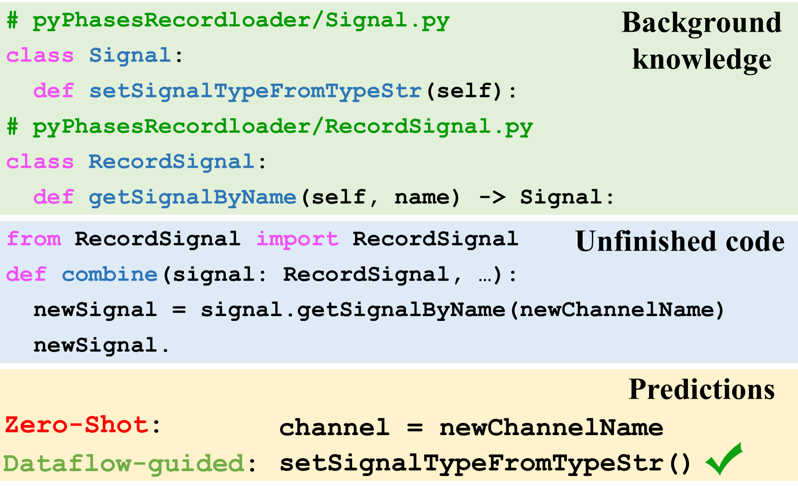
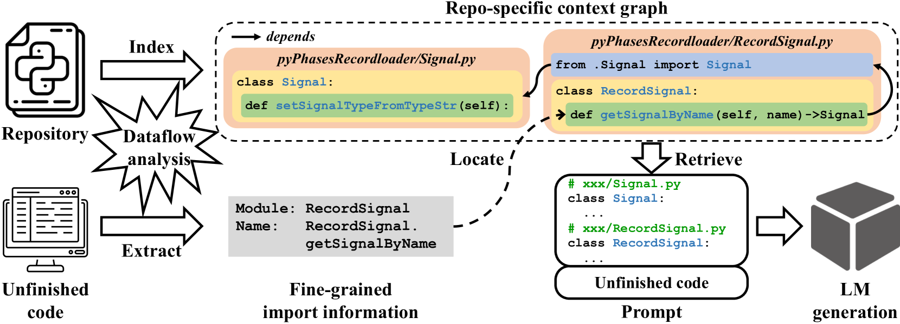
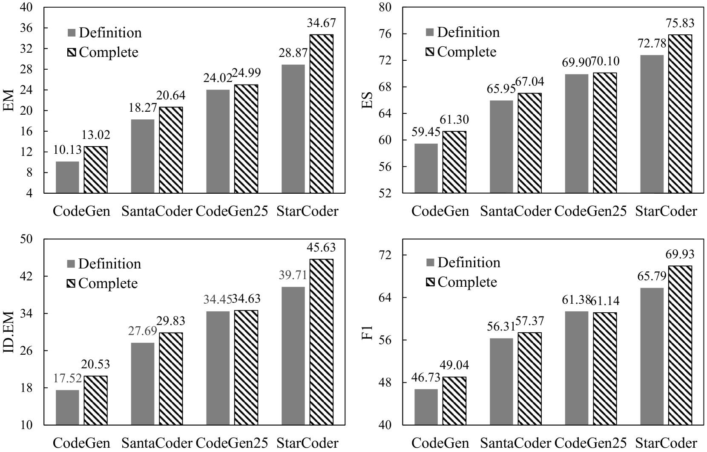
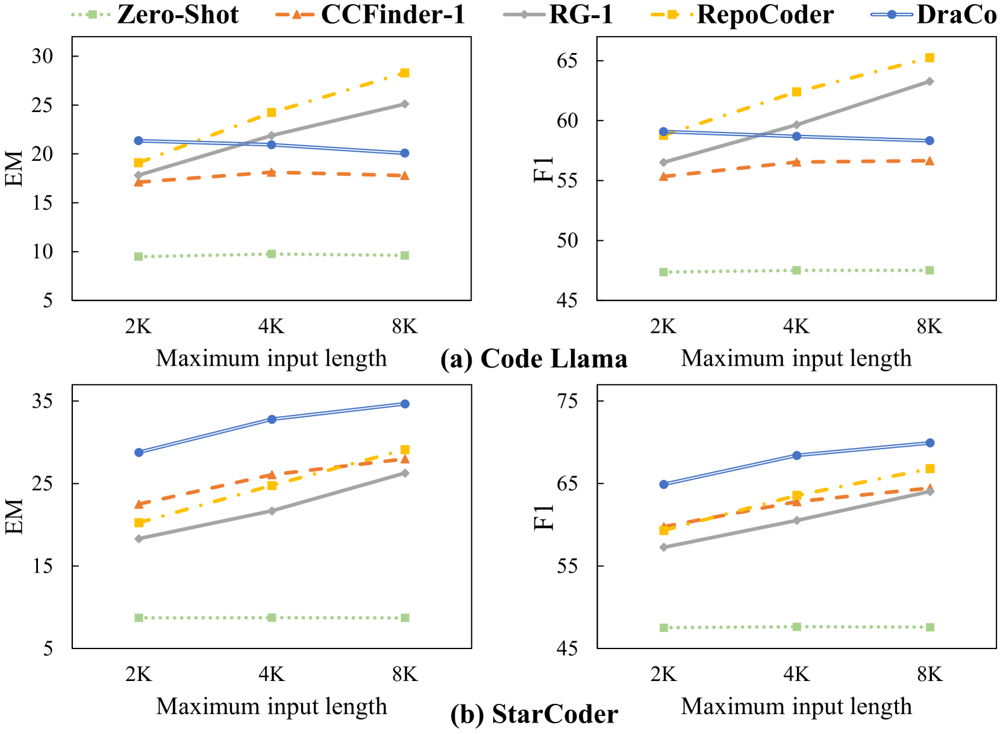
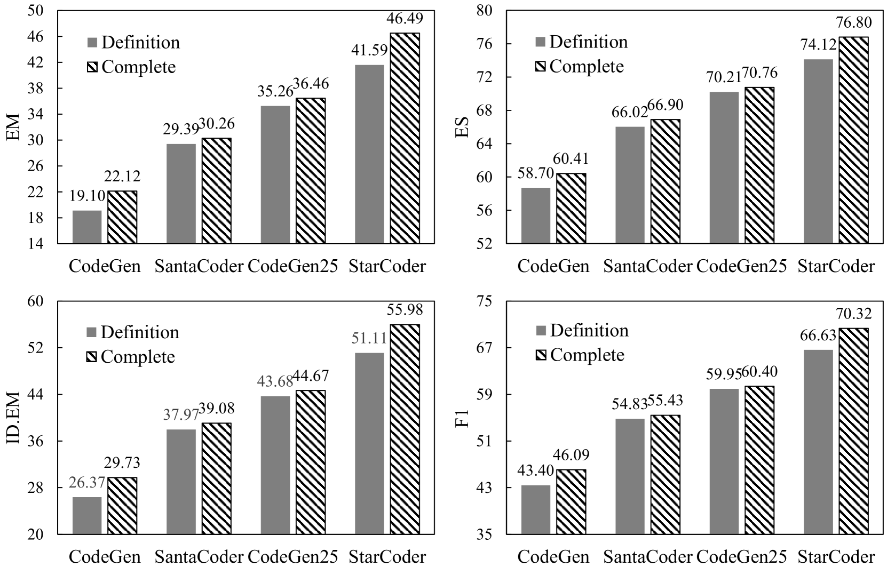

# 基于数据流的检索增强技术，助力仓库级代码补全

发布时间：2024年05月30日

`LLM应用

这篇论文介绍了一种名为DraCo的新方法，该方法通过数据流分析增强代码语言模型在私有代码库中的代码补全能力。这种方法特别针对代码库级别的代码补全任务，通过构建代码实体及其关系的上下文图，提高了代码补全的精确度和相关性。此外，论文还创建了一个新的Python数据集ReccEval，用于评估代码补全的效果。因此，这篇论文属于大型语言模型（LLM）的应用范畴，具体是在代码补全这一特定应用场景中的改进和优化。` `软件开发` `代码补全`

> Dataflow-Guided Retrieval Augmentation for Repository-Level Code Completion

# 摘要

> 近年来，代码语言模型（LMs）在代码补全等智能任务中大放异彩。但预训练模型在私有代码库中生成正确补全仍是一大挑战。以往研究依赖导入关系或文本相似性检索跨文件上下文，但与补全目标的相关性不足。为此，我们提出了DraCo，一种数据流引导的检索增强方法，专为代码库级别的代码补全设计。DraCo通过扩展的数据流分析，将私有代码库转化为代码实体及其关系网络，构建出特定于代码库的上下文图。在代码补全触发时，DraCo能精准提取此图中的相关背景知识，生成优质提示以供代码LMs查询。我们还创建了Python数据集ReccEval，其补全目标更为多元。实验结果显示，DraCo在提升代码精确匹配和标识符F1分数方面均超越了现有技术，分别提高了3.43%和3.27%。

> Recent years have witnessed the deployment of code language models (LMs) in various code intelligence tasks such as code completion. Yet, it is challenging for pre-trained LMs to generate correct completions in private repositories. Previous studies retrieve cross-file context based on import relations or text similarity, which is insufficiently relevant to completion targets. In this paper, we propose a dataflow-guided retrieval augmentation approach, called DraCo, for repository-level code completion. DraCo parses a private repository into code entities and establishes their relations through an extended dataflow analysis, forming a repo-specific context graph. Whenever triggering code completion, DraCo precisely retrieves relevant background knowledge from the repo-specific context graph and generates well-formed prompts to query code LMs. Furthermore, we construct a large Python dataset, ReccEval, with more diverse completion targets. Our experiments demonstrate the superior accuracy and applicable efficiency of DraCo, improving code exact match by 3.43% and identifier F1-score by 3.27% on average compared to the state-of-the-art approach.

[Arxiv](https://arxiv.org/abs/2405.19782)