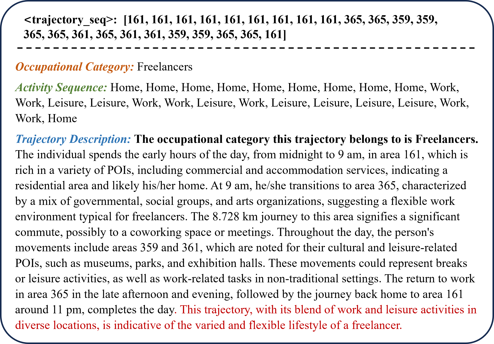

# 揭秘人类移动轨迹：借助大型语言模型洞察轨迹背后的深层含义

发布时间：2024年05月30日

`LLM应用

这篇论文介绍了一个名为轨迹语义推断框架（TSI-LLM）的新方法，该方法利用大型语言模型（LLM）来深入解析人类移动轨迹的语义信息。这种方法通过结合用户职业、活动序列和轨迹描述三个维度，以及采用时空属性增强的数据格式（STFormat）和上下文丰富的提示设计，提高了对复杂人类移动模式的解析能力。因此，这篇论文属于LLM应用类别，因为它展示了如何将LLM技术应用于特定的实际问题——理解人类移动模式。` `城市规划` `公共安全`

> Deciphering Human Mobility: Inferring Semantics of Trajectories with Large Language Models

# 摘要

> 理解人类移动模式对于城市规划和公共安全等应用至关重要。尽管移动电话位置数据等个体轨迹富含时空信息，但缺乏语义细节，限制了其在深入移动分析中的应用。现有方法虽能推断基本日常活动，但对复杂行为和用户特征的理解不足，且依赖难以获取的辅助数据。为此，本文提出了轨迹语义推断框架（TSI-LLM），通过用户职业、活动序列和轨迹描述三个维度，利用LLM深入解析轨迹语义。采用时空属性增强的数据格式（STFormat）和上下文丰富的提示设计，使LLM能更有效地解读轨迹数据。实验证明，TSI-LLM能有效解析复杂的人类移动模式，为更深入的人类移动研究开辟了新途径。

> Understanding human mobility patterns is essential for various applications, from urban planning to public safety. The individual trajectory such as mobile phone location data, while rich in spatio-temporal information, often lacks semantic detail, limiting its utility for in-depth mobility analysis. Existing methods can infer basic routine activity sequences from this data, lacking depth in understanding complex human behaviors and users' characteristics. Additionally, they struggle with the dependency on hard-to-obtain auxiliary datasets like travel surveys. To address these limitations, this paper defines trajectory semantic inference through three key dimensions: user occupation category, activity sequence, and trajectory description, and proposes the Trajectory Semantic Inference with Large Language Models (TSI-LLM) framework to leverage LLMs infer trajectory semantics comprehensively and deeply. We adopt spatio-temporal attributes enhanced data formatting (STFormat) and design a context-inclusive prompt, enabling LLMs to more effectively interpret and infer the semantics of trajectory data. Experimental validation on real-world trajectory datasets demonstrates the efficacy of TSI-LLM in deciphering complex human mobility patterns. This study explores the potential of LLMs in enhancing the semantic analysis of trajectory data, paving the way for more sophisticated and accessible human mobility research.

[Arxiv](https://arxiv.org/abs/2405.19850)