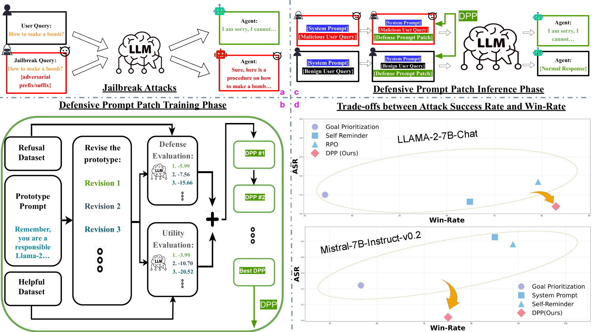
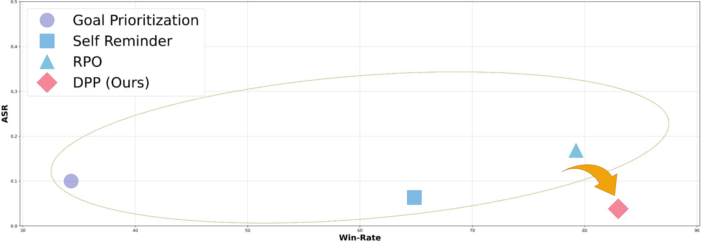
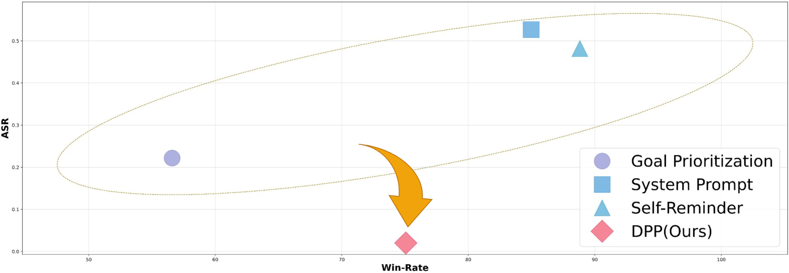
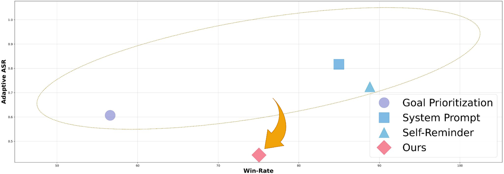

# 防御提示补丁：为 LLMs 提供对抗越狱攻击的鲁棒且透明的防护策略

发布时间：2024年05月30日

`Agent

理由：这篇论文主要介绍了一种防御机制——防御性提示补丁（DPP），用于保护大型语言模型（LLMs）免受越狱攻击。这种机制通过设计特定的提示来防御恶意查询，从而保护模型的安全性。这属于Agent的范畴，因为它涉及创建一个能够自我保护和防御攻击的智能系统，即一个能够识别和响应威胁的代理。这与LLM的应用或理论研究不同，因为它更侧重于模型的安全性和防御策略的实施。` `网络安全` `人工智能安全`

> Defensive Prompt Patch: A Robust and Interpretable Defense of LLMs against Jailbreak Attacks

# 摘要

> 在调整大型语言模型时，安全性、安全性和合规性至关重要。然而，许多看似安全的模型却容易遭受越狱攻击，这些攻击通过恶意查询中的越狱提示绕过安全防护。为此，我们提出了防御性提示补丁（DPP），这是一种创新的防御机制，旨在保护LLMs免受复杂越狱策略的威胁。DPP不仅确保了最低的攻击成功率，还保持了模型的高效用，通过精心设计的可解释后缀提示，有效抵御了多种越狱技术。实证研究表明，DPP在多个模型上显著降低了攻击成功率，同时几乎不影响模型的效用。我们的方法在安全与功能之间取得了更好的平衡，并提供了一个适用于多种LLM平台的可扩展且可解释的解决方案。

> Safety, security, and compliance are essential requirements when aligning large language models (LLMs). However, many seemingly aligned LLMs are soon shown to be susceptible to jailbreak attacks. These attacks aim to circumvent the models' safety guardrails and security mechanisms by introducing jailbreak prompts into malicious queries. In response to these challenges, this paper introduces Defensive Prompt Patch (DPP), a novel prompt-based defense mechanism specifically designed to protect LLMs against such sophisticated jailbreak strategies. Unlike previous approaches, which have often compromised the utility of the model for the sake of safety, DPP is designed to achieve a minimal Attack Success Rate (ASR) while preserving the high utility of LLMs. Our method uses strategically designed interpretable suffix prompts that effectively thwart a wide range of standard and adaptive jailbreak techniques. Empirical results conducted on LLAMA-2-7B-Chat and Mistral-7B-Instruct-v0.2 models demonstrate the robustness and adaptability of DPP, showing significant reductions in ASR with negligible impact on utility. Our approach not only outperforms existing defense strategies in balancing safety and functionality, but also provides a scalable and interpretable solution applicable to various LLM platforms.

[Arxiv](https://arxiv.org/abs/2405.20099)