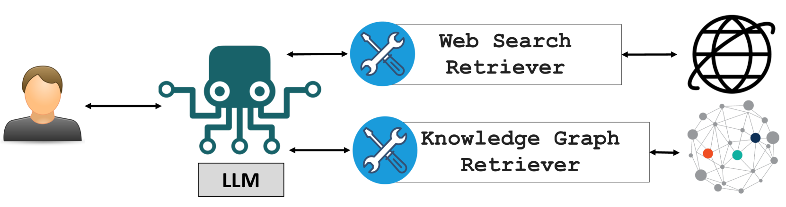
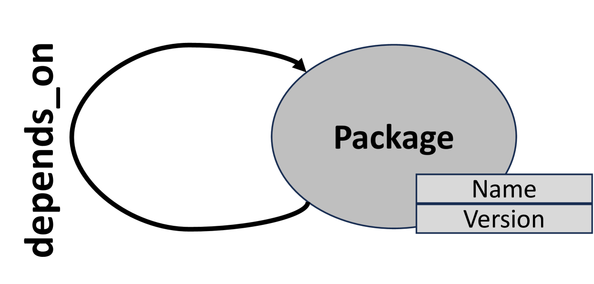
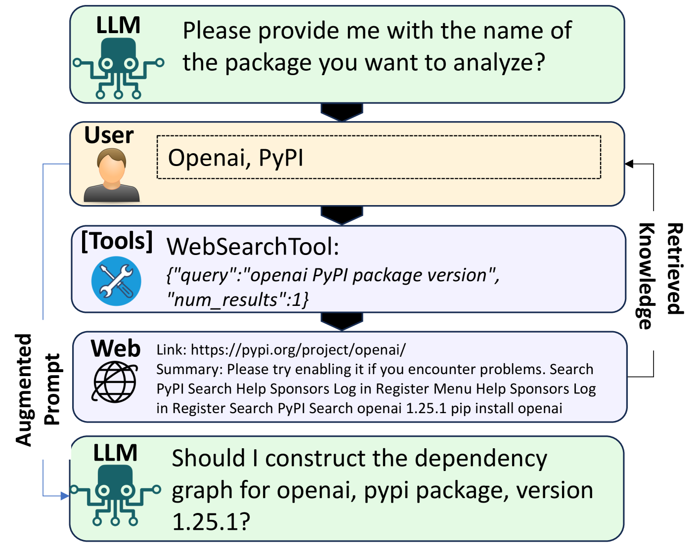
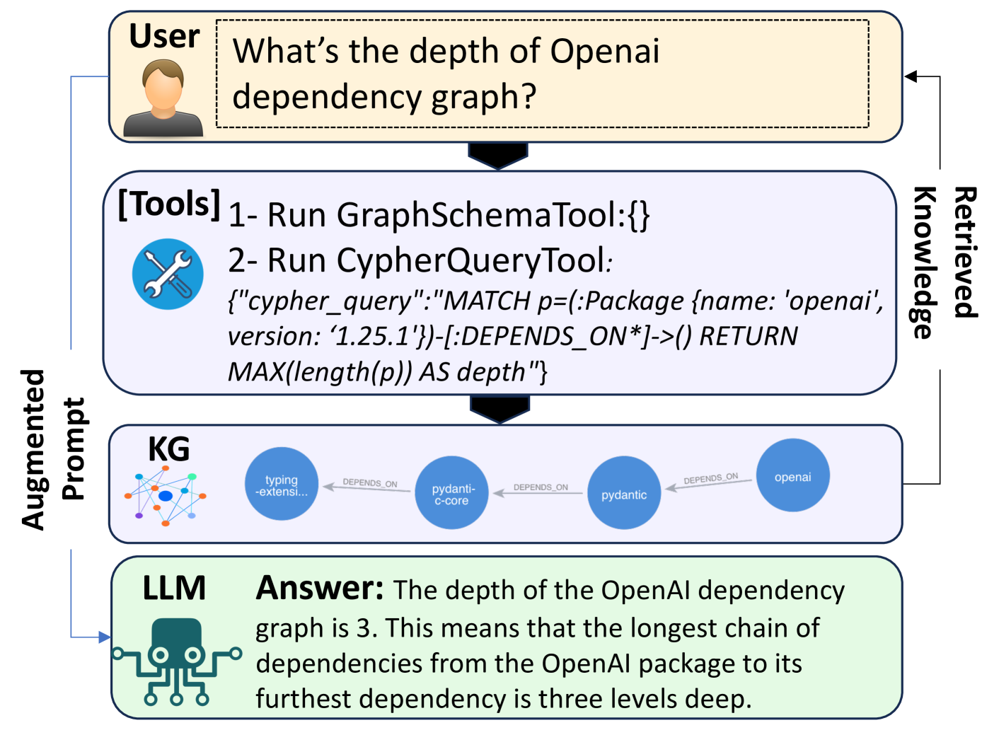
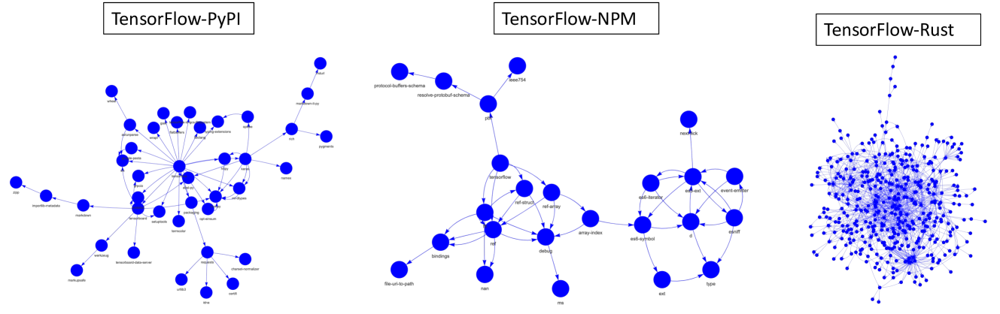

# DepesRAG：借助大型语言模型优化软件依赖管理

发布时间：2024年05月30日

`RAG

理由：这篇论文介绍了一种基于检索增强生成（RAG）的方法，名为 DepsRAG，用于管理软件依赖。它利用知识图谱（KG）和网络搜索来检索和整合信息，以解答关于软件依赖的问题。这种方法特别强调了 RAG 技术在软件依赖管理中的应用，因此属于RAG分类。虽然它涉及大型语言模型（LLMs）的使用，但主要焦点是 RAG 技术的应用，而不是 LLM 的理论或应用。` `软件开发` `知识图谱`

> DepesRAG: Towards Managing Software Dependencies using Large Language Models

# 摘要

> 在软件开发中，管理软件依赖是一项至关重要的维护任务，随着软件供应链攻击的激增，这一领域正迅速成为研究热点。深入理解依赖关系及其隐藏属性（如依赖数量、依赖链、依赖深度）需要专业知识和大量开发者的努力。得益于大型语言模型（LLMs）的最新进展，我们现在能够从多源数据中检索信息，为软件依赖管理开辟了新途径。我们推出的~\tool，是一种基于检索增强生成（RAG）的概念验证方法，它将软件包的直接和传递依赖构建为四个主流软件生态系统中的知识图谱（KG）。DepsRAG 能自动生成查询，从 KG 中检索信息，解答用户关于软件依赖的疑问，并将这些信息融入 LLMs 的输入中。对于 KG 无法直接解答的问题，DepsRAG 还能进行网络搜索。我们探讨了 DepsRAG 的实际应用价值及其局限性。

> Managing software dependencies is a crucial maintenance task in software development and is becoming a rapidly growing research field, especially in light of the significant increase in software supply chain attacks. Specialized expertise and substantial developer effort are required to fully comprehend dependencies and reveal hidden properties about the dependencies (e.g., number of dependencies, dependency chains, depth of dependencies).
  Recent advancements in Large Language Models (LLMs) allow the retrieval of information from various data sources for response generation, thus providing a new opportunity to uniquely manage software dependencies. To highlight the potential of this technology, we present~\tool, a proof-of-concept Retrieval Augmented Generation (RAG) approach that constructs direct and transitive dependencies of software packages as a Knowledge Graph (KG) in four popular software ecosystems. DepsRAG can answer user questions about software dependencies by automatically generating necessary queries to retrieve information from the KG, and then augmenting the input of LLMs with the retrieved information. DepsRAG can also perform Web search to answer questions that the LLM cannot directly answer via the KG. We identify tangible benefits that DepsRAG can offer and discuss its limitations.

[Arxiv](https://arxiv.org/abs/2405.20455)