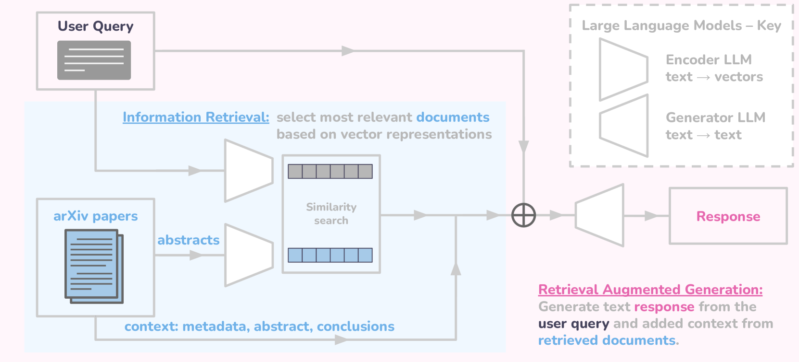
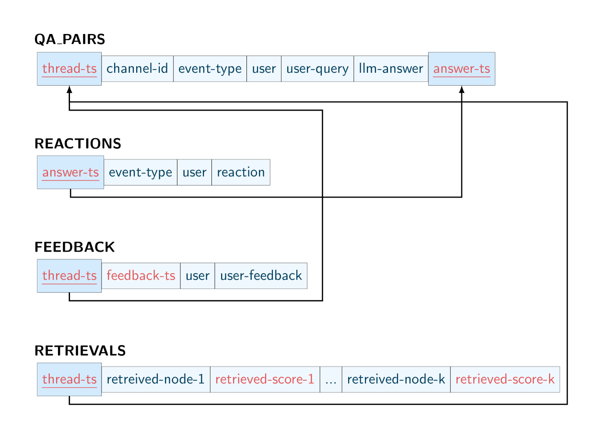

# 构建天文学研究中大型语言模型的评估框架

发布时间：2024年05月30日

`RAG

理由：该论文摘要描述了一个实验，其中引入了基于检索增强生成（RAG）技术的Slack聊天机器人，用于在天文学领域中与用户互动并提供信息。这个实验特别关注了RAG技术在天文学中的应用，以及如何通过这种技术来增强大型语言模型（LLMs）的实用性。因此，这篇论文更符合RAG分类，因为它主要探讨了RAG技术在特定领域的应用。` `天文学` `科学研究`

> Designing an Evaluation Framework for Large Language Models in Astronomy Research

# 摘要

> 大型语言模型（LLMs）正重塑科学研究的面貌，尤其是天文学等子领域如何从中获益，这一议题亟待探讨。目前，尚无标准来评估LLMs在天文学中的应用。为此，我们设计了一项实验，旨在探究天文学家如何与LLMs互动。我们引入了一款Slack聊天机器人，它利用检索增强生成（RAG）技术，基于arXiv上的天文学论文为用户答疑解惑。我们记录并匿名处理用户提问、聊天机器人回复、用户对LLM回复的评价反馈，以及相关文档的检索与相似度评分。这一数据收集策略，为未来动态评估天文学领域的LLM工具奠定了基础。

> Large Language Models (LLMs) are shifting how scientific research is done. It is imperative to understand how researchers interact with these models and how scientific sub-communities like astronomy might benefit from them. However, there is currently no standard for evaluating the use of LLMs in astronomy. Therefore, we present the experimental design for an evaluation study on how astronomy researchers interact with LLMs. We deploy a Slack chatbot that can answer queries from users via Retrieval-Augmented Generation (RAG); these responses are grounded in astronomy papers from arXiv. We record and anonymize user questions and chatbot answers, user upvotes and downvotes to LLM responses, user feedback to the LLM, and retrieved documents and similarity scores with the query. Our data collection method will enable future dynamic evaluations of LLM tools for astronomy.

[Arxiv](https://arxiv.org/abs/2405.20389)