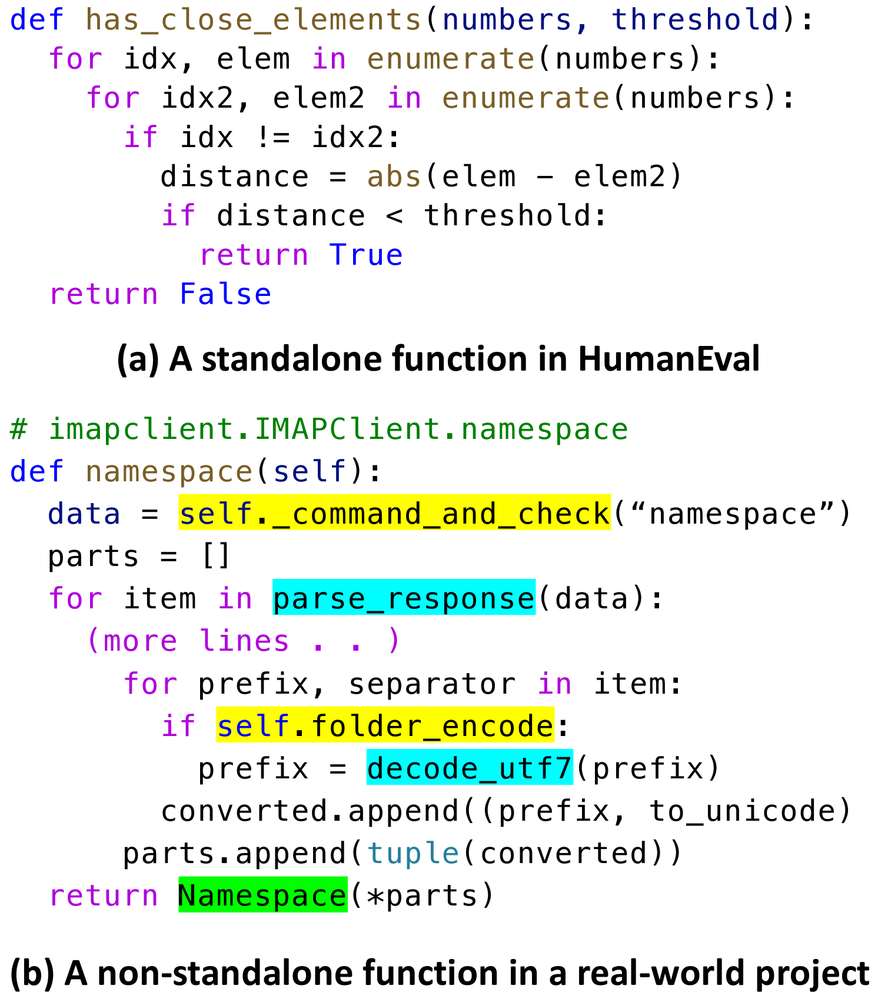
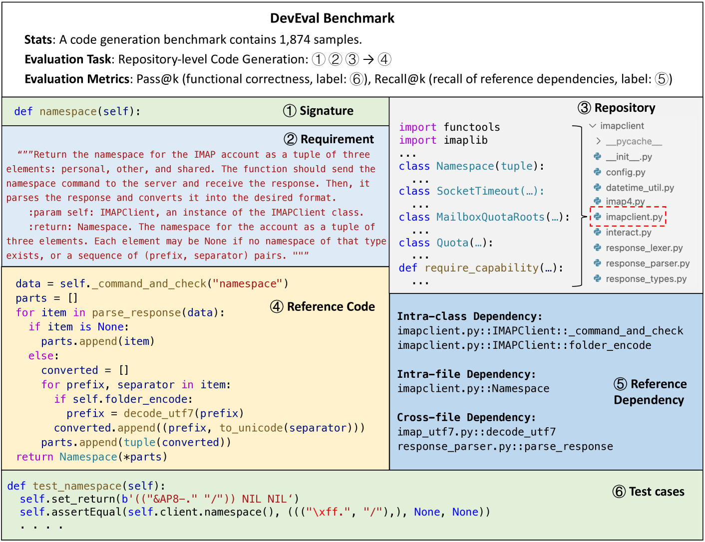
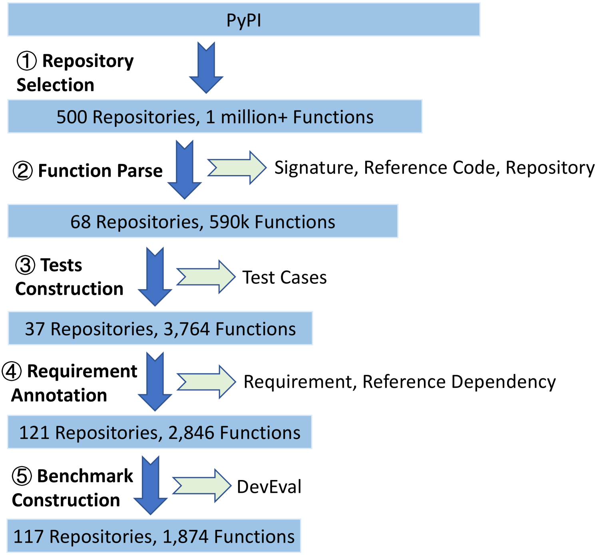
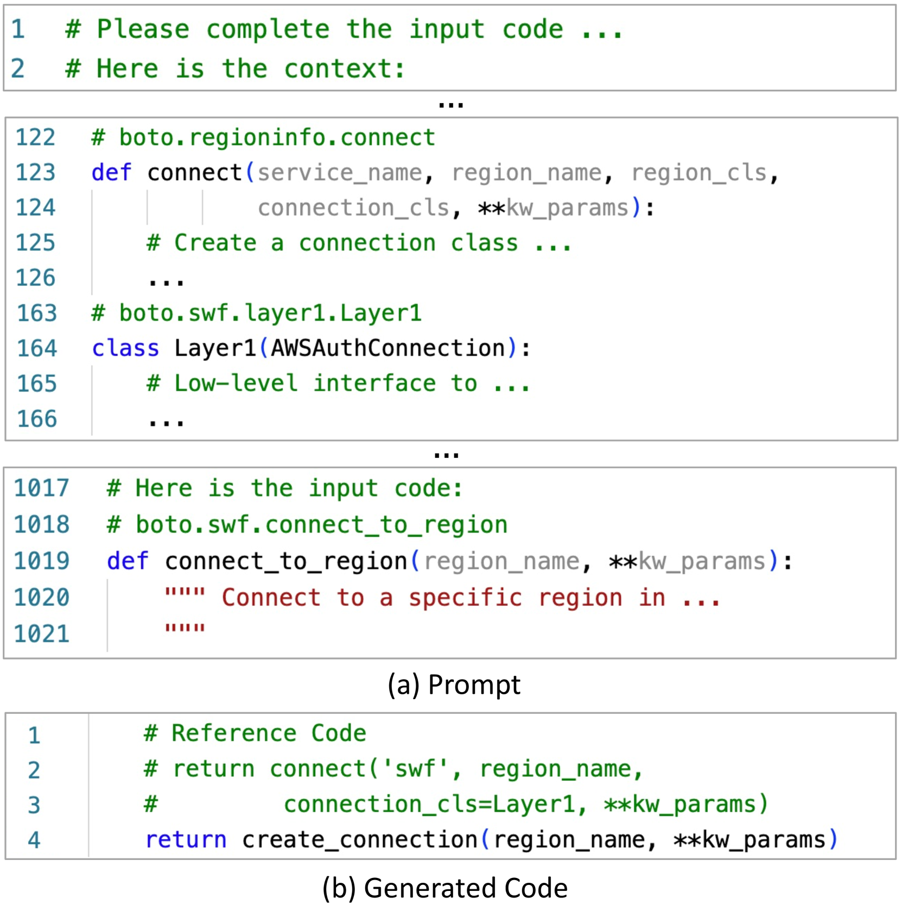
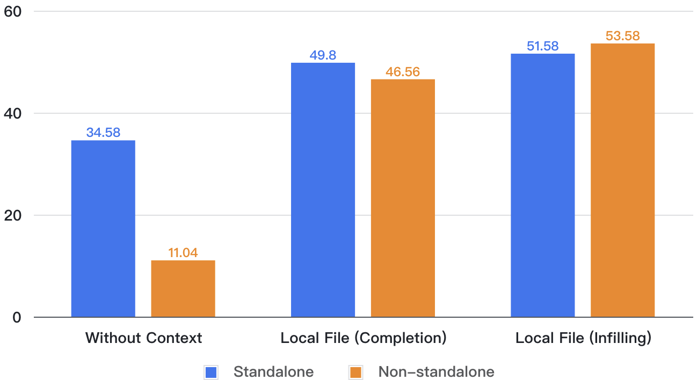
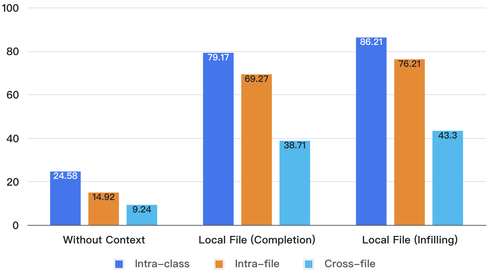

# DevEval：真实世界代码仓库对齐的手工标注代码生成基准

发布时间：2024年05月30日

`LLM应用

这篇论文主要关注的是评估大型语言模型（LLMs）在编码能力方面的表现，并为此推出了一个新的基准DevEval。该基准旨在更真实地反映LLMs在实际代码环境中的表现，通过多维度的评估和详细的标注信息，以及大量的测试样本，来全面评估LLMs的编码技能。论文中还对多个LLMs进行了实际的评估，并分析了它们在特定任务上的表现和不足。因此，这篇论文更偏向于LLM的应用层面，即如何应用和评估LLMs在特定领域（如代码生成）的能力。` `软件开发` `人工智能`

> DevEval: A Manually-Annotated Code Generation Benchmark Aligned with Real-World Code Repositories

# 摘要

> 评估大型语言模型（LLMs）的编码能力仍是一个待解之谜。现有基准与真实代码库的匹配度不佳，难以全面评估LLMs的编码技能。为此，我们推出了新基准DevEval，它具备三大亮点：(1) 多维度与真实代码库对齐，包括代码及依赖的分布；(2) 由13位开发者精心标注，涵盖详尽的标注信息，如需求、仓库源、参考代码及依赖；(3) 包含1,874个测试样本，源自117个仓库，横跨10大热门领域。我们基于DevEval，探索了仓库级代码生成，并对8款热门LLMs进行了评估，揭示了它们在真实代码环境中的表现。例如，实验显示，gpt-4-turbo的最高通过率仅为53.04%。我们还深入分析了失败案例，指出了LLMs的短板。期待DevEval能助力LLMs在真实代码世界中的进步。相关数据、提示及模型预测已公开发布。

> How to evaluate the coding abilities of Large Language Models (LLMs) remains an open question. We find that existing benchmarks are poorly aligned with real-world code repositories and are insufficient to evaluate the coding abilities of LLMs.
  To address the knowledge gap, we propose a new benchmark named DevEval, which has three advances. (1) DevEval aligns with real-world repositories in multiple dimensions, e.g., code distributions and dependency distributions. (2) DevEval is annotated by 13 developers and contains comprehensive annotations (e.g., requirements, original repositories, reference code, and reference dependencies). (3) DevEval comprises 1,874 testing samples from 117 repositories, covering 10 popular domains (e.g., Internet, Database). Based on DevEval, we propose repository-level code generation and evaluate 8 popular LLMs on DevEval (e.g., gpt-4, gpt-3.5, StarCoder 2, DeepSeek Coder, CodeLLaMa). Our experiments reveal these LLMs' coding abilities in real-world code repositories. For example, in our experiments, the highest Pass@1 of gpt-4-turbo is only 53.04%. We also analyze LLMs' failed cases and summarize their shortcomings. We hope DevEval can facilitate the development of LLMs in real code repositories. DevEval, prompts, and LLMs' predictions have been released.

[Arxiv](https://arxiv.org/abs/2405.19856)