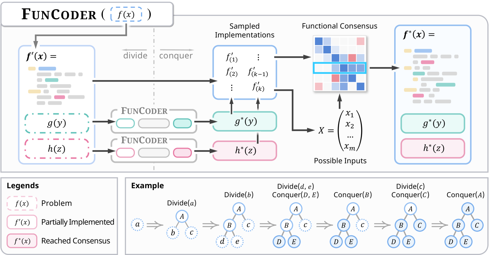
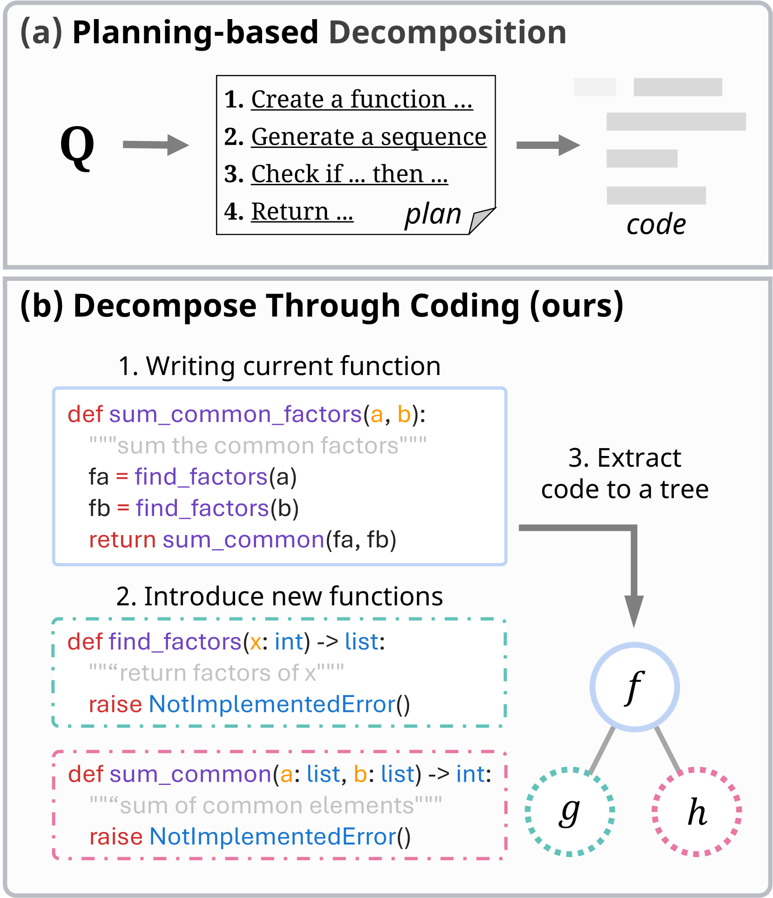
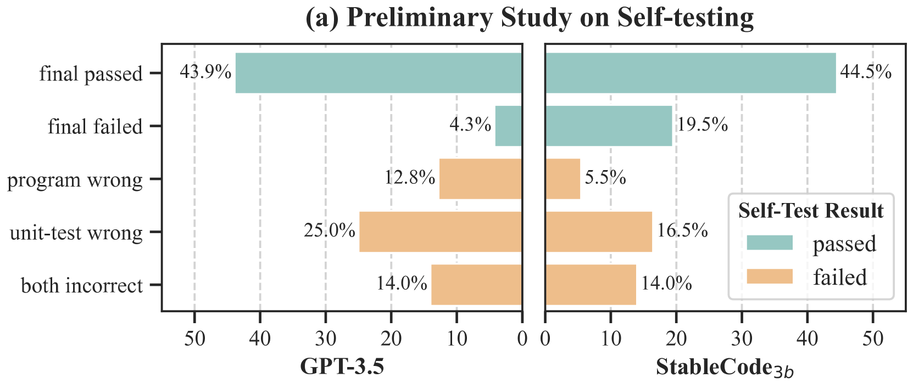
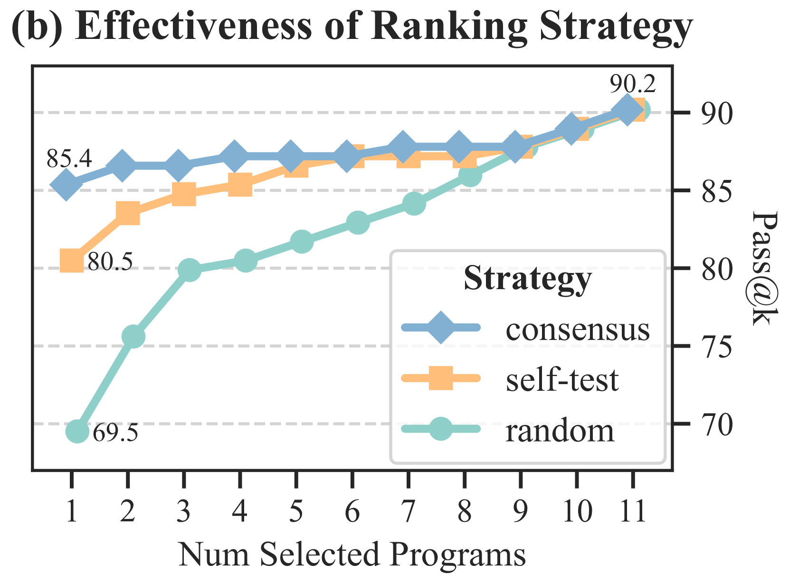
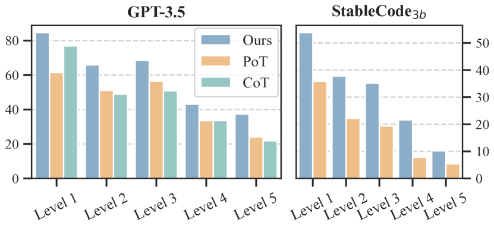

# 分治策略与共识机制的结合：激发代码生成中函数的潜能

发布时间：2024年05月30日

`LLM应用

理由：这篇论文介绍了一种名为FunCoder的代码生成框架，它利用了大型语言模型（LLM）如GPT-3.5和GPT-4的能力，通过分治策略和功能共识来提高代码生成的效率和准确性。该研究专注于LLM在实际应用中的性能提升，特别是在代码生成领域，因此属于LLM应用类别。论文中提到的技术改进和性能测试结果表明，这是一种针对特定应用场景（代码生成）的LLM优化方法，而不是探讨LLM的理论基础或Agent的行为，也不涉及RAG（Retrieval-Augmented Generation）的相关技术。` `软件开发` `人工智能`

> Divide-and-Conquer Meets Consensus: Unleashing the Power of Functions in Code Generation

# 摘要

> 尽管大型语言模型在代码生成上有所进步，但面对复杂需求的程序仍显吃力。新近研究采用计划-解决分解策略简化问题，并通过自测试优化程序。然而，深入预先规划需求颇具挑战，且自测试的准确性对自我提升至关重要。为此，我们开发了FunCoder，一种融合分治策略与功能共识的代码生成框架。FunCoder在生成代码时，递归地分解出子功能作为小目标，并以树状结构呈现。这些子功能随后被整合以实现更复杂的任务。我们通过识别程序行为的共性来达成功能共识，有效抑制错误扩散。在HumanEval、MBPP、xCodeEval和MATH测试中，FunCoder使用GPT-3.5和GPT-4平均超越现有技术+9.8%。不仅如此，在小模型上，FunCoder使StableCode-3b超越GPT-3.5达18.6%，并在HumanEval上达到GPT-4性能的97.7%。深入分析揭示，我们的动态功能分解能有效应对复杂需求，且功能共识在正确性评估上优于自测试。

> Despite recent progress made by large language models in code generation, they still struggle with programs that meet complex requirements. Recent work utilizes plan-and-solve decomposition to decrease the complexity and leverage self-tests to refine the generated program. Yet, planning deep-inside requirements in advance can be challenging, and the tests need to be accurate to accomplish self-improvement. To this end, we propose FunCoder, a code generation framework incorporating the divide-and-conquer strategy with functional consensus. Specifically, FunCoder recursively branches off sub-functions as smaller goals during code generation, represented by a tree hierarchy. These sub-functions are then composited to attain more complex objectives. Additionally, we designate functions via a consensus formed by identifying similarities in program behavior, mitigating error propagation. FunCoder outperforms state-of-the-art methods by +9.8% on average in HumanEval, MBPP, xCodeEval and MATH with GPT-3.5 and GPT-4. Moreover, our method demonstrates superiority on smaller models: With FunCoder, StableCode-3b surpasses GPT-3.5 by +18.6% and achieves 97.7% of GPT-4's performance on HumanEval. Further analysis reveals that our proposed dynamic function decomposition is capable of handling complex requirements, and the functional consensus prevails over self-testing in correctness evaluation.

[Arxiv](https://arxiv.org/abs/2405.20092)