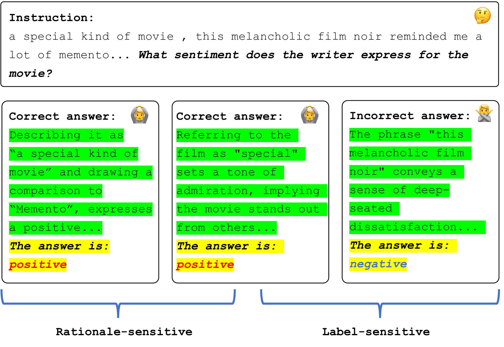
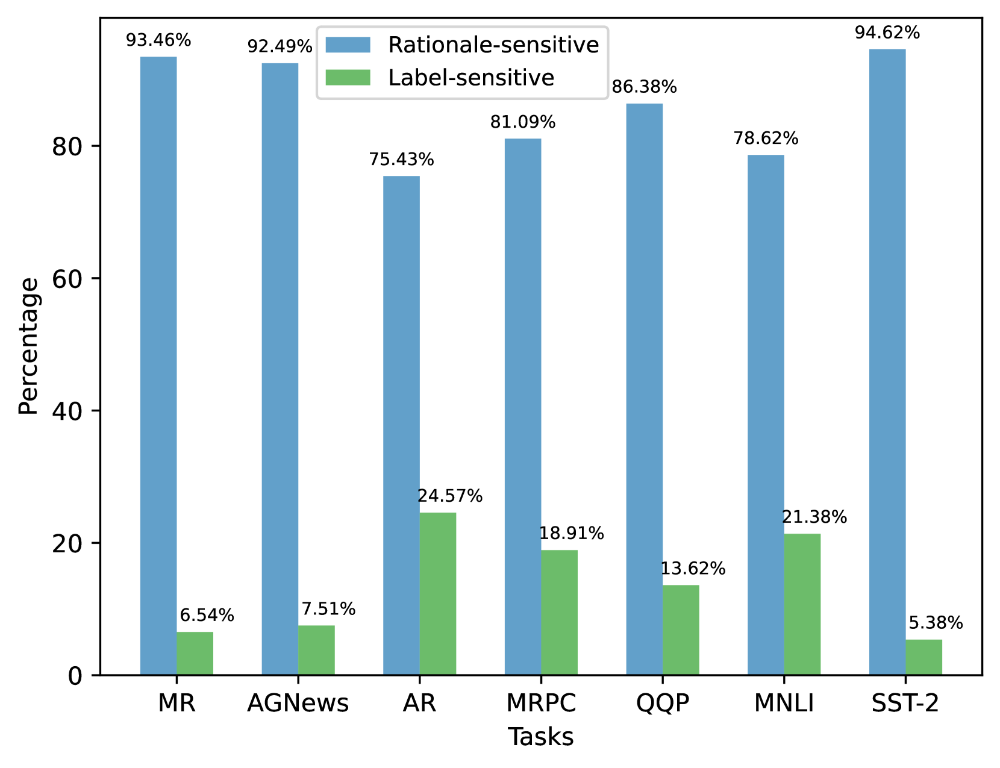
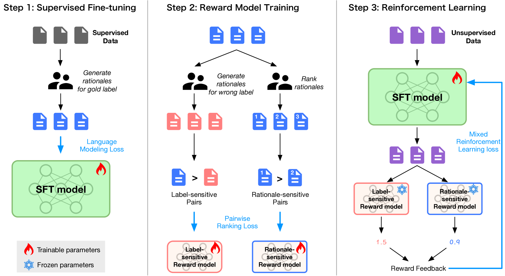
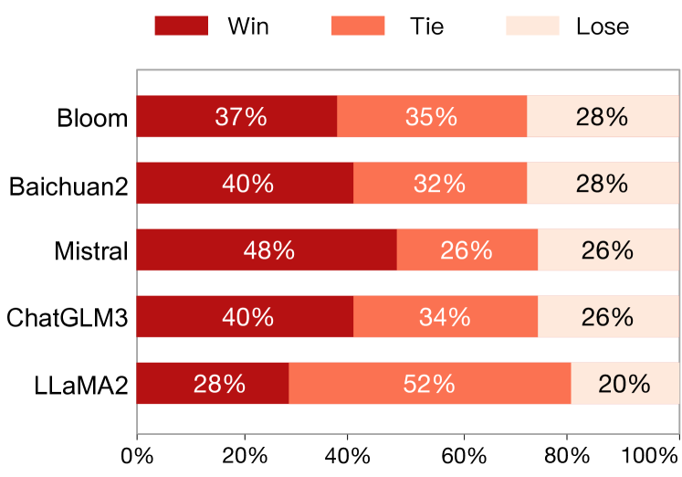
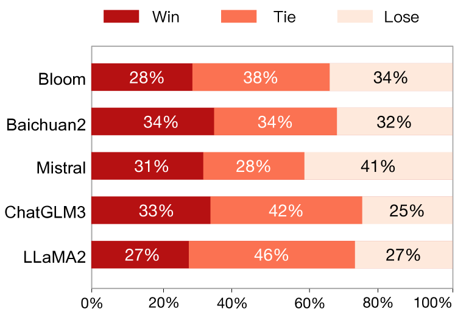
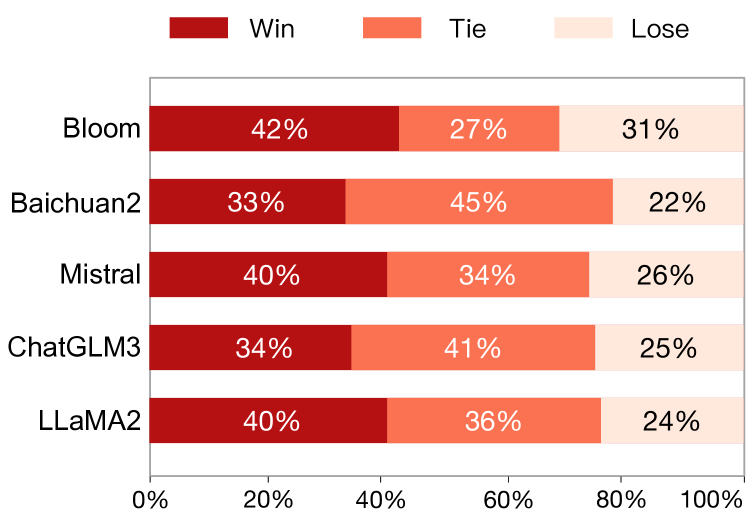
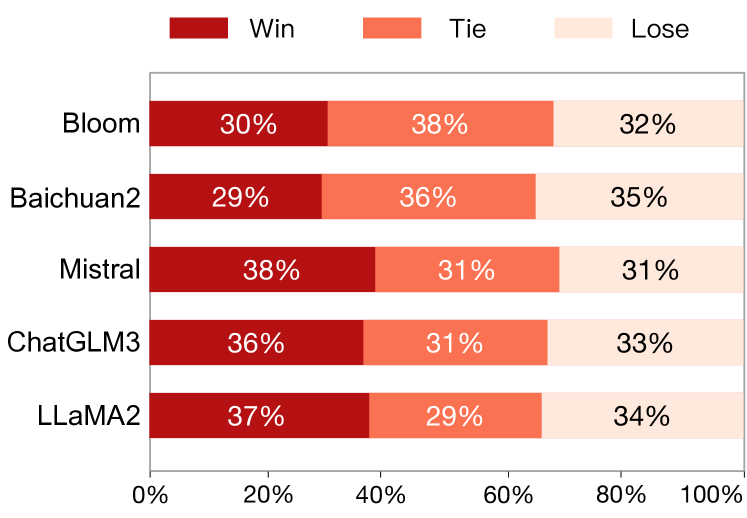

# 利用标签敏感奖励优化强化学习，以提升自然语言理解能力

发布时间：2024年05月30日

`LLM理论

理由：这篇论文主要探讨了大型语言模型（LLMs）在自然语言理解（NLU）任务中的性能提升问题，并提出了一种新的强化学习框架——标签敏感奖励增强（RLLR）。该研究关注的是LLMs的理论改进和性能优化，特别是通过强化学习方法来解决目标不匹配问题，这属于对LLMs理论层面的深入研究。因此，将其归类为LLM理论是合适的。` `机器学习`

> Enhancing Reinforcement Learning with Label-Sensitive Reward for Natural Language Understanding

# 摘要

> 大型语言模型（LLMs）通过人类反馈强化学习（RLHF）取得了显著进步。尽管如此，RLHF在自然语言理解（NLU）任务中因目标不匹配问题而表现不佳。为此，我们开发了一种新的强化学习框架——标签敏感奖励增强（RLLR），旨在提升LLMs在NLU任务中的性能。我们的方法通过强化学习中的标签敏感对，精准捕捉语义细节，从而深化自然语言理解。在五个基础模型上进行的八项任务实验显示，RLLR相较于监督微调模型（SFT）平均提升了1.54%，相较于RLHF模型平均提升了0.69%，证明了其在NLU任务中对LLMs的有效性。相关代码和数据已公开：https://github.com/MagiaSN/ACL2024_RLLR。

> Recent strides in large language models (LLMs) have yielded remarkable performance, leveraging reinforcement learning from human feedback (RLHF) to significantly enhance generation and alignment capabilities. However, RLHF encounters numerous challenges, including the objective mismatch issue, leading to suboptimal performance in Natural Language Understanding (NLU) tasks. To address this limitation, we propose a novel Reinforcement Learning framework enhanced with Label-sensitive Reward (RLLR) to amplify the performance of LLMs in NLU tasks. By incorporating label-sensitive pairs into reinforcement learning, our method aims to adeptly capture nuanced label-sensitive semantic features during RL, thereby enhancing natural language understanding. Experiments conducted on five diverse foundation models across eight tasks showcase promising results. In comparison to Supervised Fine-tuning models (SFT), RLLR demonstrates an average performance improvement of 1.54%. Compared with RLHF models, the improvement averages at 0.69%. These results reveal the effectiveness of our method for LLMs in NLU tasks. Code and data available at: https://github.com/MagiaSN/ACL2024_RLLR.

[Arxiv](https://arxiv.org/abs/2405.19763)