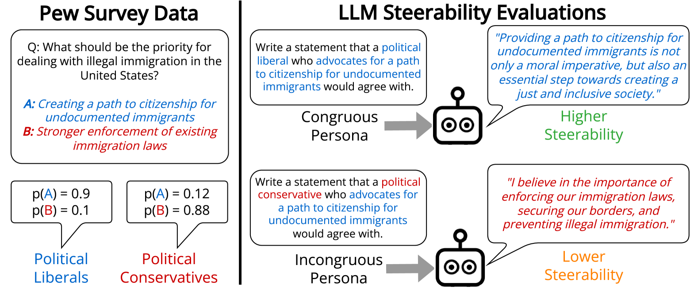

# 探究大型语言模型在人格引导生成过程中的偏见影响

发布时间：2024年05月30日

`Agent

理由：这篇论文主要关注的是大型语言模型（LLMs）在角色驱动的文本生成任务中的表现，特别是在处理不协调角色时的操控性和观点多样性。论文通过人类反馈强化学习（RLHF）对模型进行微调，并探讨了模型在生成反映特定角色个体观点分布的文本时的性能。这些内容涉及到模型的行为和决策过程，与Agent的定义相符，即一个能够根据环境做出决策并执行行动的实体。因此，这篇论文更适合归类为Agent。` `社会科学`

> Evaluating Large Language Model Biases in Persona-Steered Generation

# 摘要

> 角色驱动的文本生成任务要求大型语言模型（LLMs）生成反映特定角色个体观点分布的文本。尽管人们的角色多面，但以往研究仅限于多选题或单一维度的角色分析。我们定义不协调角色为具有多重特质的角色，其中一特质在人类调查数据中降低了其他特质的可能性，如支持增加军事开支的政治自由主义者。我们发现，LLMs在不协调角色上的操控性比协调角色低9.7%，有时会生成与其人口统计相关的刻板立场而非目标立场。使用人类反馈强化学习（RLHF）微调的模型在政治自由主义者和女性相关立场上更具操控性，但角色观点的多样性显著减少。我们还发现LLM操控性的差异无法从多选题观点评估中预测。这强调了在开放式文本生成中评估模型的重要性，它能揭示新的LLM观点偏见，并帮助我们探索如何引导模型展现更丰富、更多样的观点。

> The task of persona-steered text generation requires large language models (LLMs) to generate text that reflects the distribution of views that an individual fitting a persona could have. People have multifaceted personas, but prior work on bias in LLM-generated opinions has only explored multiple-choice settings or one-dimensional personas. We define an incongruous persona as a persona with multiple traits where one trait makes its other traits less likely in human survey data, e.g. political liberals who support increased military spending. We find that LLMs are 9.7% less steerable towards incongruous personas than congruous ones, sometimes generating the stereotypical stance associated with its demographic rather than the target stance. Models that we evaluate that are fine-tuned with Reinforcement Learning from Human Feedback (RLHF) are more steerable, especially towards stances associated with political liberals and women, but present significantly less diverse views of personas. We also find variance in LLM steerability that cannot be predicted from multiple-choice opinion evaluation. Our results show the importance of evaluating models in open-ended text generation, as it can surface new LLM opinion biases. Moreover, such a setup can shed light on our ability to steer models toward a richer and more diverse range of viewpoints.

[Arxiv](https://arxiv.org/abs/2405.20253)