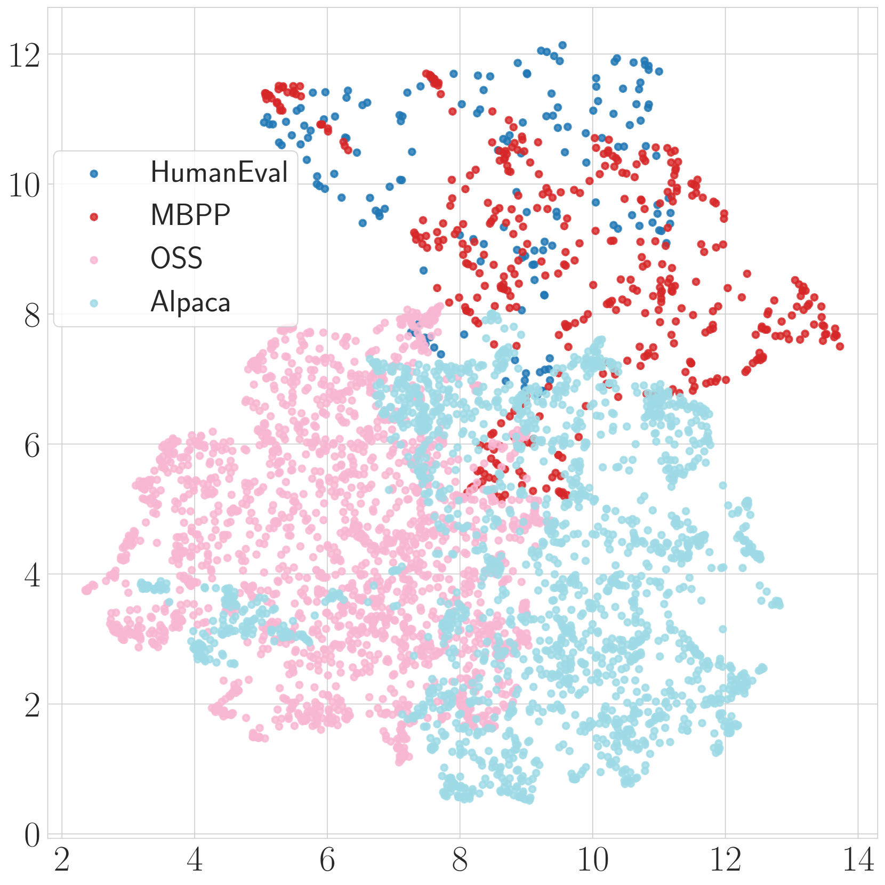

# 从符号任务到代码生成：任务执行者的多样化提升表现

发布时间：2024年05月30日

`LLM理论

理由：这篇论文探讨了指令调优技术对大规模语言模型的影响，特别是模型如何理解和执行未在训练中遇到的指令。研究通过基于马尔可夫算法的合成实验来深入探究这一过程，并讨论了指令调优集的语义空间对模型能力的影响。这些内容更偏向于对LLM工作原理的理论分析和理解，而不是具体的应用案例或Agent的设计，因此归类为LLM理论。` `代码生成` `人工智能`

> From Symbolic Tasks to Code Generation: Diversification Yields Better Task Performers

# 摘要

> 指令调优技术，即针对大规模语言模型进行指令-输出对的调优，展现出使模型更贴合现实世界的潜力。然而，模型如何理解并执行未在训练中遇到的指令，其背后的关键因素尚待深入探究。我们的研究从一系列基于马尔可夫算法的合成实验开始，该算法为图灵完备，允许对指令调优数据进行精细操控。实验表明，即使每个任务的示例有限，提供多样化的任务集也能增强模型的泛化能力和鲁棒性。我们将这一发现应用于代码生成的实际场景，并观察到，一个涵盖更广泛任务的指令集，不仅限于代码相关任务，能显著提升代码生成的效果。这表明，指令调优集的语义空间越丰富，模型遵循指令和完成任务的能力就越强。

> Instruction tuning -- tuning large language models on instruction-output pairs -- is a promising technique for making models better adapted to the real world. Yet, the key factors driving the model's capability to understand and follow instructions not seen during training remain under-explored. Our investigation begins with a series of synthetic experiments within the theoretical framework of a Turing-complete algorithm called Markov algorithm, which allows fine-grained control over the instruction-tuning data. Generalization and robustness with respect to the training distribution emerge once a diverse enough set of tasks is provided, even though very few examples are provided for each task. We extend these initial results to a real-world application scenario of code generation and find that a more diverse instruction set, extending beyond code-related tasks, improves the performance of code generation. Our observations suggest that a more diverse semantic space for instruction-tuning sets greatly improves the model's ability to follow instructions and perform tasks.

[Arxiv](https://arxiv.org/abs/2405.19787)