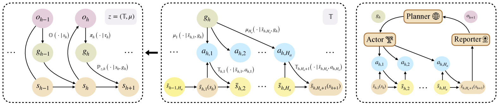

# 从言辞到实践：探索大型语言模型驱动自主系统的理论根基

发布时间：2024年05月30日

`Agent

理由：这篇论文主要探讨了大型语言模型（LLM）赋能的智能体在解决现实世界决策问题中的应用，特别是通过构建一个分层强化学习模型，其中LLM规划器负责高级任务规划，执行者负责具体执行。论文从理论角度分析了智能体的决策过程，包括上下文学习、贝叶斯聚合模仿学习（BAIL）、探索策略等，这些都是智能体研究的核心内容。因此，这篇论文更适合归类于Agent分类。` `人工智能` `决策支持系统`

> From Words to Actions: Unveiling the Theoretical Underpinnings of LLM-Driven Autonomous Systems

# 摘要

> 本研究从理论视角探讨了大型语言模型（LLM）赋能的智能体如何解决现实世界的决策问题。我们构建了一个分层强化学习模型，其中LLM规划器负责高级任务规划，而执行者负责具体执行。LLM规划器通过生成语言子目标，在部分可观测的马尔可夫决策过程中导航。在预训练数据的合理假设下，我们证明了LLM规划器通过上下文学习实现了贝叶斯聚合模仿学习（BAIL）。然而，简单遵循LLM生成的子目标会导致线性遗憾，因此我们强调了探索的必要性，并引入了ε-贪婪策略以减少遗憾。此外，我们的理论框架还涵盖了LLM规划器作为世界模型推断环境转移模型的情况，以及多智能体协作的场景。

> In this work, from a theoretical lens, we aim to understand why large language model (LLM) empowered agents are able to solve decision-making problems in the physical world. To this end, consider a hierarchical reinforcement learning (RL) model where the LLM Planner and the Actor perform high-level task planning and low-level execution, respectively. Under this model, the LLM Planner navigates a partially observable Markov decision process (POMDP) by iteratively generating language-based subgoals via prompting. Under proper assumptions on the pretraining data, we prove that the pretrained LLM Planner effectively performs Bayesian aggregated imitation learning (BAIL) through in-context learning. Additionally, we highlight the necessity for exploration beyond the subgoals derived from BAIL by proving that naively executing the subgoals returned by LLM leads to a linear regret. As a remedy, we introduce an $ε$-greedy exploration strategy to BAIL, which is proven to incur sublinear regret when the pretraining error is small. Finally, we extend our theoretical framework to include scenarios where the LLM Planner serves as a world model for inferring the transition model of the environment and to multi-agent settings, enabling coordination among multiple Actors.

[Arxiv](https://arxiv.org/abs/2405.19883)