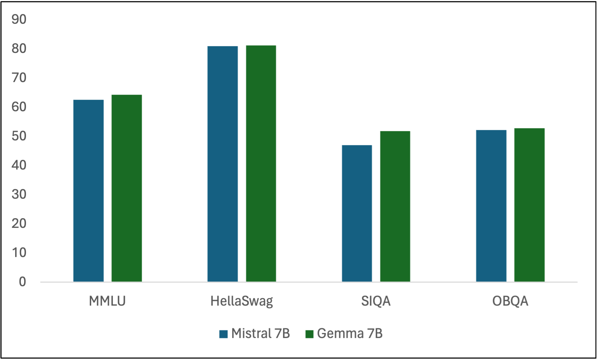

# GAMedX：利用大型语言模型的生成式AI技术，精准提取医疗实体数据

发布时间：2024年05月30日

`LLM应用

这篇论文介绍了一种基于大型语言模型的命名实体识别方法GAMedX，该方法能够从非结构化的医疗文本中高效提取信息。这种方法利用了生成式AI和LLMs来提升数据提取的效率，并且在实际应用中取得了显著的效果，如在评估数据集上达到98%的ROUGE F1分数。因此，这篇论文属于LLM应用类别，因为它展示了LLM在特定领域（医疗保健）的具体应用和实际效果。` `医疗保健` `信息提取`

> GAMedX: Generative AI-based Medical Entity Data Extractor Using Large Language Models

# 摘要

> 在医疗保健领域及其他快速发展的行业中，生成式AI与电子健康记录的融合标志着一项重大进步，有效填补了当前信息提取技术的空白。本文推出的GAMedX，是一种基于大型语言模型的命名实体识别方法，能从患者住院期间产生的医疗叙述和非结构化文本中高效提取信息。面对处理非结构化医疗文本的挑战，GAMedX巧妙运用生成式AI和LLMs，提升了数据提取的效率。该方法采用统一策略，结合开源LLMs进行NER，通过链式提示和Pydantic模式生成结构化输出，巧妙应对医疗专业术语的复杂性。研究显示，在某一评估数据集上，ROUGE F1分数高达98%。这一创新不仅优化了实体提取，还提供了一种高效、经济的自动化表格填充方案，从非结构化数据中提取信息。GAMedX的引入，不仅简化了非结构化医疗文本的处理流程，还在NER领域树立了新标杆，对医疗技术以外的理论与实践进步做出了显著贡献。

> In the rapidly evolving field of healthcare and beyond, the integration of generative AI in Electronic Health Records (EHRs) represents a pivotal advancement, addressing a critical gap in current information extraction techniques. This paper introduces GAMedX, a Named Entity Recognition (NER) approach utilizing Large Language Models (LLMs) to efficiently extract entities from medical narratives and unstructured text generated throughout various phases of the patient hospital visit. By addressing the significant challenge of processing unstructured medical text, GAMedX leverages the capabilities of generative AI and LLMs for improved data extraction. Employing a unified approach, the methodology integrates open-source LLMs for NER, utilizing chained prompts and Pydantic schemas for structured output to navigate the complexities of specialized medical jargon. The findings reveal significant ROUGE F1 score on one of the evaluation datasets with an accuracy of 98\%. This innovation enhances entity extraction, offering a scalable, cost-effective solution for automated forms filling from unstructured data. As a result, GAMedX streamlines the processing of unstructured narratives, and sets a new standard in NER applications, contributing significantly to theoretical and practical advancements beyond the medical technology sphere.

[Arxiv](https://arxiv.org/abs/2405.20585)